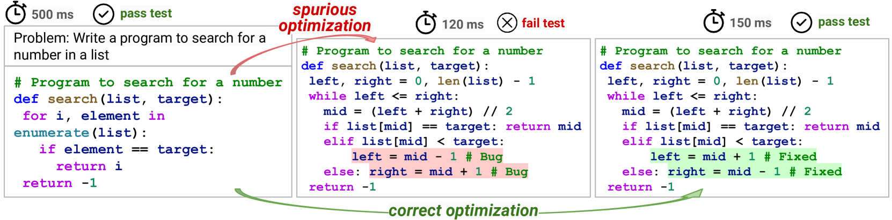
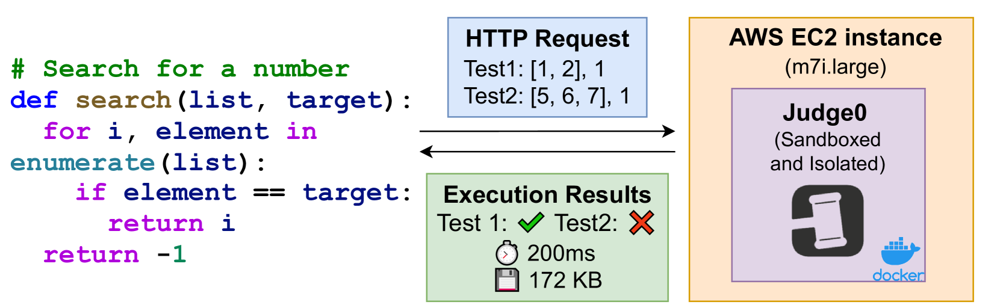
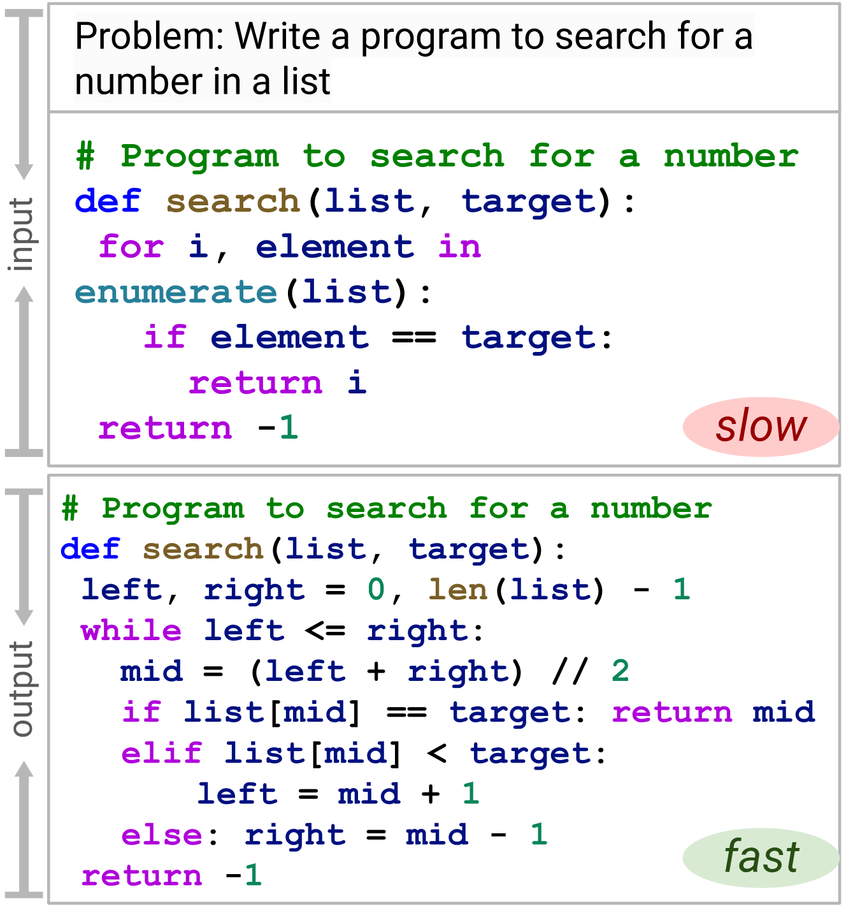
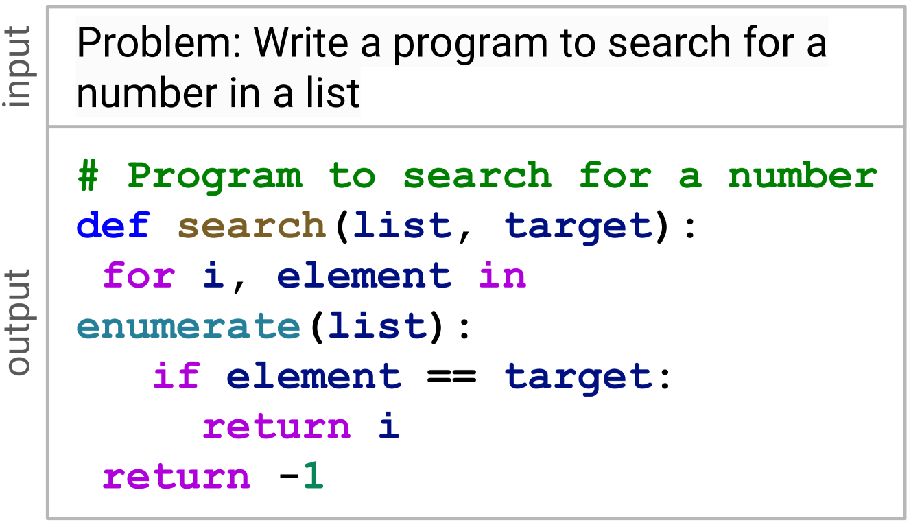
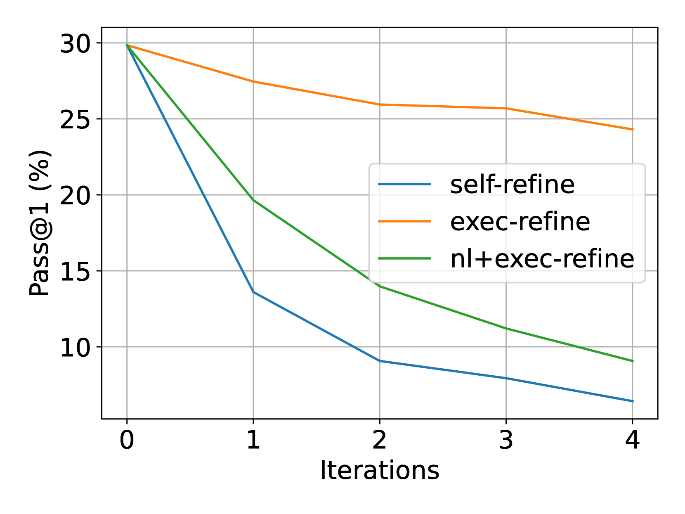
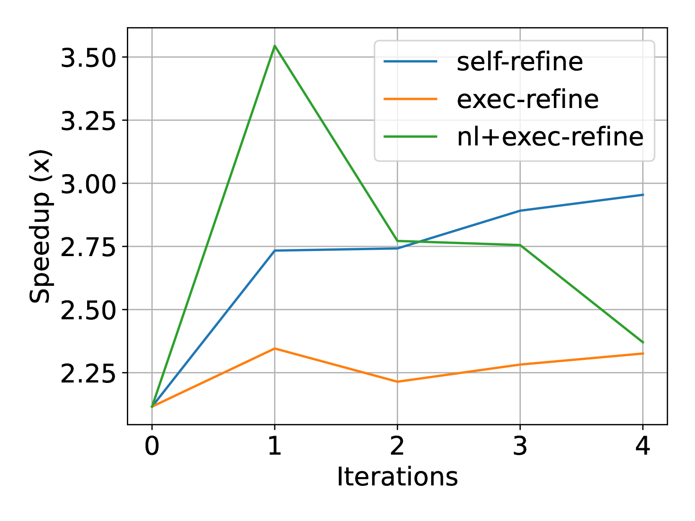
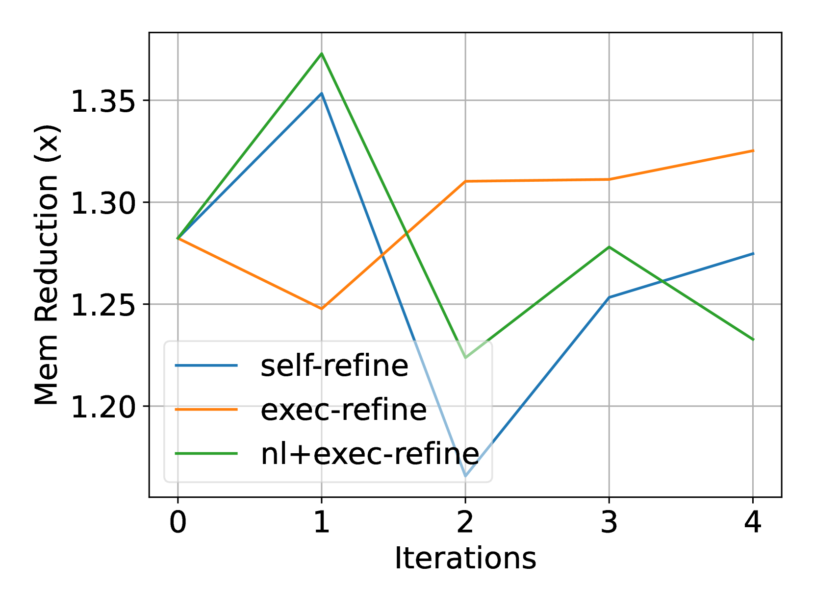

# ECCO 项目探讨：如何在确保功能无误的前提下，提升 AI 生成代码的效率？

发布时间：2024年07月19日

`LLM应用` `软件开发` `人工智能`

> ECCO: Can We Improve Model-Generated Code Efficiency Without Sacrificing Functional Correctness?

# 摘要

> 大型语言模型 (LLM) 在生成功能正确的程序方面表现出色，但如何在确保正确性的同时提升效率仍是一大挑战。特别是，对于像 Python 这样的流行解释型语言，不同硬件上的代码效率基准测试存在不稳定性。为此，我们推出了 ECCO，一个可重复的基准，通过自然语言 (NL) 代码生成和历史代码编辑两种方式评估程序效率。在 ECCO 上，我们深入研究了三种领先的 LLM 方法：in-context learning、结合执行或 NL 反馈的迭代细化，以及基于执行和编辑历史的微调。研究发现，虽然多数方法在提高效率的同时牺牲了功能正确性，但引入执行信息有助于保持正确性，而 NL 反馈则显著提升了效率。我们公开了 ECCO 基准，以促进未来基于 LLM 的高效代码生成研究。

> Although large language models (LLMs) have been largely successful in generating functionally correct programs, conditioning models to produce efficient solutions while ensuring correctness remains a challenge. Further, unreliability in benchmarking code efficiency is a hurdle across varying hardware specifications for popular interpreted languages such as Python. In this paper, we present ECCO, a reproducible benchmark for evaluating program efficiency via two paradigms: natural language (NL) based code generation and history-based code editing. On ECCO, we adapt and thoroughly investigate the three most promising existing LLM-based approaches: in-context learning, iterative refinement with execution or NL feedback, and fine-tuning conditioned on execution and editing history. While most methods degrade functional correctness and moderately increase program efficiency, we find that adding execution information often helps maintain functional correctness, and NL feedback enhances more on efficiency. We release our benchmark to support future work on LLM-based generation of efficient code.

[Arxiv](https://arxiv.org/abs/2407.14044)