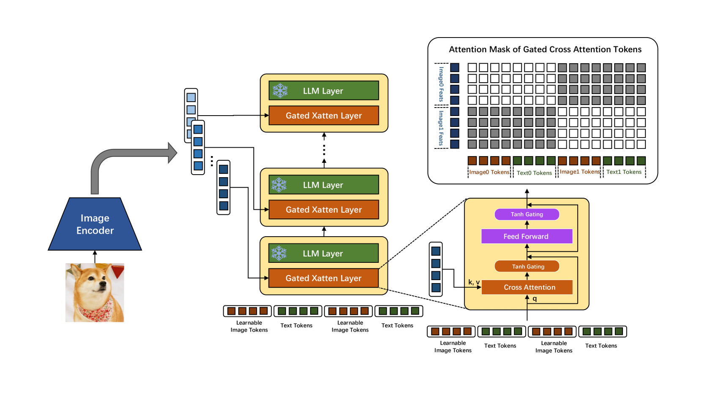

# EVLM：一款高效的视觉-语言模型，专为视觉理解设计。

发布时间：2024年07月19日

`LLM应用` `人工智能` `多媒体`

> EVLM: An Efficient Vision-Language Model for Visual Understanding

# 摘要

> 在多模态语言模型领域，主流方法多基于类似LLaVA的架构，使用单层ViT特征作为视觉提示，直接与文本标记一同输入语言模型。然而，处理长视觉序列如视频时，语言模型的自注意力机制会带来显著计算负担。此外，单层ViT特征限制了大型模型对视觉信号的全面感知。为此，我们提出了一种高效的多模态语言模型，旨在降低计算成本的同时，最大化视觉信号的感知能力。我们的方法包括：（1）借鉴Flamingo的跨注意力机制进行图像-文本交互。（2）采用分层ViT特征。（3）引入专家混合（MoE）机制提升模型性能。该模型在多模态基准测试中表现优异，并在图像和视频描述任务中展现出良好性能。

> In the field of multi-modal language models, the majority of methods are built on an architecture similar to LLaVA. These models use a single-layer ViT feature as a visual prompt, directly feeding it into the language models alongside textual tokens. However, when dealing with long sequences of visual signals or inputs such as videos, the self-attention mechanism of language models can lead to significant computational overhead. Additionally, using single-layer ViT features makes it challenging for large language models to perceive visual signals fully. This paper proposes an efficient multi-modal language model to minimize computational costs while enabling the model to perceive visual signals as comprehensively as possible. Our method primarily includes: (1) employing cross-attention to image-text interaction similar to Flamingo. (2) utilize hierarchical ViT features. (3) introduce the Mixture of Experts (MoE) mechanism to enhance model effectiveness. Our model achieves competitive scores on public multi-modal benchmarks and performs well in tasks such as image captioning and video captioning.

[Arxiv](https://arxiv.org/abs/2407.14177)