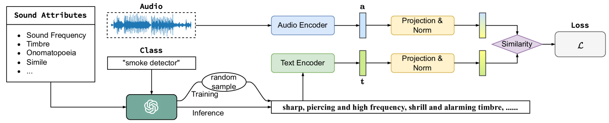
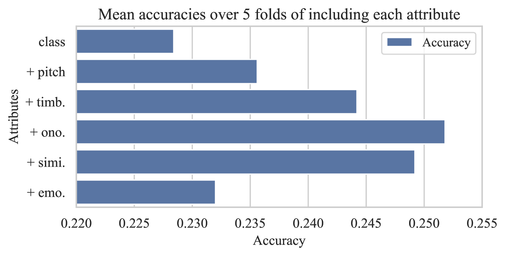
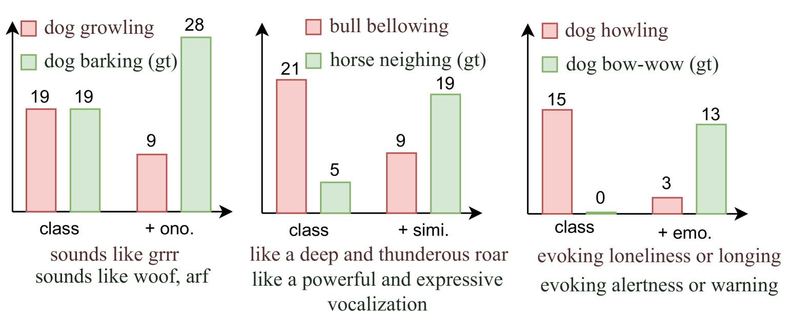

# 借助大型语言模型的声音属性知识，提升零-shot 音频分类的性能

发布时间：2024年07月19日

`LLM应用` `音频处理` `机器学习`

> Enhancing Zero-shot Audio Classification using Sound Attribute Knowledge from Large Language Models

# 摘要

> 本文提出了一种新颖的零-shot音频分类方法，通过自动生成的声音属性描述来识别和分类未见过的声音类别。我们不仅提出了一系列声音属性，还利用大型语言模型的知识为每个类别生成详尽的属性描述，从而捕捉声音的多维度特征。此外，通过引入对比学习，我们进一步提升了从文本标签中进行零-shot学习的能力。实验证明，我们的方法在VGGSound和AudioSet上显著提高了零-shot分类的准确性，且性能提升不受模型架构影响。

> Zero-shot audio classification aims to recognize and classify a sound class that the model has never seen during training. This paper presents a novel approach for zero-shot audio classification using automatically generated sound attribute descriptions. We propose a list of sound attributes and leverage large language model's domain knowledge to generate detailed attribute descriptions for each class. In contrast to previous works that primarily relied on class labels or simple descriptions, our method focuses on multi-dimensional innate auditory attributes, capturing different characteristics of sound classes. Additionally, we incorporate a contrastive learning approach to enhance zero-shot learning from textual labels. We validate the effectiveness of our method on VGGSound and AudioSet\footnote{The code is available at \url{https://www.github.com/wsntxxn/AttrEnhZsAc}.}. Our results demonstrate a substantial improvement in zero-shot classification accuracy. Ablation results show robust performance enhancement, regardless of the model architecture.

[Arxiv](https://arxiv.org/abs/2407.14355)