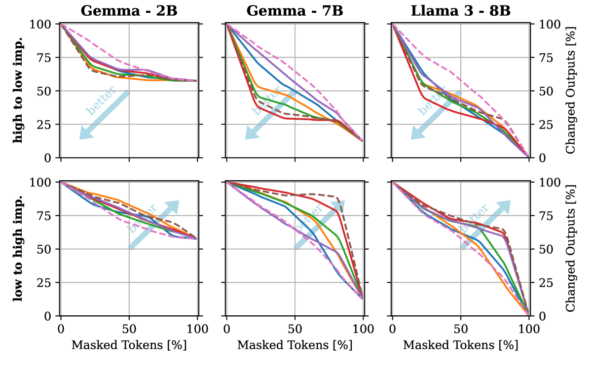
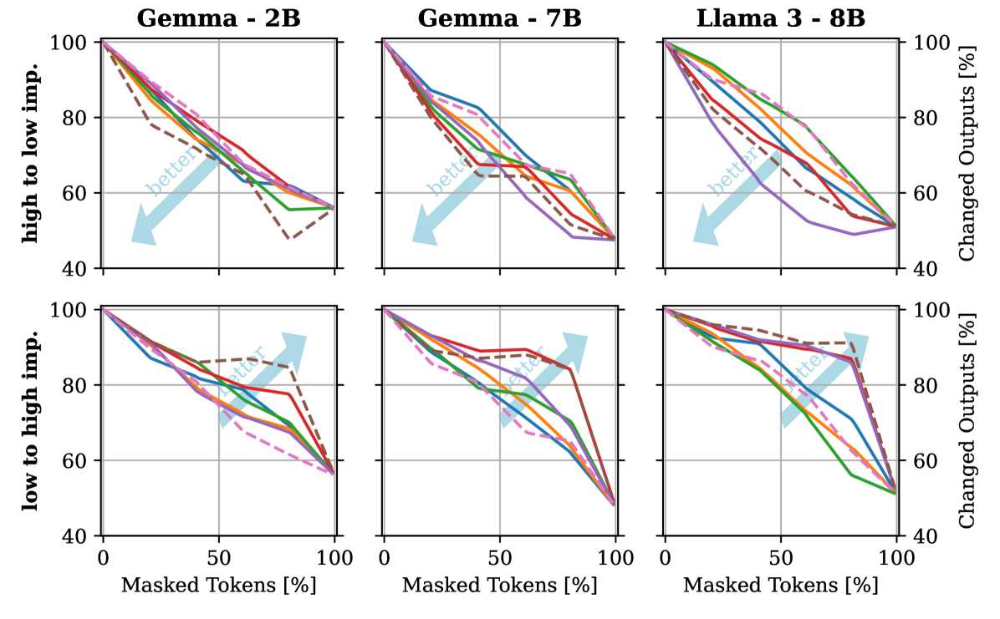

# 探究大型语言模型自我解释的可信度

发布时间：2024年07月19日

`LLM理论` `人工智能` `可解释性`

> Evaluating the Reliability of Self-Explanations in Large Language Models

# 摘要

> 本研究探讨了 LLM 在解释自身输出时的可靠性，评估了抽取式和反事实两种自我解释方法。研究发现，尽管这些解释与人类判断相关，但并未完全反映模型的决策过程，存在感知与实际推理的差距。通过生成反事实解释，这一差距得以弥合，产生忠实、信息丰富且易于验证的结果。这些反事实解释为传统可解释性方法提供了有前景的替代方案，关键在于定制提示并确保其有效性。

> This paper investigates the reliability of explanations generated by large language models (LLMs) when prompted to explain their previous output. We evaluate two kinds of such self-explanations - extractive and counterfactual - using three state-of-the-art LLMs (2B to 8B parameters) on two different classification tasks (objective and subjective). Our findings reveal, that, while these self-explanations can correlate with human judgement, they do not fully and accurately follow the model's decision process, indicating a gap between perceived and actual model reasoning. We show that this gap can be bridged because prompting LLMs for counterfactual explanations can produce faithful, informative, and easy-to-verify results. These counterfactuals offer a promising alternative to traditional explainability methods (e.g. SHAP, LIME), provided that prompts are tailored to specific tasks and checked for validity.

[Arxiv](https://arxiv.org/abs/2407.14487)