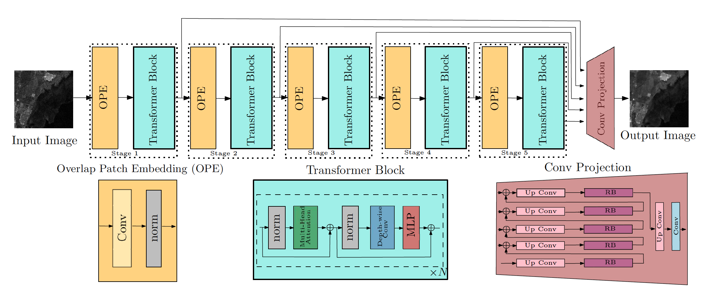
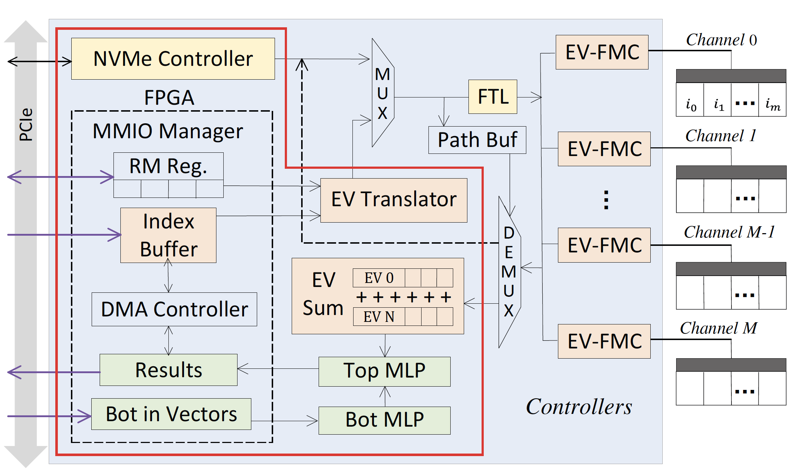
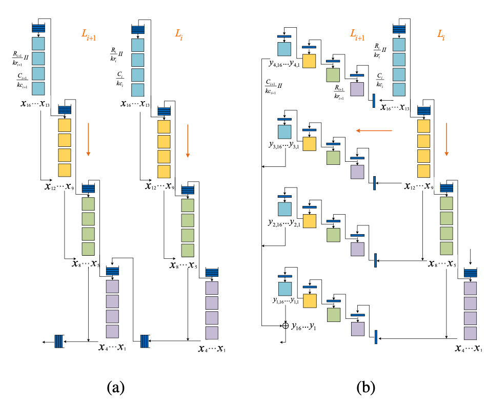

# 深度学习的尖端探索：跨越创新应用至实际部署

发布时间：2024年07月19日

`LLM理论` `图像处理` `推荐系统`

> Frontiers of Deep Learning: From Novel Application to Real-World Deployment

# 摘要

> 深度学习正不断革新多个领域，涵盖自然语言处理、图像识别、数据分析及推荐系统等。本报告深入探讨了两篇近期深度学习研究论文，它们分别从不同角度展示了该领域的进步：首篇论文利用常用于语言处理的transformer网络，显著降低了合成孔径雷达图像中的斑点噪声，提升了图像质量；第二篇论文则提出了一种创新的存储内计算架构，旨在打造经济高效且性能卓越的深度学习推荐系统。报告不仅概述了各论文的核心理念、技术手段及评估成果，还展望了未来研究的可能方向。通过细致研读这两篇论文及其相关文献，该博士生对深度学习的长远影响及其高效应用有了更深刻的认识。

> Deep learning continues to re-shape numerous fields, from natural language processing and imaging to data analytics and recommendation systems. This report studies two research papers that represent recent progress on deep learning from two largely different aspects: The first paper applied the transformer networks, which are typically used in language models, to improve the quality of synthetic aperture radar image by effectively reducing the speckle noise. The second paper presents an in-storage computing design solution to enable cost-efficient and high-performance implementations of deep learning recommendation systems. In addition to summarizing each paper in terms of motivation, key ideas and techniques, and evaluation results, this report also presents thoughts and discussions about possible future research directions. By carrying out in-depth study on these two representative papers and related references, this doctoral candidate has developed better understanding on the far-reaching impact and efficient implementation of deep learning models.

[Arxiv](https://arxiv.org/abs/2407.14386)