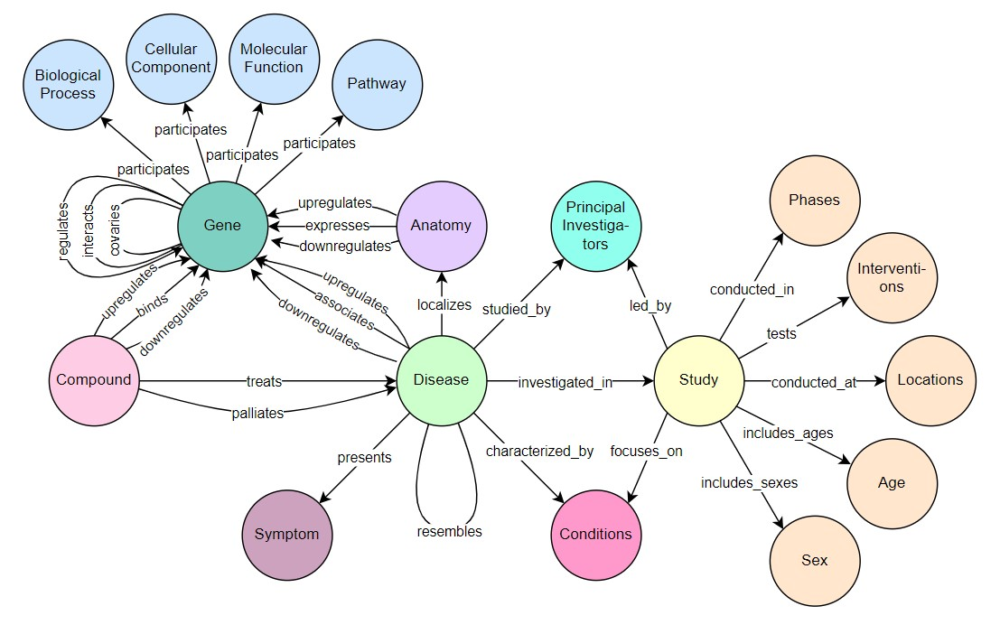
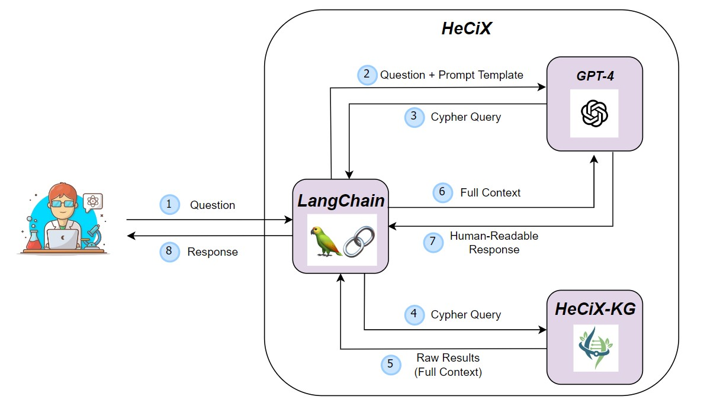
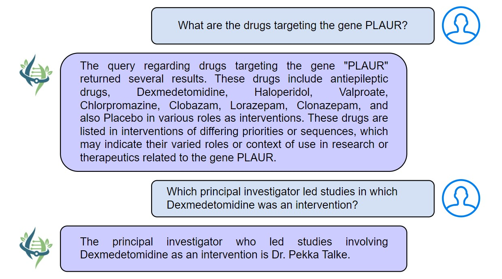

# HeCiX 项目旨在整合知识图谱与大型语言模型，以推动生物医学研究的发展。

发布时间：2024年07月19日

`LLM应用` `生物技术`

> HeCiX: Integrating Knowledge Graphs and Large Language Models for Biomedical Research

# 摘要

> 尽管药物研发策略不断进步，但临床试验失败率仍高达90%，凸显了目标验证和药物优化中的盲点。为此，我们创新性地融合了ClinicalTrials.gov与Hetionet的数据，构建了HeCiX-KG知识图谱，为临床研究提供了全面的数据支持。同时，我们开发的HeCiX系统，通过LangChain技术与GPT-4结合，大幅提升了数据利用效率。在多项临床相关问题的测试中，HeCiX表现卓越，预示着其在提升临床研究效能方面的广阔前景。这一创新方法不仅拓宽了临床试验的视野，也为生物数据的整合利用开辟了新路径。

> Despite advancements in drug development strategies, 90% of clinical trials fail. This suggests overlooked aspects in target validation and drug optimization. In order to address this, we introduce HeCiX-KG, Hetionet-Clinicaltrials neXus Knowledge Graph, a novel fusion of data from ClinicalTrials.gov and Hetionet in a single knowledge graph. HeCiX-KG combines data on previously conducted clinical trials from ClinicalTrials.gov, and domain expertise on diseases and genes from Hetionet. This offers a thorough resource for clinical researchers. Further, we introduce HeCiX, a system that uses LangChain to integrate HeCiX-KG with GPT-4, and increase its usability. HeCiX shows high performance during evaluation against a range of clinically relevant issues, proving this model to be promising for enhancing the effectiveness of clinical research. Thus, this approach provides a more holistic view of clinical trials and existing biological data.

[Arxiv](https://arxiv.org/abs/2407.14030)