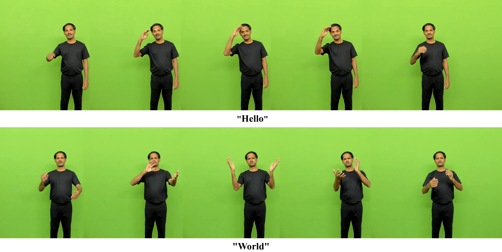
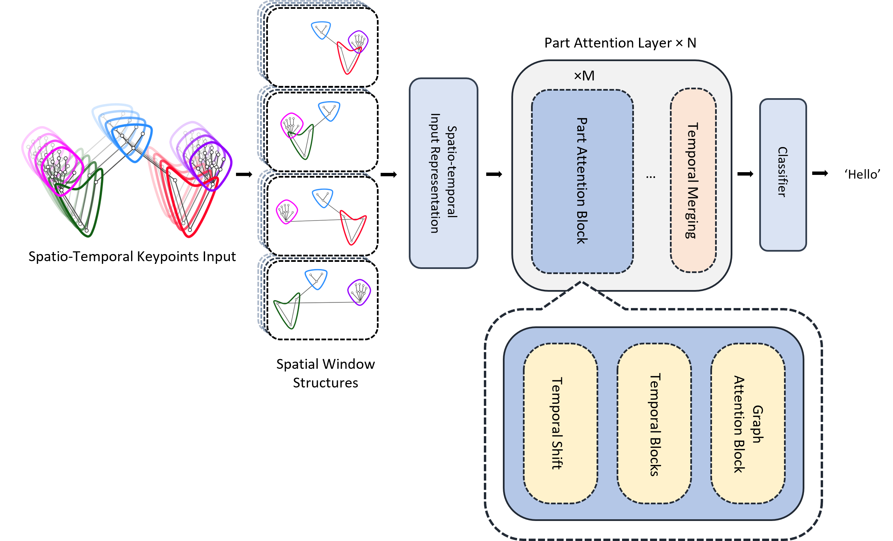
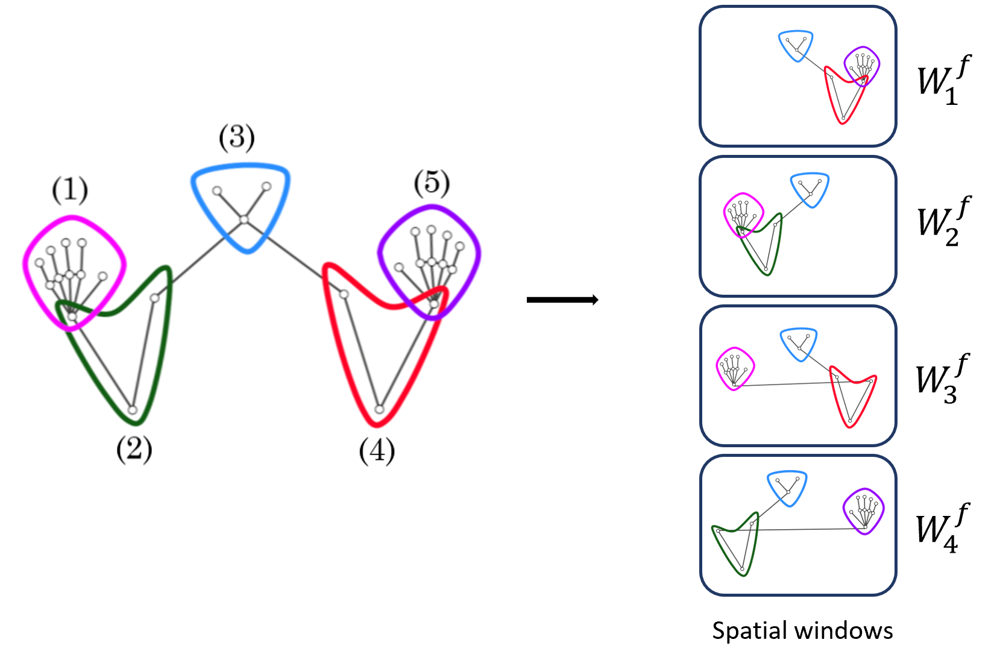
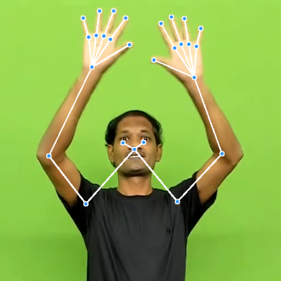
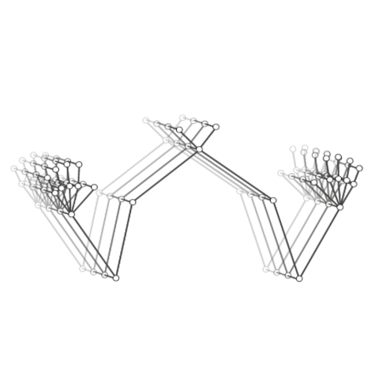
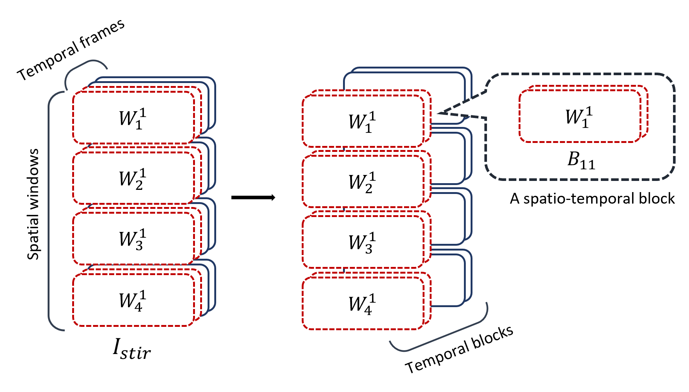
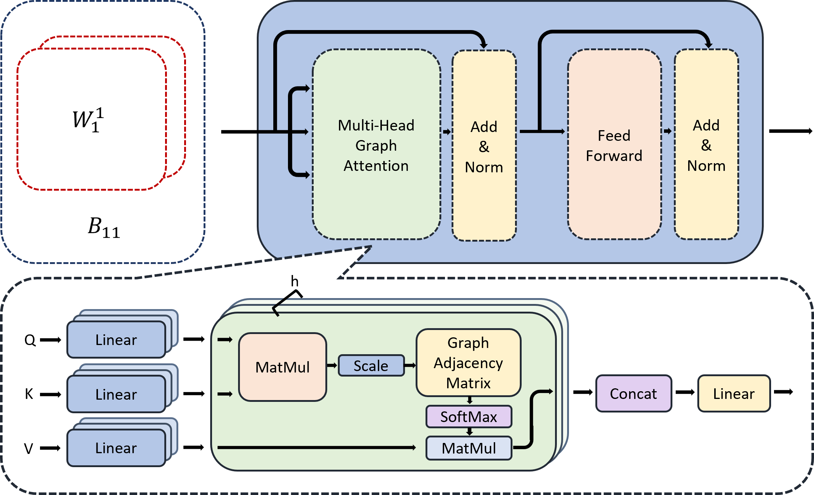
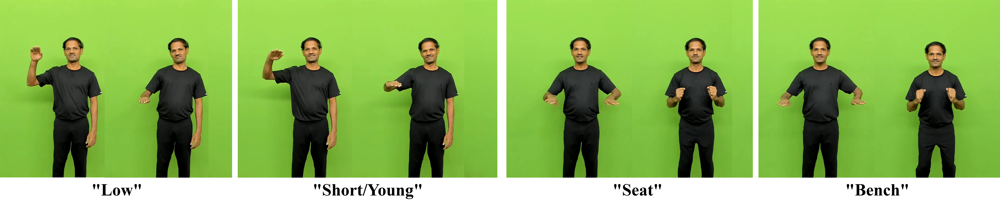

# 分层窗口图注意力网络与大规模数据集助力孤立印度手语识别

发布时间：2024年07月19日

`Agent` `计算机视觉` `手语识别`

> Hierarchical Windowed Graph Attention Network and a Large Scale Dataset for Isolated Indian Sign Language Recognition

# 摘要

> 在计算机视觉领域，自动手语识别是一项关键任务。为构建强大的手语识别系统，我们急需大量数据，尤其是在印度手语方面。本文中，我们引入了大规模的孤立印度手语数据集及基于骨架图结构的新型识别模型。该数据集收录了2,002个聋人社区常用词汇，由20名成年聋人录制，共40033个视频。我们提出的分层窗口图注意力网络（HWGAT）模型，利用人体上半身骨架结构，精准捕捉独特动作。通过广泛实验，我们验证了数据集的实用性和模型的有效性。在自建数据集上预训练并微调后，模型在多个手语数据集上的性能显著提升，超越了现有顶尖的基于骨架的模型。

> Automatic Sign Language (SL) recognition is an important task in the computer vision community. To build a robust SL recognition system, we need a considerable amount of data which is lacking particularly in Indian sign language (ISL). In this paper, we propose a large-scale isolated ISL dataset and a novel SL recognition model based on skeleton graph structure. The dataset covers 2,002 daily used common words in the deaf community recorded by 20 (10 male and 10 female) deaf adult signers (contains 40033 videos). We propose a SL recognition model namely Hierarchical Windowed Graph Attention Network (HWGAT) by utilizing the human upper body skeleton graph structure. The HWGAT tries to capture distinctive motions by giving attention to different body parts induced by the human skeleton graph structure. The utility of the proposed dataset and the usefulness of our model are evaluated through extensive experiments. We pre-trained the proposed model on the proposed dataset and fine-tuned it across different sign language datasets further boosting the performance of 1.10, 0.46, 0.78, and 6.84 percentage points on INCLUDE, LSA64, AUTSL and WLASL respectively compared to the existing state-of-the-art skeleton-based models.

[Arxiv](https://arxiv.org/abs/2407.14224)