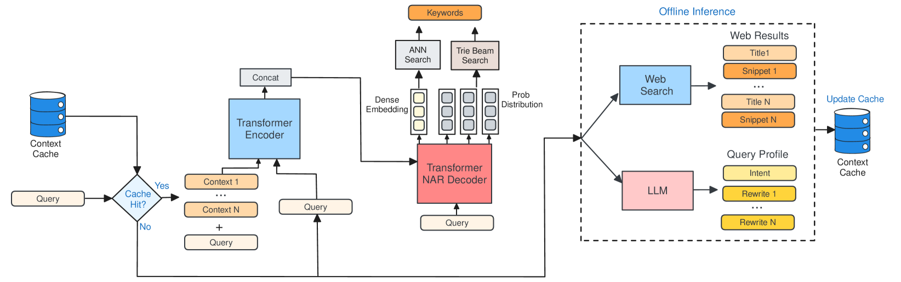

# 借助查询上下文信号，提升赞助搜索的检索效果

发布时间：2024年07月19日

`LLM应用` `在线广告` `搜索引擎`

> Improving Retrieval in Sponsored Search by Leveraging Query Context Signals

# 摘要

> 在赞助搜索中，准确捕捉用户查询的竞价关键词至关重要，尤其对于短而模糊的查询，这一挑战更为突出。为此，我们创新性地结合网页搜索结果和大型语言模型的丰富上下文，通过在线缓存增强查询理解。具体操作包括：利用网页标题和摘要，将查询与现实信息对接；借助GPT-4，生成查询重写和解释，精准把握用户意图。通过Fusion-in-Decoder的Unity架构，我们实现了高效集成，确保了检索性能与传统无上下文模型相当的服务成本。针对缓存中缺乏上下文的情况，我们设计了“上下文扫视”策略，通过课程学习提升模型在无上下文信号时的鲁棒性和性能。离线实验和在线A/B测试均证实，我们的上下文感知方法在用户参与度和收入方面带来了显著提升。

> Accurately retrieving relevant bid keywords for user queries is critical in Sponsored Search but remains challenging, particularly for short, ambiguous queries. Existing dense and generative retrieval models often fail to capture nuanced user intent in these cases. To address this, we propose an approach to enhance query understanding by augmenting queries with rich contextual signals derived from web search results and large language models, stored in an online cache. Specifically, we use web search titles and snippets to ground queries in real-world information and utilize GPT-4 to generate query rewrites and explanations that clarify user intent. These signals are efficiently integrated through a Fusion-in-Decoder based Unity architecture, enabling both dense and generative retrieval with serving costs on par with traditional context-free models. To address scenarios where context is unavailable in the cache, we introduce context glancing, a curriculum learning strategy that improves model robustness and performance even without contextual signals during inference. Extensive offline experiments demonstrate that our context-aware approach substantially outperforms context-free models. Furthermore, online A/B testing on a prominent search engine across 160+ countries shows significant improvements in user engagement and revenue.

[Arxiv](https://arxiv.org/abs/2407.14346)