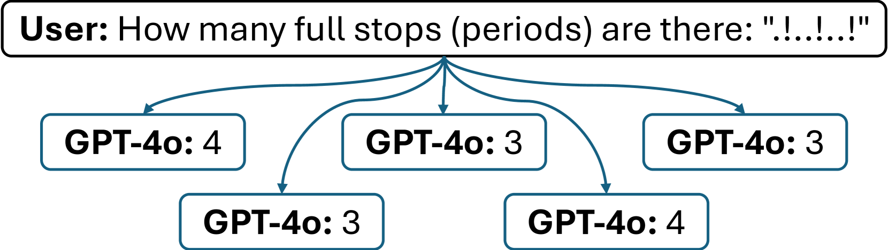
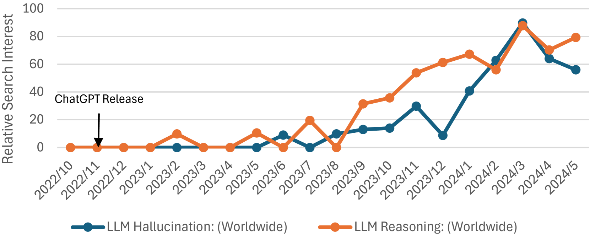
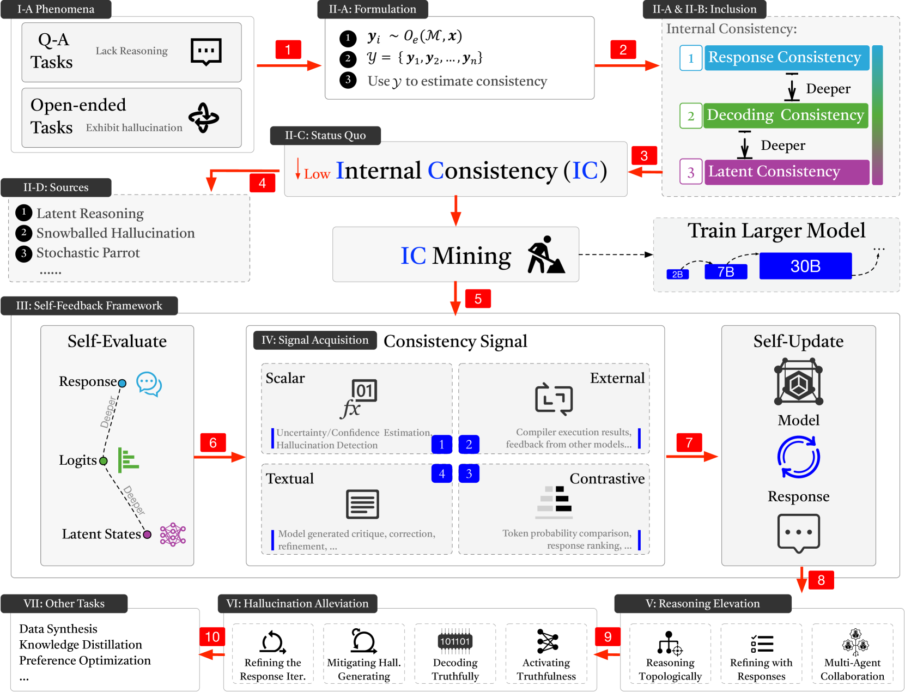
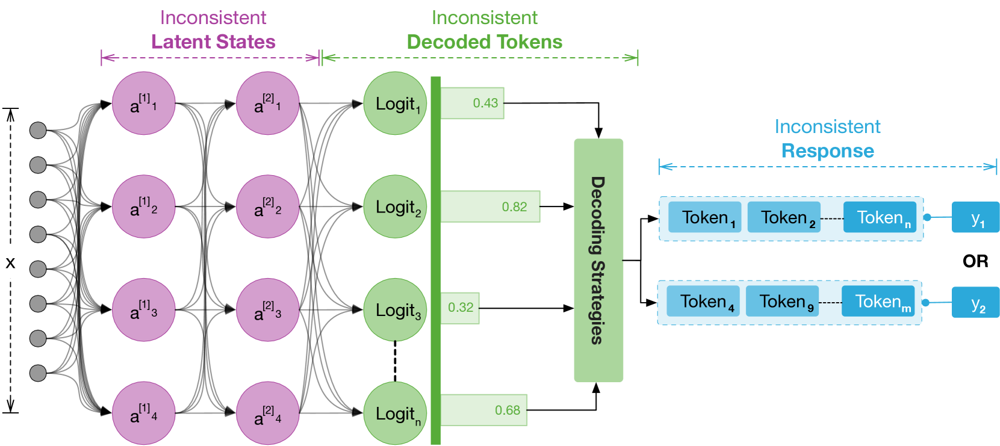
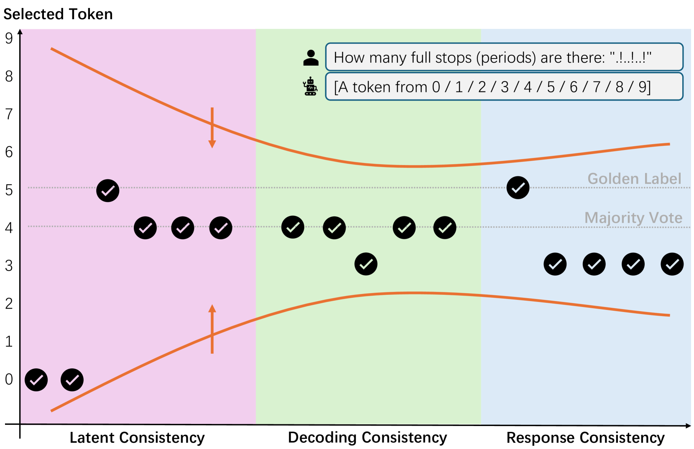
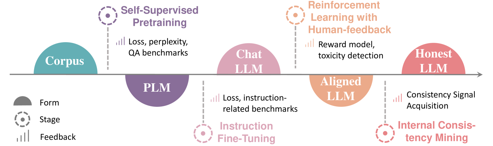
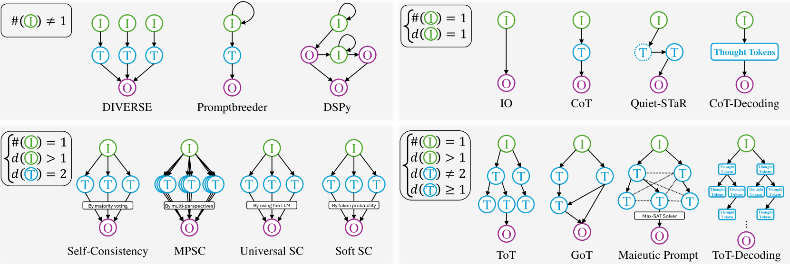
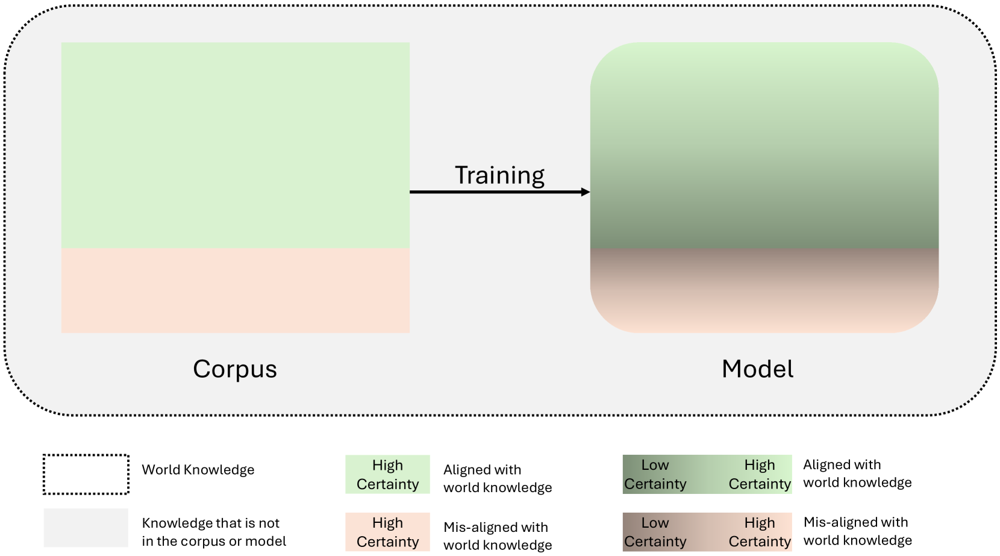

# 大型语言模型中的内部一致性与自我反馈探究

发布时间：2024年07月19日

`LLM理论` `人工智能` `计算机科学`

> Internal Consistency and Self-Feedback in Large Language Models: A Survey

# 摘要

> 大型语言模型（LLM）虽被寄予厚望，却常因推理不足或产生幻觉内容而令人失望。为此，一系列以“自我”为名的研究应运而生，如自我一致性、自我改进和自我细化，旨在通过模型自我评估与更新来解决问题。然而，这些研究缺乏统一的总结视角，因为现有调查多聚焦于分类而非探究其背后的动机。  本文提出了一个名为“内部一致性”的理论框架，为推理缺失和幻觉现象提供了统一解释。该框架通过采样方法评估模型各层间的连贯性，并在此基础上引入了“自我反馈”框架，包含自我评估与自我更新两大模块，已被广泛应用于相关研究。  我们系统梳理了这些研究的任务分类和工作线索，总结了评估方法和基准，并深入探讨了“自我反馈”的实际效果。我们提出了“内部一致性的沙漏进化”、“一致性即（几乎）正确性”等关键假设，并指出了未来研究的方向。相关实验代码、参考列表和统计数据已开源，详情请访问 \url{https://github.com/IAAR-Shanghai/ICSFSurvey}。

> Large language models (LLMs) are expected to respond accurately but often exhibit deficient reasoning or generate hallucinatory content. To address these, studies prefixed with ``Self-'' such as Self-Consistency, Self-Improve, and Self-Refine have been initiated. They share a commonality: involving LLMs evaluating and updating itself to mitigate the issues. Nonetheless, these efforts lack a unified perspective on summarization, as existing surveys predominantly focus on categorization without examining the motivations behind these works.
  In this paper, we summarize a theoretical framework, termed Internal Consistency, which offers unified explanations for phenomena such as the lack of reasoning and the presence of hallucinations. Internal Consistency assesses the coherence among LLMs' latent layer, decoding layer, and response layer based on sampling methodologies. Expanding upon the Internal Consistency framework, we introduce a streamlined yet effective theoretical framework capable of mining Internal Consistency, named Self-Feedback. The Self-Feedback framework consists of two modules: Self-Evaluation and Self-Update. This framework has been employed in numerous studies.
  We systematically classify these studies by tasks and lines of work; summarize relevant evaluation methods and benchmarks; and delve into the concern, ``Does Self-Feedback Really Work?'' We propose several critical viewpoints, including the ``Hourglass Evolution of Internal Consistency'', ``Consistency Is (Almost) Correctness'' hypothesis, and ``The Paradox of Latent and Explicit Reasoning''. Furthermore, we outline promising directions for future research. We have open-sourced the experimental code, reference list, and statistical data, available at \url{https://github.com/IAAR-Shanghai/ICSFSurvey}.

[Arxiv](https://arxiv.org/abs/2407.14507)