# KoMA：一个知识驱动型多智能体框架，专为搭载大型语言模型的自动驾驶系统设计。

发布时间：2024年07月19日

`Agent` `自动驾驶` `交通运输`

> KoMA: Knowledge-driven Multi-agent Framework for Autonomous Driving with Large Language Models

# 摘要

> 大型语言模型（LLM）作为自主代理，为解决现实挑战开辟了知识驱动的新途径。这些LLM增强方法在泛化与解释性上表现卓越。然而，驾驶任务的复杂性常需多异构代理协同，凸显了LLM代理间合作知识共享与认知协同的必要。当前应用多聚焦于单一代理场景。为拓展知识驱动策略并强化自主代理泛化力，我们提出KoMA框架，含多代理交互、多步规划、共享内存及基于排名的反思模块，旨在提升复杂驾驶场景中多代理决策。框架基于生成的驾驶场景描述，使LLM代理能分析推断周围车辆意图，类似人类认知。多步规划模块确保短期决策一致性。共享内存积累集体经验以优化决策，而反思模块评估改进代理行为，提升驾驶安全与效率。KoMA框架不仅增强自动驾驶代理的鲁健与适应性，更显著提升其在多样场景中的泛化力。实证显示，我们的方法在处理复杂不可预测驾驶环境上优于传统方法，尤其在无需大量再训练的情况下。

> Large language models (LLMs) as autonomous agents offer a novel avenue for tackling real-world challenges through a knowledge-driven manner. These LLM-enhanced methodologies excel in generalization and interpretability. However, the complexity of driving tasks often necessitates the collaboration of multiple, heterogeneous agents, underscoring the need for such LLM-driven agents to engage in cooperative knowledge sharing and cognitive synergy. Despite the promise of LLMs, current applications predominantly center around single agent scenarios. To broaden the horizons of knowledge-driven strategies and bolster the generalization capabilities of autonomous agents, we propose the KoMA framework consisting of multi-agent interaction, multi-step planning, shared-memory, and ranking-based reflection modules to enhance multi-agents' decision-making in complex driving scenarios. Based on the framework's generated text descriptions of driving scenarios, the multi-agent interaction module enables LLM agents to analyze and infer the intentions of surrounding vehicles, akin to human cognition. The multi-step planning module enables LLM agents to analyze and obtain final action decisions layer by layer to ensure consistent goals for short-term action decisions. The shared memory module can accumulate collective experience to make superior decisions, and the ranking-based reflection module can evaluate and improve agent behavior with the aim of enhancing driving safety and efficiency. The KoMA framework not only enhances the robustness and adaptability of autonomous driving agents but also significantly elevates their generalization capabilities across diverse scenarios. Empirical results demonstrate the superiority of our approach over traditional methods, particularly in its ability to handle complex, unpredictable driving environments without extensive retraining.

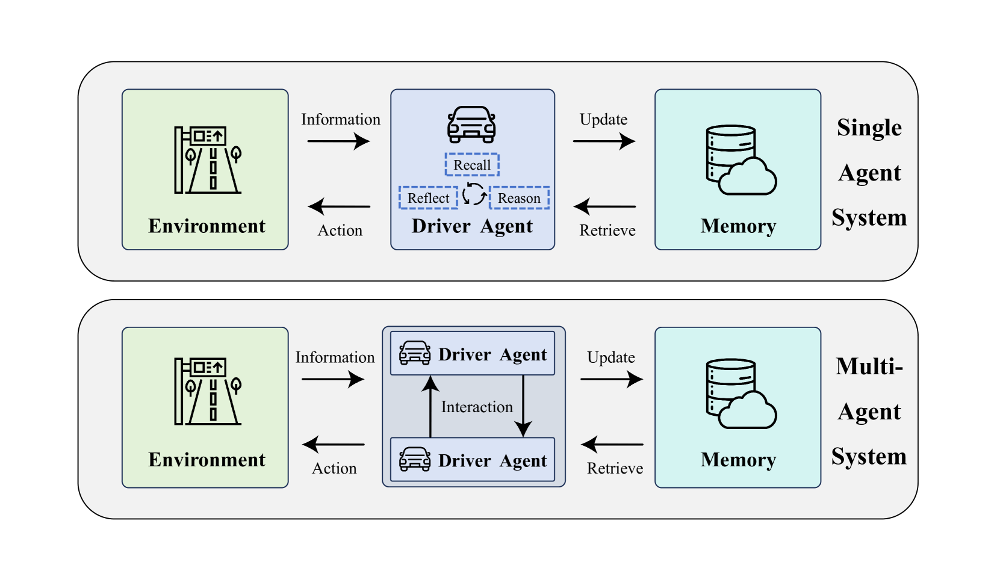

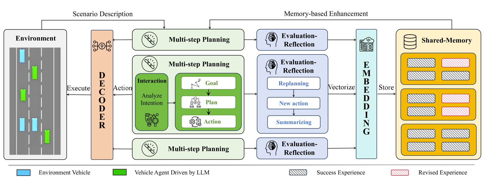

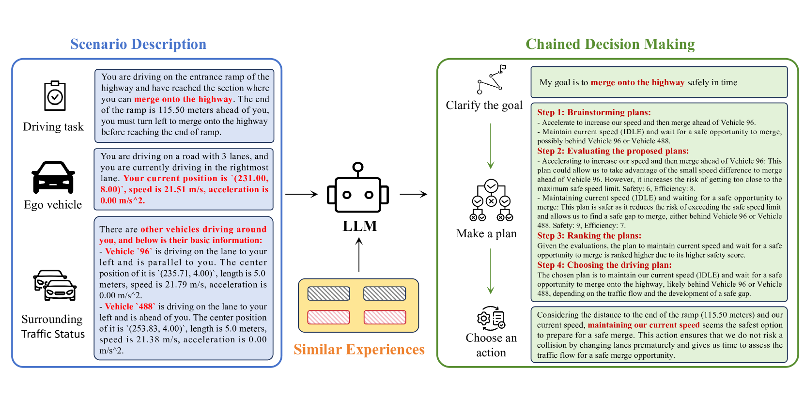

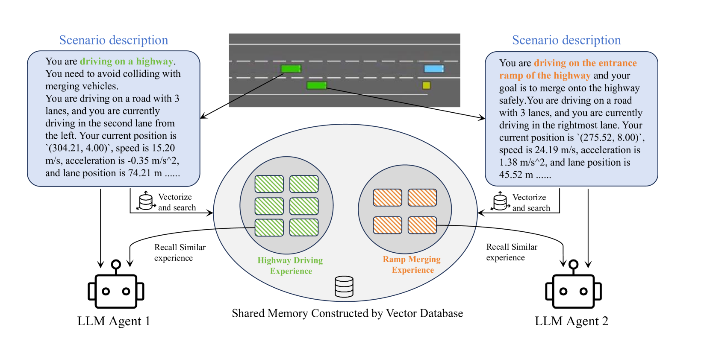

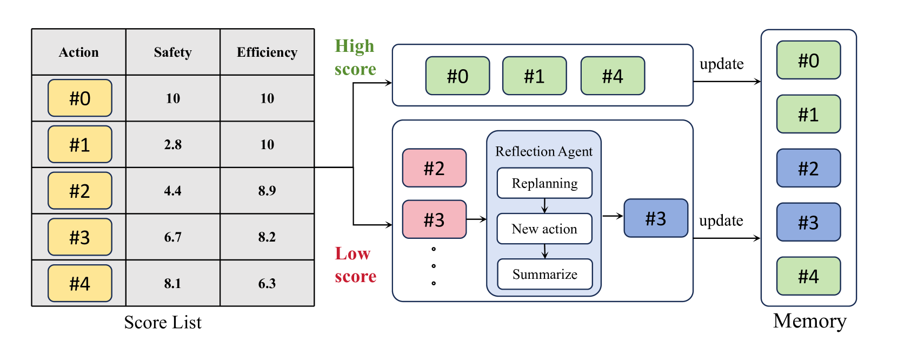

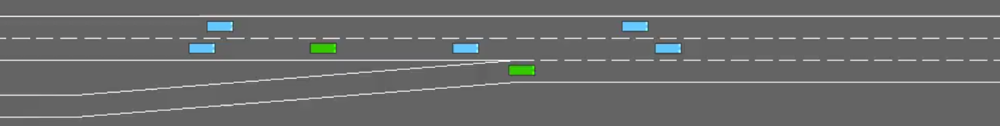

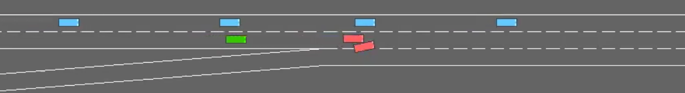

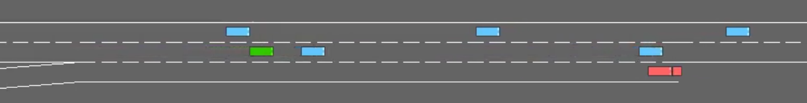

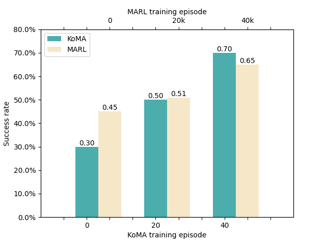

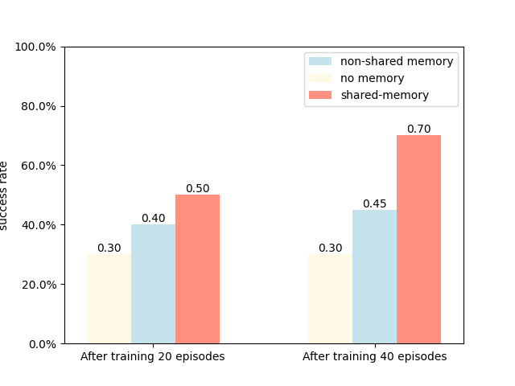

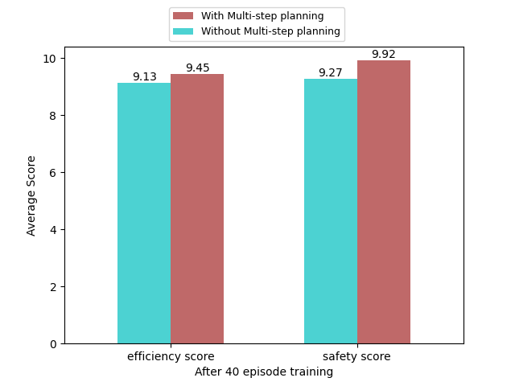

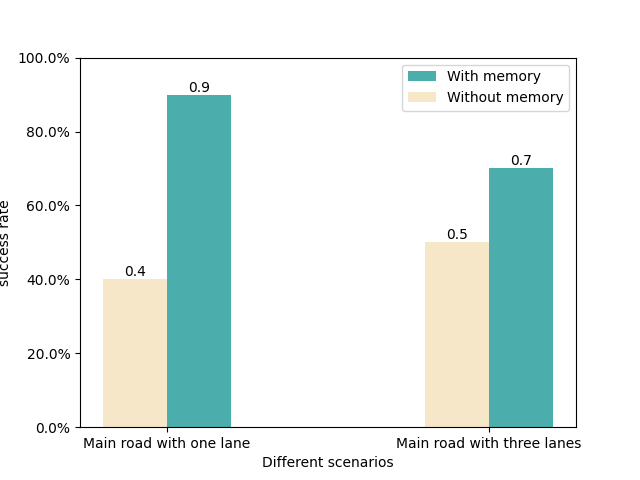

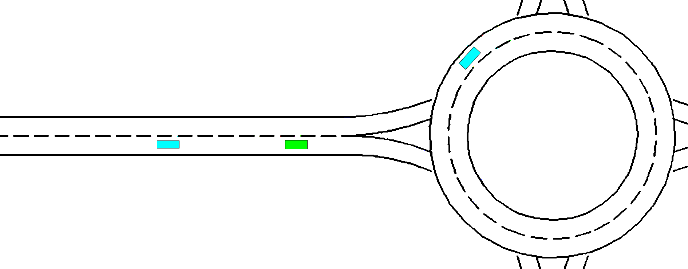

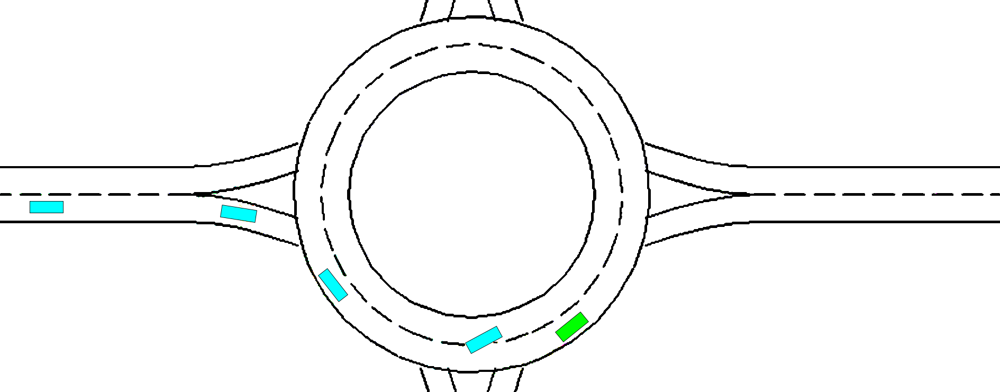

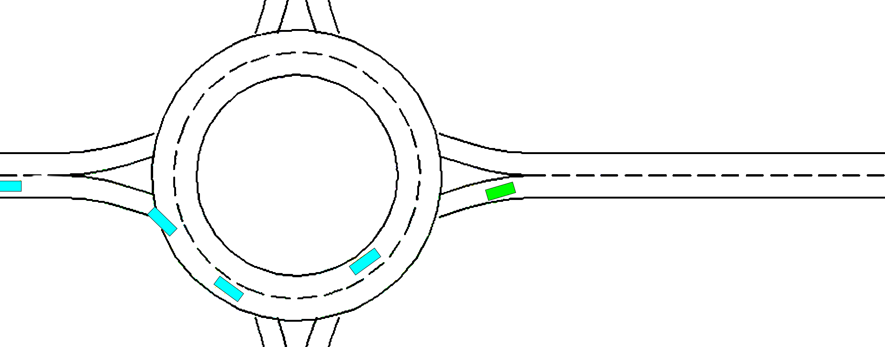

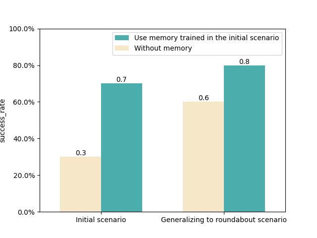

[Arxiv](https://arxiv.org/abs/2407.14239)