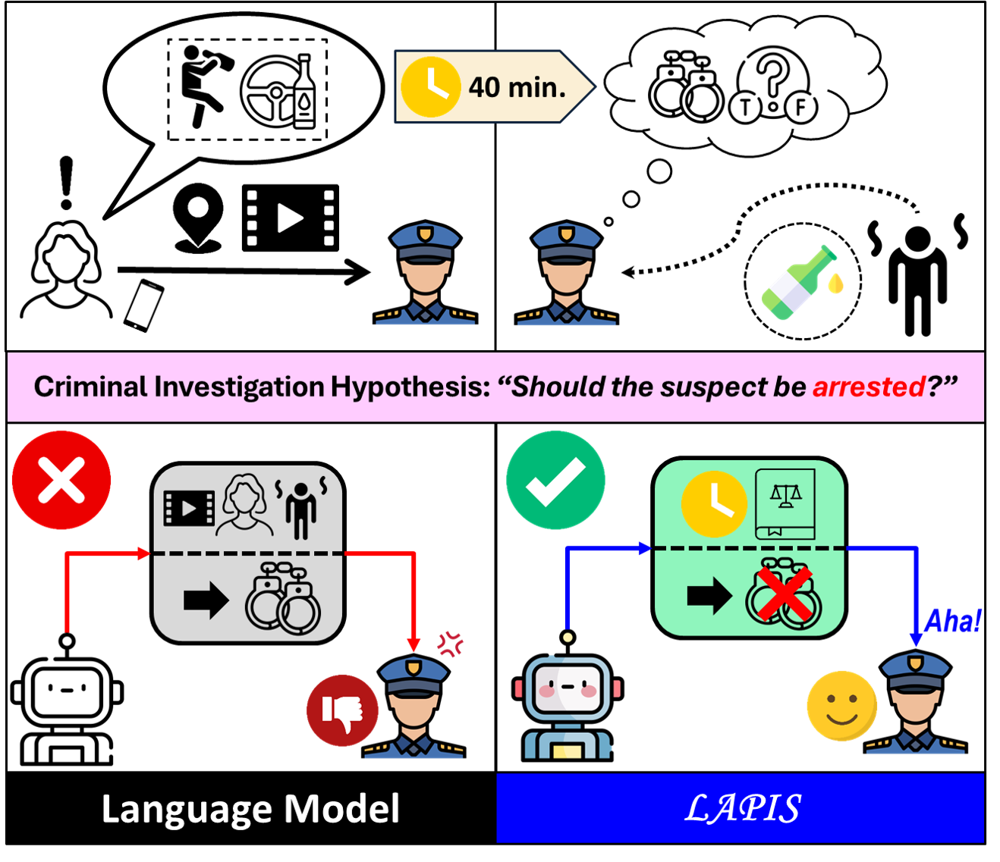
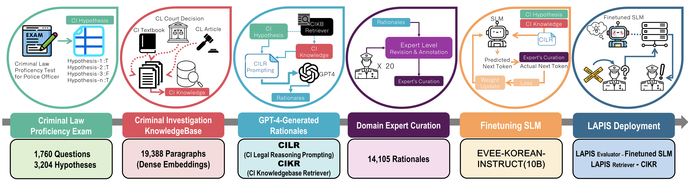
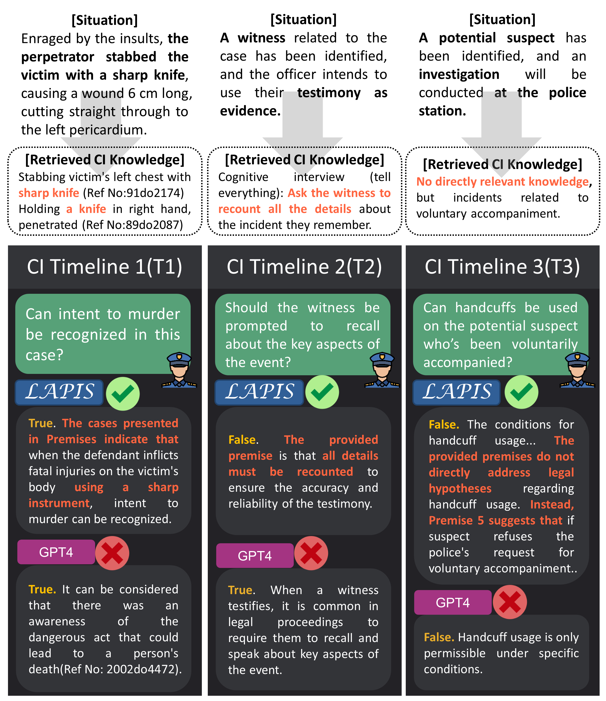

# LAPIS：一款结合语言模型技术的警察调查增强系统

发布时间：2024年07月19日

`LLM应用` `公共安全`

> LAPIS: Language Model-Augmented Police Investigation System

# 摘要

> 在犯罪调查中，时间就是生命。我们推出的LAPIS系统，通过AI技术为警察提供即时的法律支持，确保调查行动既合理又合法。该系统结合了专家精心筛选的数据集和高效的知识检索机制，使得即使是小型韩语模型也能在法律推理任务中表现出色，其准确性甚至超越了GPT-4。LAPIS不仅加速了调查进程，更通过其精准的推理能力，确保了法律结论的正确性。

> Crime situations are race against time. An AI-assisted criminal investigation system, providing prompt but precise legal counsel is in need for police officers. We introduce LAPIS (Language Model Augmented Police Investigation System), an automated system that assists police officers to perform rational and legal investigative actions. We constructed a finetuning dataset and retrieval knowledgebase specialized in crime investigation legal reasoning task. We extended the dataset's quality by incorporating manual curation efforts done by a group of domain experts. We then finetuned the pretrained weights of a smaller Korean language model to the newly constructed dataset and integrated it with the crime investigation knowledgebase retrieval approach. Experimental results show LAPIS' potential in providing reliable legal guidance for police officers, even better than the proprietary GPT-4 model. Qualitative analysis on the rationales generated by LAPIS demonstrate the model's reasoning ability to leverage the premises and derive legally correct conclusions.

[Arxiv](https://arxiv.org/abs/2407.20248)