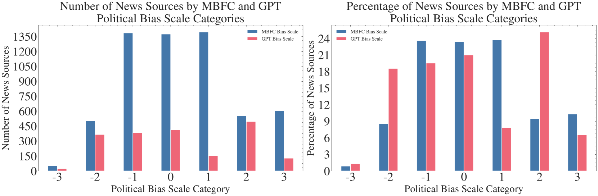
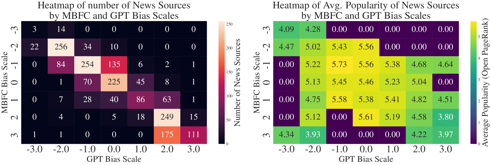
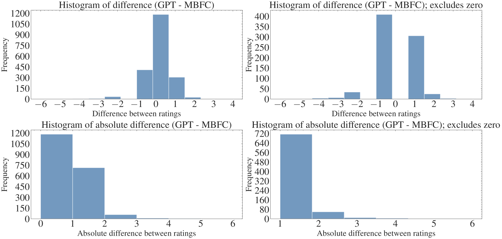
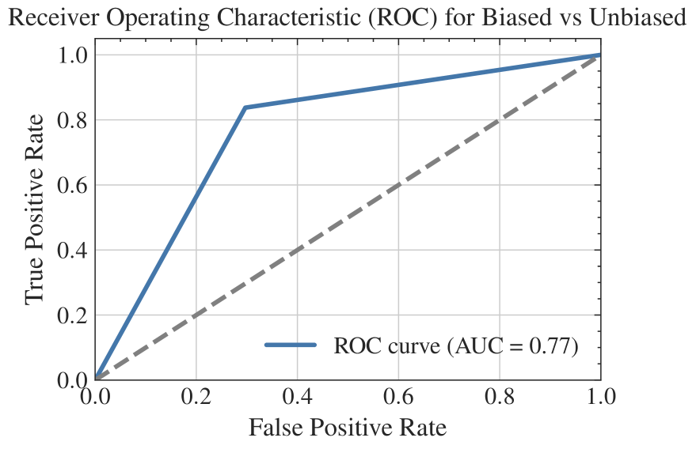
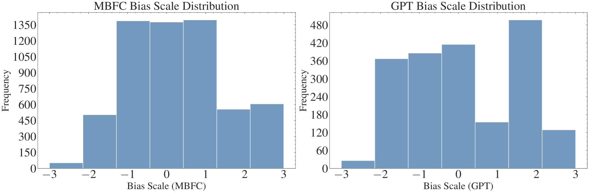
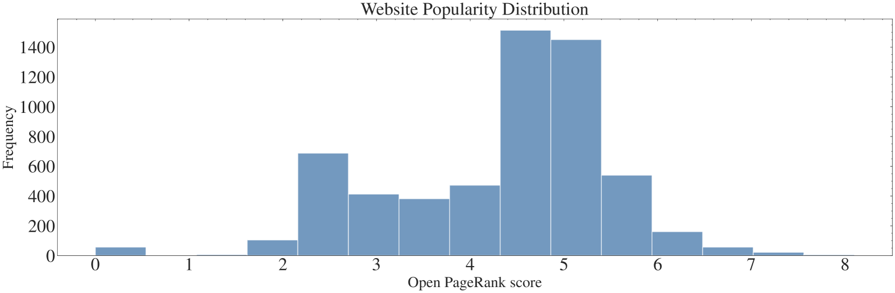

# GPT 在识别网络域名中的政治偏见方面能力如何？本研究全方位评估其表现。

发布时间：2024年07月19日

`LLM应用` `新闻媒体`

> LLMs left, right, and center: Assessing GPT's capabilities to label political bias from web domains

# 摘要

> 本研究探讨了OpenAI的GPT-4是否能仅凭新闻来源的URL准确识别其政治倾向。由于政治标签的主观性，研究常借助Ad Fontes Media、AllSides和MBFC等第三方评级来分析新闻多样性。我们旨在验证GPT-4能否在七级偏见尺度上复制人类评级。通过对比GPT-4与MBFC的评级，并控制网站流行度，我们发现两者高度相关（Spearman's ρ= .89，n = 5,877，p < 0.001），显示了GPT-4的可靠性。但GPT-4对约三分之二的数据集未作分类，尤其是那些不太流行和偏见较小的来源。此外，GPT-4的分类略偏左。研究建议，GPT-4虽可作为高效的政治偏见分类工具，但应结合人类判断以减少偏见。未来研究应进一步探索其在不同环境、语言和数据集上的表现。

> This research investigates whether OpenAI's GPT-4, a state-of-the-art large language model, can accurately classify the political bias of news sources based solely on their URLs. Given the subjective nature of political labels, third-party bias ratings like those from Ad Fontes Media, AllSides, and Media Bias/Fact Check (MBFC) are often used in research to analyze news source diversity. This study aims to determine if GPT-4 can replicate these human ratings on a seven-degree scale ("far-left" to "far-right"). The analysis compares GPT-4's classifications against MBFC's, and controls for website popularity using Open PageRank scores. Findings reveal a high correlation ($\text{Spearman's } ρ= .89$, $n = 5,877$, $p < 0.001$) between GPT-4's and MBFC's ratings, indicating the model's potential reliability. However, GPT-4 abstained from classifying approximately $\frac{2}{3}$ of the dataset, particularly less popular and less biased sources. The study also identifies a slight leftward skew in GPT-4's classifications compared to MBFC's. The analysis suggests that while GPT-4 can be a scalable, cost-effective tool for political bias classification of news websites, but its use should complement human judgment to mitigate biases. Further research is recommended to explore the model's performance across different settings, languages, and additional datasets.

[Arxiv](https://arxiv.org/abs/2407.14344)