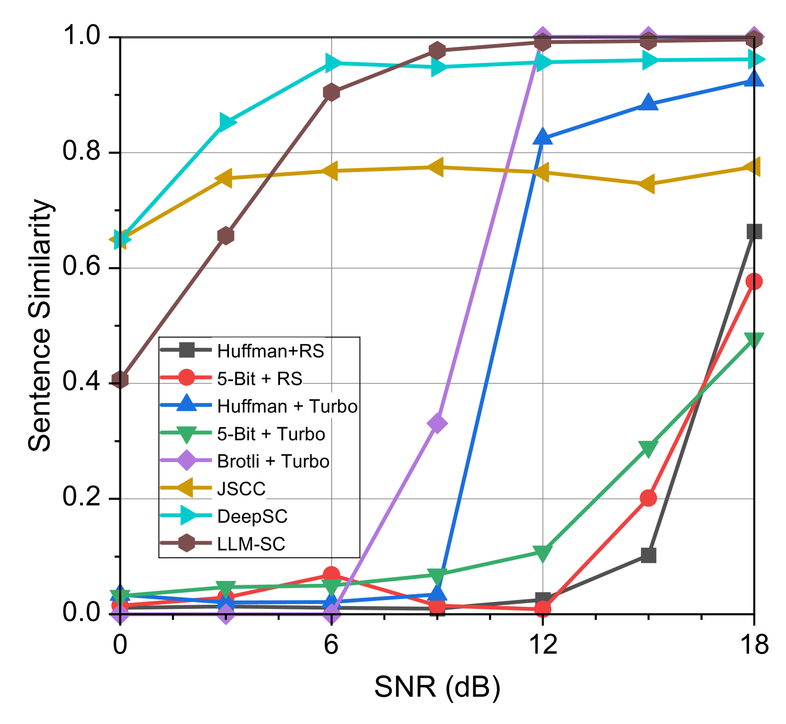
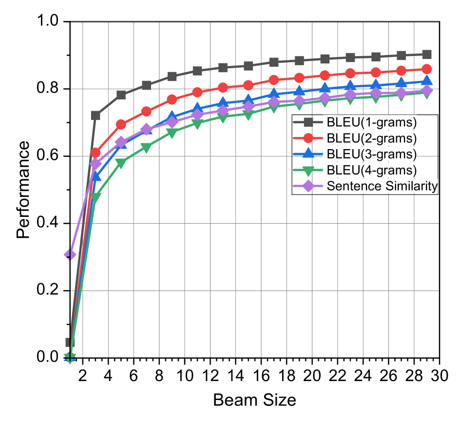

# 基于大型语言模型的语义通信系统

发布时间：2024年07月19日

`LLM应用` `信息技术`

> Large Language Model Enabled Semantic Communication Systems

# 摘要

> 大型语言模型 (LLM) 近期在多项自然语言处理 (NLP) 任务中表现卓越，接近人类水平，并与语义通信的核心原则高度一致。受此启发，我们创新性地提出了 LLM-SC 框架，首次将 LLM 直接应用于物理层编码与解码。通过深入分析 LLM 训练与语义通信优化目标的关联，我们设计了基于 LLM tokenizer 的语义编码器训练方法，并利用无监督预训练构建了语义知识库，助力构建高效解码器。在此基础上，我们确立了接收端的最佳解码策略，并优化了波束搜索算法以降低复杂度。此外，我们证实现有 LLM 可直接应用于 LLM-SC，无需额外训练或调整。仿真显示，LLM-SC 在信噪比超过 3 dB 时超越传统 DeepSC，实现高 SNR 下的无误语义信息传输。同时，LLM-SC 在技术性能上也表现出色，无需信道编码即可实现 8 dB 编码增益，且保持与传统系统相同的联合源信道编码速率。

> Large language models (LLMs) have recently demonstrated state-of-the-art performance across various natural language processing (NLP) tasks, achieving near-human levels in multiple language understanding challenges and aligning closely with the core principles of semantic communication. Inspired by LLMs' advancements in semantic processing, we propose an innovative LLM-enabled semantic communication system framework, named LLM-SC, that applies LLMs directly to the physical layer coding and decoding for the first time. By analyzing the relationship between the training process of LLMs and the optimization objectives of semantic communication, we propose training a semantic encoder through LLMs' tokenizer training and establishing a semantic knowledge base via the LLMs' unsupervised pre-training process. This knowledge base aids in constructing the optimal decoder by providing the prior probability of the transmitted language sequence. Based on this foundation, we derive the optimal decoding criterion for the receiver and introduce the beam search algorithm to further reduce the complexity. Furthermore, we assert that existing LLMs can be employed directly for LLM-SC without additional re-training or fine-tuning. Simulation results demonstrate that LLM-SC outperforms classical DeepSC at signal-to-noise ratios (SNR) exceeding 3 dB, enabling error-free transmission of semantic information under high SNR, which is unattainable by DeepSC. In addition to semantic-level performance, LLM-SC demonstrates compatibility with technical-level performance, achieving approximately 8 dB coding gain for a bit error ratio (BER) of $10^{-3}$ without any channel coding while maintaining the same joint source-channel coding rate as traditional communication systems.

[Arxiv](https://arxiv.org/abs/2407.14112)