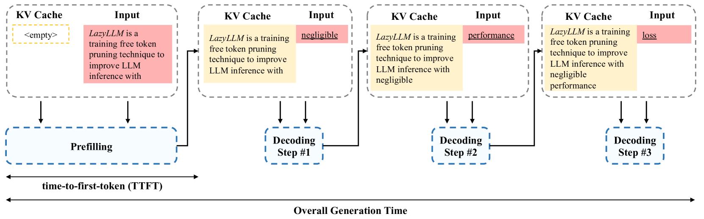
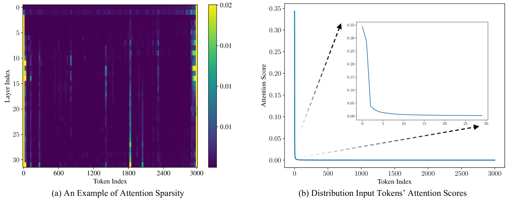
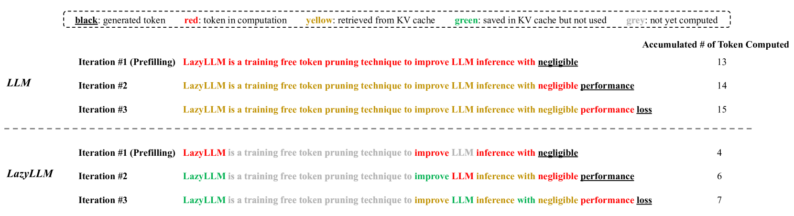
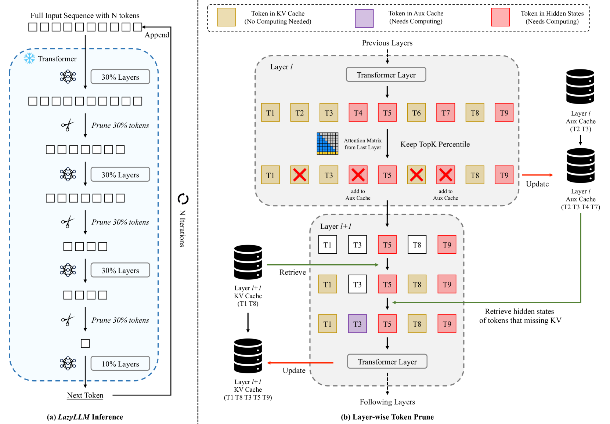
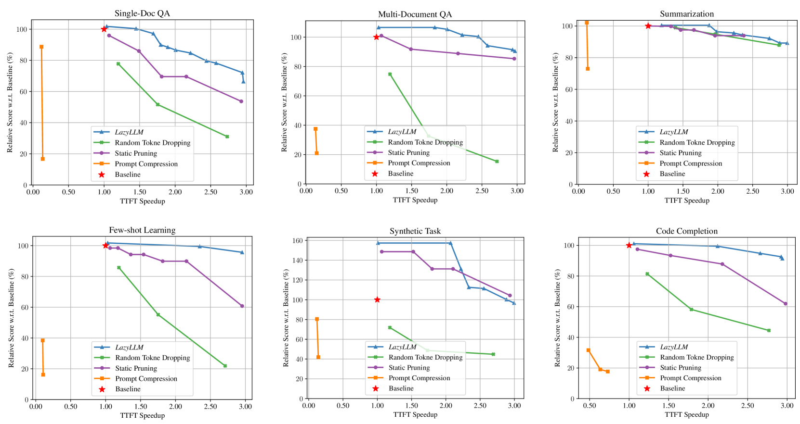
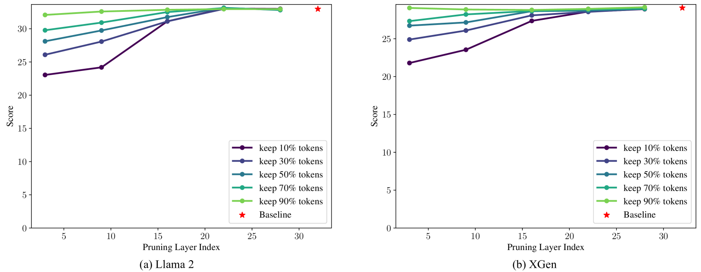
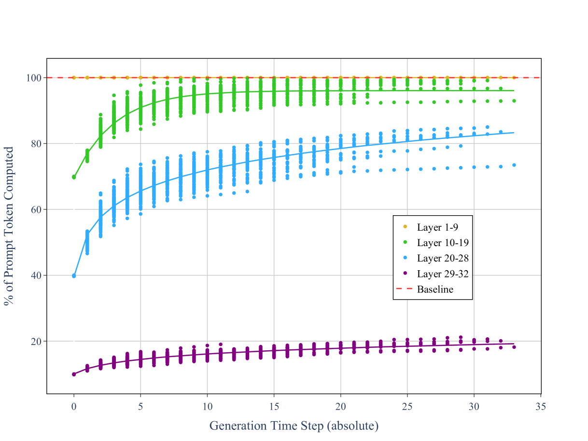

# LazyLLM：通过动态令牌修剪优化长上下文 LLM 推理效率

发布时间：2024年07月19日

`LLM应用` `问答系统` `人工智能`

> LazyLLM: Dynamic Token Pruning for Efficient Long Context LLM Inference

# 摘要

> 基于Transformer的大型语言模型推理分为两个阶段：预填充阶段计算提示的KV缓存并生成首个令牌，解码阶段生成后续令牌。对于长提示，预填充阶段需为所有令牌计算KV缓存，这可能成为生成过程的瓶颈。我们提出的LazyLLM方法，在预填充和解码阶段选择性地计算对下一个令牌预测重要的令牌的KV，与一次性修剪提示的静态方法不同，LazyLLM允许模型在不同生成步骤中动态选择令牌子集。实验证明，LazyLLM能无缝集成到现有模型中，显著加速生成而无需微调，如在多文档问答任务中，LazyLLM将LLama 2 7B模型的预填充阶段加速了2.34倍，同时保持了准确性。

> The inference of transformer-based large language models consists of two sequential stages: 1) a prefilling stage to compute the KV cache of prompts and generate the first token, and 2) a decoding stage to generate subsequent tokens. For long prompts, the KV cache must be computed for all tokens during the prefilling stage, which can significantly increase the time needed to generate the first token. Consequently, the prefilling stage may become a bottleneck in the generation process. An open question remains whether all prompt tokens are essential for generating the first token. To answer this, we introduce a novel method, LazyLLM, that selectively computes the KV for tokens important for the next token prediction in both the prefilling and decoding stages. Contrary to static pruning approaches that prune the prompt at once, LazyLLM allows language models to dynamically select different subsets of tokens from the context in different generation steps, even though they might be pruned in previous steps. Extensive experiments on standard datasets across various tasks demonstrate that LazyLLM is a generic method that can be seamlessly integrated with existing language models to significantly accelerate the generation without fine-tuning. For instance, in the multi-document question-answering task, LazyLLM accelerates the prefilling stage of the LLama 2 7B model by 2.34x while maintaining accuracy.

[Arxiv](https://arxiv.org/abs/2407.14057)