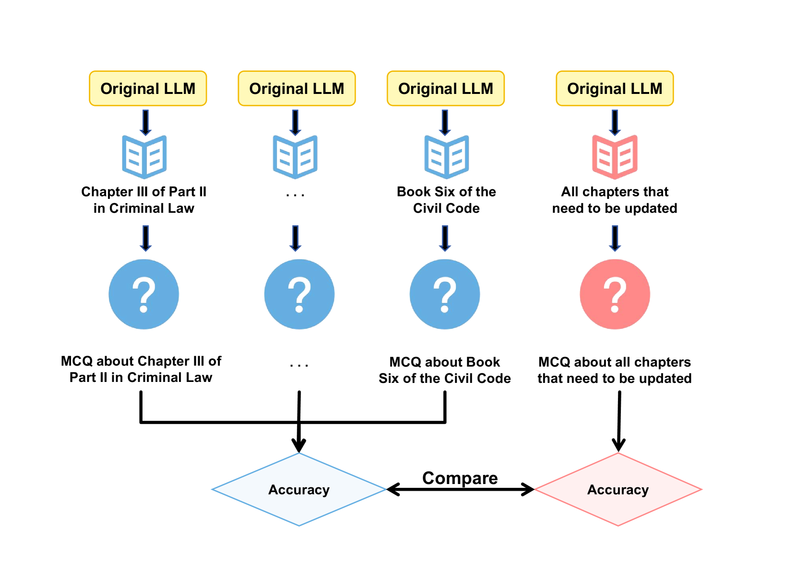
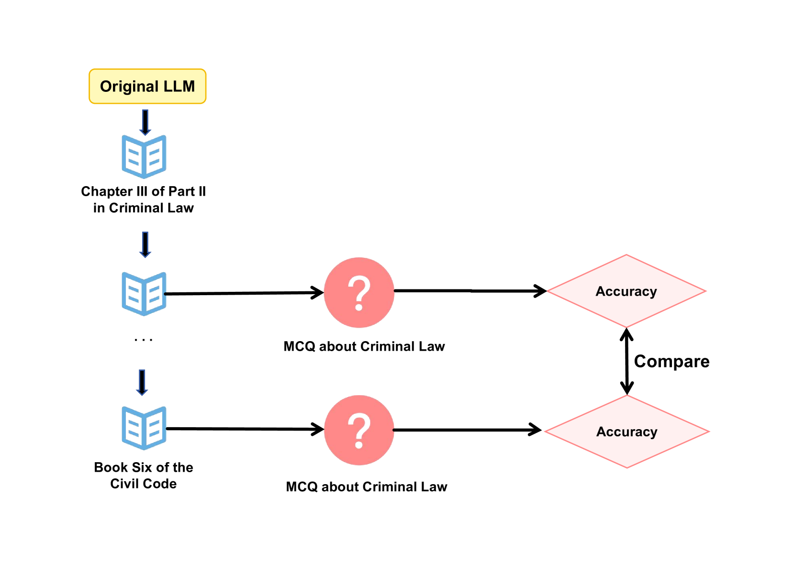
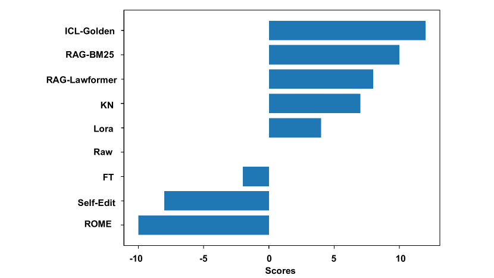

# LeKUBE：法律知识更新的标杆

发布时间：2024年07月19日

`LLM应用` `人工智能`

> LeKUBE: A Legal Knowledge Update BEnchmark

# 摘要

> 大型语言模型（LLM）的进步深刻影响了 AI 在法律智能等领域的应用。经过大量法律文本训练的 LLM 能有效捕捉法律知识，支持法律咨询等应用。然而，法律法规的动态性为 LLM 在法律领域的应用带来挑战，尤其是如何高效更新法律知识。现有评估基准多针对开放领域，难以应对法律领域的特殊挑战。为此，我们推出法律知识更新基准 LeKUBE，从五个维度评估知识更新方法。我们与法律专家合作，分类法律知识更新需求，并聘请法学院注释者制作中国刑法和民法的合成更新及相应问题集。评估显示，现有方法与法律领域需求存在显著差距，凸显了开发专门知识更新机制的必要性。

> Recent advances in Large Language Models (LLMs) have significantly shaped the applications of AI in multiple fields, including the studies of legal intelligence. Trained on extensive legal texts, including statutes and legal documents, the legal LLMs can capture important legal knowledge/concepts effectively and provide important support for downstream legal applications such as legal consultancy. Yet, the dynamic nature of legal statutes and interpretations also poses new challenges to the use of LLMs in legal applications. Particularly, how to update the legal knowledge of LLMs effectively and efficiently has become an important research problem in practice. Existing benchmarks for evaluating knowledge update methods are mostly designed for the open domain and cannot address the specific challenges of the legal domain, such as the nuanced application of new legal knowledge, the complexity and lengthiness of legal regulations, and the intricate nature of legal reasoning. To address this gap, we introduce the Legal Knowledge Update BEnchmark, i.e. LeKUBE, which evaluates knowledge update methods for legal LLMs across five dimensions. Specifically, we categorize the needs of knowledge updates in the legal domain with the help of legal professionals, and then hire annotators from law schools to create synthetic updates to the Chinese Criminal and Civil Code as well as sets of questions of which the answers would change after the updates. Through a comprehensive evaluation of state-of-the-art knowledge update methods, we reveal a notable gap between existing knowledge update methods and the unique needs of the legal domain, emphasizing the need for further research and development of knowledge update mechanisms tailored for legal LLMs.

[Arxiv](https://arxiv.org/abs/2407.14192)