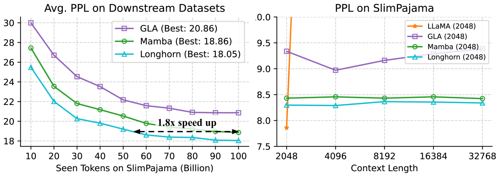
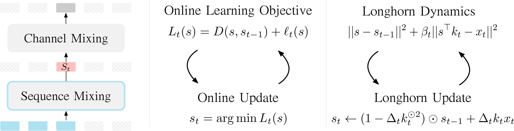
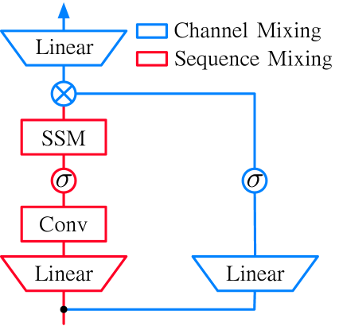
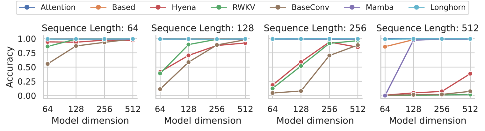
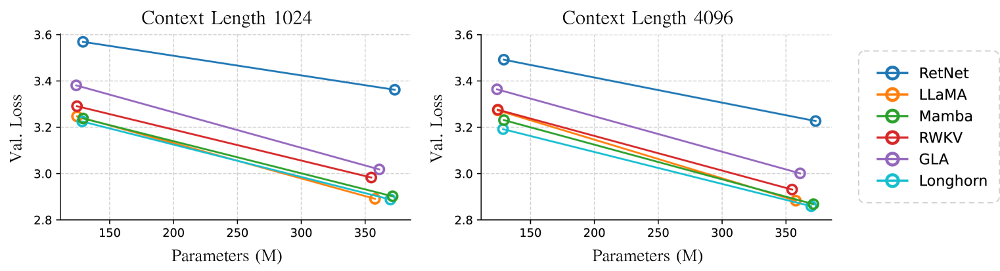

# Longhorn：状态空间模型实为摊销在线学习的高手

发布时间：2024年07月19日

`LLM理论` `人工智能` `计算机科学`

> Longhorn: State Space Models are Amortized Online Learners

# 摘要

> 大型语言模型（LLM）的核心能力在于预测长序列中的下一个标记，这一过程被称为“序列建模”。尽管Transformer模型在此领域占据主导地位，但其高昂的计算成本仍是一大短板。状态空间模型（SSM）以其高效的线性解码和并行训练能力，成为有力的竞争者。然而，现有SSM的设计往往缺乏系统性。我们通过在线学习的视角重新审视SSM设计，将其视为解决特定在线学习问题的元模块。这一创新方法不仅精确关联了SSM设计与在线学习目标，还通过优化这些目标推导出状态转换规则。基于此，我们提出了一种新型深度SSM架构，该架构通过隐式更新优化在线回归目标。实验证明，我们的模型在序列建模和语言建模任务中均超越了现有最先进模型，包括Mamba。

> The most fundamental capability of modern AI methods such as Large Language Models (LLMs) is the ability to predict the next token in a long sequence of tokens, known as ``sequence modeling." Although the Transformers model is the current dominant approach to sequence modeling, its quadratic computational cost with respect to sequence length is a significant drawback. State-space models (SSMs) offer a promising alternative due to their linear decoding efficiency and high parallelizability during training. However, existing SSMs often rely on seemingly ad hoc linear recurrence designs. In this work, we explore SSM design through the lens of online learning, conceptualizing SSMs as meta-modules for specific online learning problems. This approach links SSM design to formulating precise online learning objectives, with state transition rules derived from optimizing these objectives. Based on this insight, we introduce a novel deep SSM architecture based on the implicit update for optimizing an online regression objective. Our experimental results show that our models outperform state-of-the-art SSMs, including the Mamba model, on standard sequence modeling benchmarks and language modeling tasks.

[Arxiv](https://arxiv.org/abs/2407.14207)