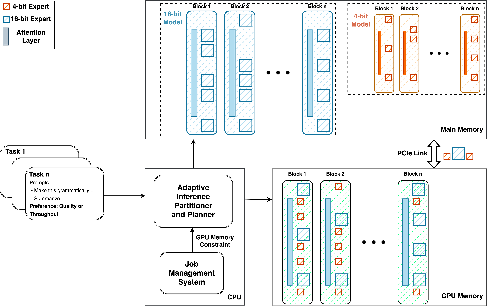
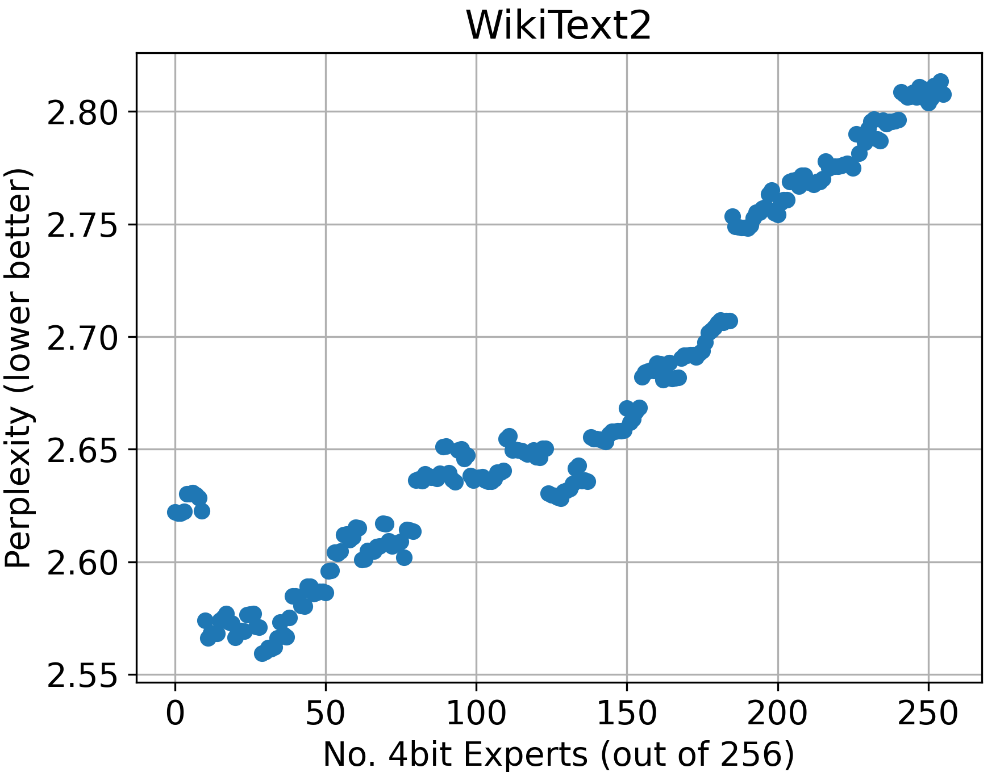
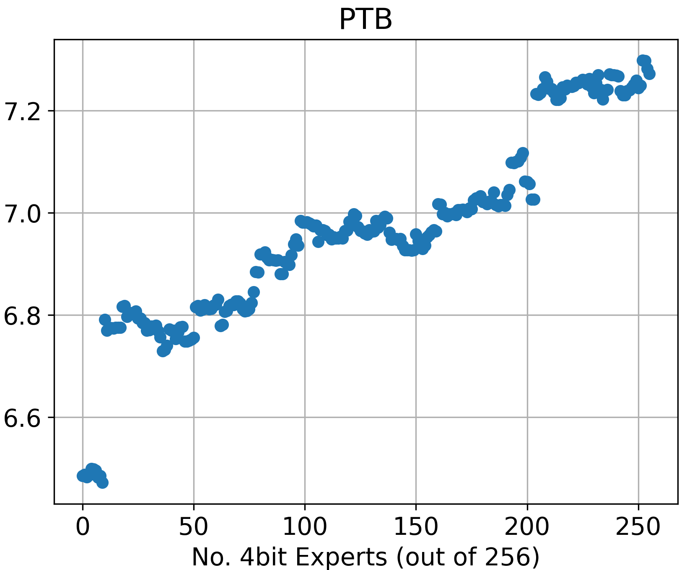
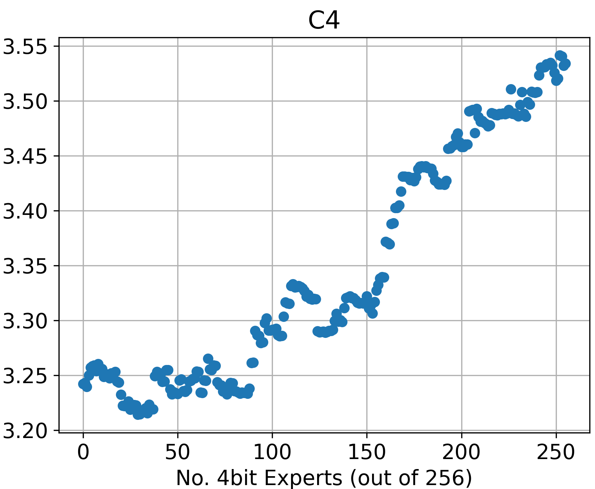
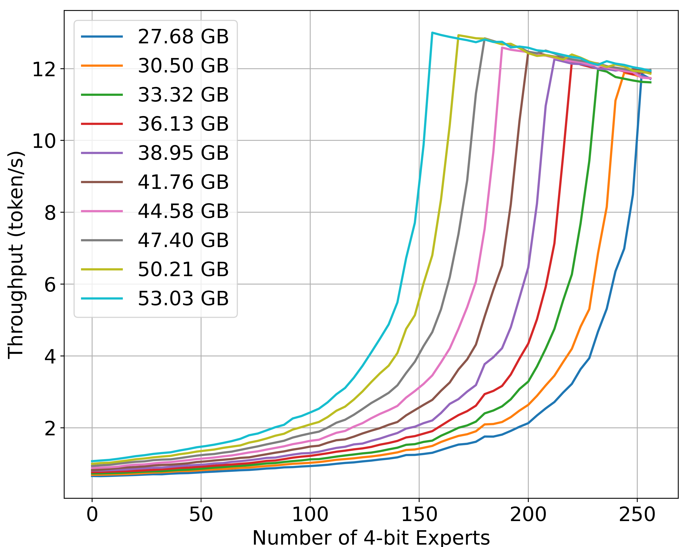
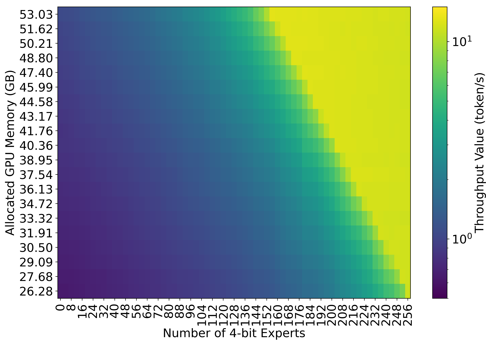

# 通过专家与精度混合模型优化服务质量

发布时间：2024年07月19日

`LLM应用` `计算机硬件` `人工智能`

> Mixture of Experts with Mixture of Precisions for Tuning Quality of Service

# 摘要

> 随着在资源受限环境中部署大型MoE模型的需求增加，我们需要高效方法来应对其高内存和计算需求。本文提出了一种适应性服务方法，通过部分量化专家，动态调整量化专家数量及其在CPU和GPU间的分布，探索帕累托前沿，提供细粒度配置以平衡吞吐量和模型质量。在NVIDIA A100 GPU上使用Mixtral 8x7B MoE模型进行的评估显示，令牌生成吞吐量可从每秒0.63个调整至13.00个，而困惑度仅小幅增加，突显了该方法在动态且对精度要求高的应用中的实用性，兼顾了内存使用和输出质量。

> The increasing demand for deploying large Mixture-of-Experts (MoE) models in resource-constrained environments necessitates efficient approaches to address their high memory and computational requirements challenges. Moreover, given that tasks come in different user-defined constraints and the available resources change over time in multi-tenant environments, it is necessary to design an approach which provides a flexible configuration space. This paper presents an adaptive serving approach for the efficient deployment of MoE models, capitalizing on partial quantization of the experts. By dynamically determining the number of quantized experts and their distribution across CPU and GPU, our approach explores the Pareto frontier and offers a fine-grained range of configurations for tuning throughput and model quality. Our evaluation on an NVIDIA A100 GPU using a Mixtral 8x7B MoE model for three language modelling benchmarks demonstrates that the throughput of token generation can be adjusted from 0.63 to 13.00 token per second. This enhancement comes with a marginal perplexity increase of 2.62 to 2.80, 6.48 to 7.24, and 3.24 to 3.53 for WikiText2, PTB, and C4 datasets respectively under maximum quantization. These results highlight the practical applicability of our approach in dynamic and accuracy-sensitive applications where both memory usage and output quality are important.

[Arxiv](https://arxiv.org/abs/2407.14417)