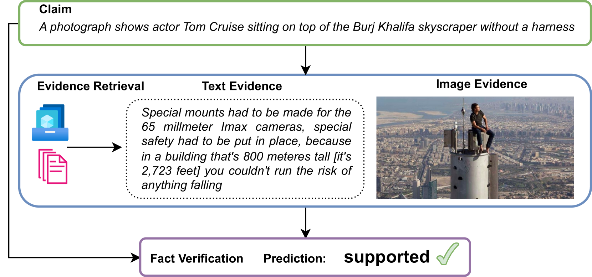
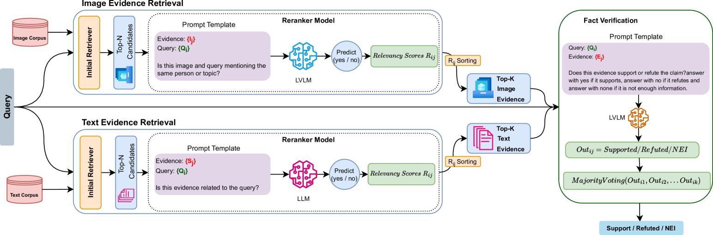
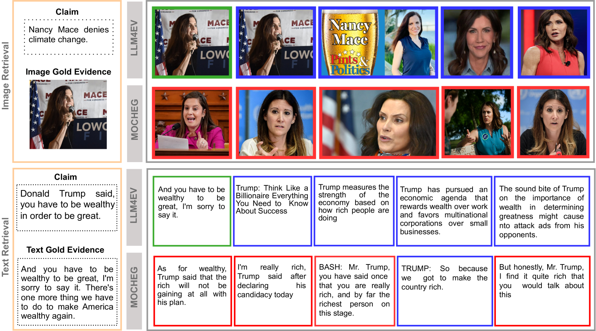
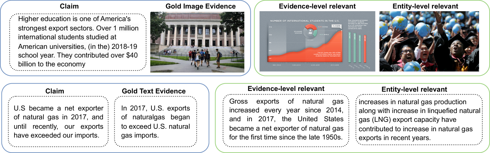
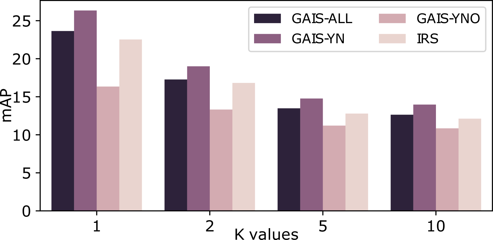
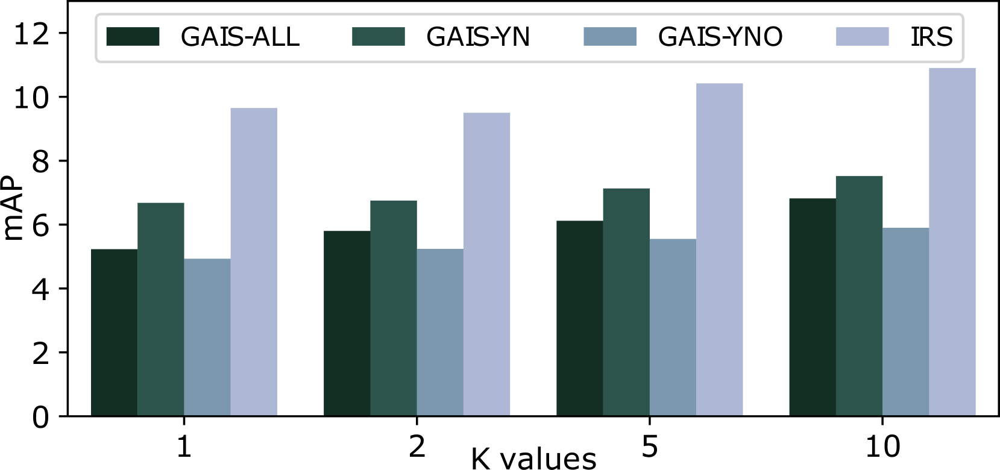

# 借助大型视觉-语言模型，我们致力于检测多模态虚假信息。

发布时间：2024年07月19日

`LLM应用` `信息安全`

> Multimodal Misinformation Detection using Large Vision-Language Models

# 摘要

> 错误信息的泛滥及其严重后果已激发了业界和学术界对错误信息检测和事实核查方法的研究。尽管大型语言模型 (LLM) 在多项任务中表现出色，但其在错误信息检测中的应用仍待深入探索。当前主流方法多忽视证据或假定证据已知，鲜有将证据检索纳入检测流程。本文探讨了 LLM 在零-shot 环境下的错误信息检测潜力，并引入证据检索环节，强调从多源收集相关信息的重要性。我们创新性地结合 LLM 和大型视觉-语言模型 (LVLM)，提出多模态证据检索的重排序策略，并将检索到的图像与文本作为 LVLM 驱动的事实验证 (LVLM4FV) 的输入。为确保评估公正，我们完善了现有数据集中的证据样本标注，涵盖图像与文本检索。实验显示，我们的方法在证据检索与事实验证上均优于传统方法，且具有更强的跨数据集泛化能力。

> The increasing proliferation of misinformation and its alarming impact have motivated both industry and academia to develop approaches for misinformation detection and fact checking. Recent advances on large language models (LLMs) have shown remarkable performance in various tasks, but whether and how LLMs could help with misinformation detection remains relatively underexplored. Most of existing state-of-the-art approaches either do not consider evidence and solely focus on claim related features or assume the evidence to be provided. Few approaches consider evidence retrieval as part of the misinformation detection but rely on fine-tuning models. In this paper, we investigate the potential of LLMs for misinformation detection in a zero-shot setting. We incorporate an evidence retrieval component into the process as it is crucial to gather pertinent information from various sources to detect the veracity of claims. To this end, we propose a novel re-ranking approach for multimodal evidence retrieval using both LLMs and large vision-language models (LVLM). The retrieved evidence samples (images and texts) serve as the input for an LVLM-based approach for multimodal fact verification (LVLM4FV). To enable a fair evaluation, we address the issue of incomplete ground truth for evidence samples in an existing evidence retrieval dataset by annotating a more complete set of evidence samples for both image and text retrieval. Our experimental results on two datasets demonstrate the superiority of the proposed approach in both evidence retrieval and fact verification tasks and also better generalization capability across dataset compared to the supervised baseline.

[Arxiv](https://arxiv.org/abs/2407.14321)