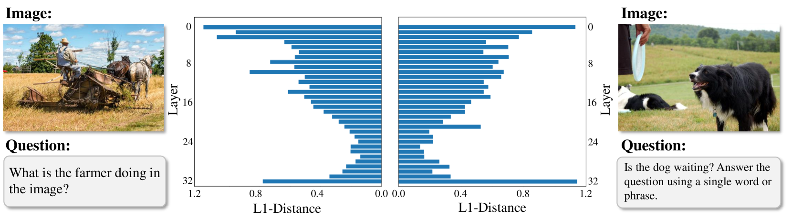
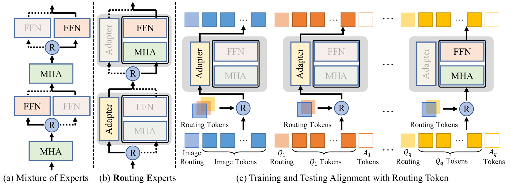
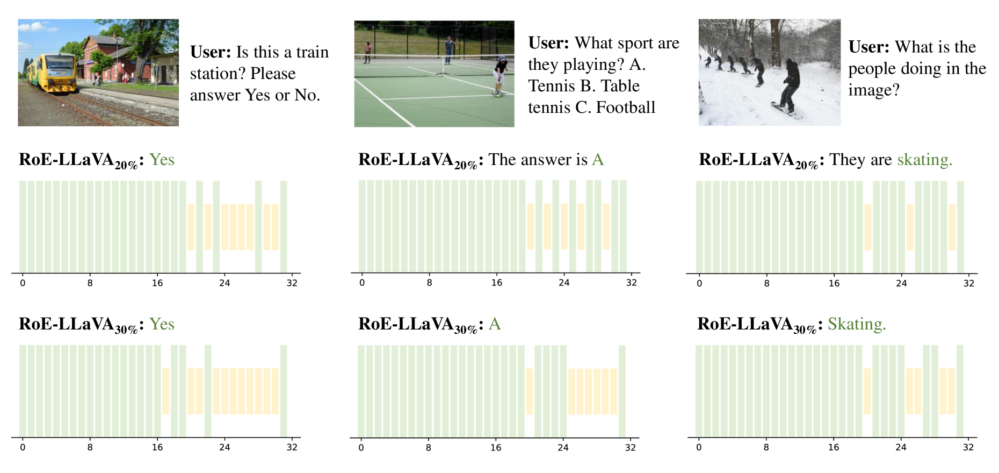

# 不必全神贯注：利用有效注意力跳过技术，实现多模态大型语言模型的高效参数与计算调优

发布时间：2024年07月19日

`LLM应用` `人工智能` `计算机视觉`

> Not All Attention is Needed: Parameter and Computation Efficient Tuning for Multi-modal Large Language Models via Effective Attention Skipping

# 摘要

> 近期，混合专家 (MoE) 模式因其能平衡多模态大型语言模型 (MLLM) 的容量与效率而备受青睐。我们独辟蹊径，深入探究现有 MLLM 中的动态专家路径，揭示标准 MLLM 亦可实现混合专家模式。为此，我们创新提出路由专家 (RoE) 方案，无需大幅结构调整即可实现示例依赖的最优路径选择。同时，通过引入结构稀疏正则化，促使 MLLM 进行更多短路推理，确保高效运作。此外，我们首次尝试在网络路由层面统一 MLLM 的训练与推理流程。为验证 RoE 效果，我们将其应用于 LLaVA-1.5、LLaVA-HR 及 VILA 等前沿 MLLM，并在多个 VL 基准上展开详尽实验。结果表明，RoE 不仅大幅提升 MLLM 效率，更在性能与速度上超越 MoE-LLaVA，如在 5 个基准测试中平均性能提升达 3.3%，且运行更迅捷。

> Recently, mixture of experts (MoE) has become a popular paradigm for achieving the trade-off between modal capacity and efficiency of multi-modal large language models (MLLMs). Different from previous efforts, we are dedicated to exploring the dynamic expert path in an already exist MLLM and show that a standard MLLM can be also a mixture of experts. To approach this target, we propose a novel dynamic expert scheme for MLLMs, termed Routing Experts (RoE), which can achieve example-dependent optimal path routing without obvious structure tweaks. Meanwhile, a new regularization of structure sparsity is also introduced to enforce MLLMs to learn more short-cut inference, ensuring the efficiency. In addition, we also realize the first attempt of aligning the training and inference schemes of MLLMs in terms of network routing. To validate RoE, we apply it to a set of latest MLLMs, including LLaVA-1.5, LLaVA-HR and VILA, and conduct extensive experiments on a bunch of VL benchmarks. The experiment results not only show the great advantages of our RoE in improving MLLMs' efficiency, but also yield obvious advantages than MoE-LLaVA in both performance and speed, e.g., an average performance gain of 3.3% on 5 benchmarks while being faster.

[Arxiv](https://arxiv.org/abs/2407.14093)