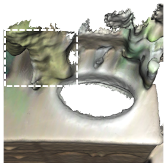

# OpenSU3D：借助基础模型探索开放世界的3D场景理解

发布时间：2024年07月19日

`LLM应用` `计算机视觉` `人工智能`

> OpenSU3D: Open World 3D Scene Understanding using Foundation Models

# 摘要

> 本文介绍了一种创新且可扩展的方法，用于构建开放集、实例级别的3D场景表示，从而深化了对3D环境的开放世界理解。传统方法依赖预构建的3D场景，且因逐点特征向量学习而受限于可扩展性，影响了复杂查询的应对能力。我们的方法则通过2D基础模型逐步构建3D场景的实例级表示，高效整合了掩码、特征向量、名称和标题等细节，突破了这些限制。我们还设计了特征向量融合方案，以提升其在复杂查询中的表现和上下文理解。同时，我们利用大型语言模型进行自动标注和空间推理，增强了系统的鲁棒性。在ScanNet和Replica数据集上的实验表明，我们的方法具有零-shot泛化能力，显著超越了现有技术，在开放世界3D场景理解领域取得了新的突破。

> In this paper, we present a novel, scalable approach for constructing open set, instance-level 3D scene representations, advancing open world understanding of 3D environments. Existing methods require pre-constructed 3D scenes and face scalability issues due to per-point feature vector learning, limiting their efficacy with complex queries. Our method overcomes these limitations by incrementally building instance-level 3D scene representations using 2D foundation models, efficiently aggregating instance-level details such as masks, feature vectors, names, and captions. We introduce fusion schemes for feature vectors to enhance their contextual knowledge and performance on complex queries. Additionally, we explore large language models for robust automatic annotation and spatial reasoning tasks. We evaluate our proposed approach on multiple scenes from ScanNet and Replica datasets demonstrating zero-shot generalization capabilities, exceeding current state-of-the-art methods in open world 3D scene understanding.

[Arxiv](https://arxiv.org/abs/2407.14279)