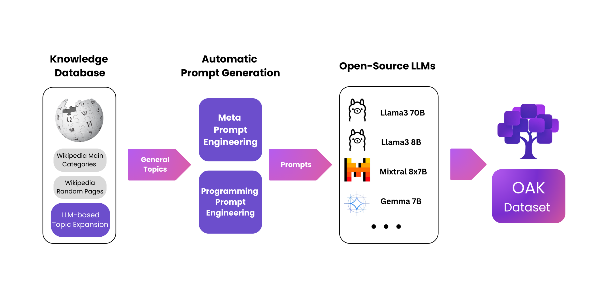
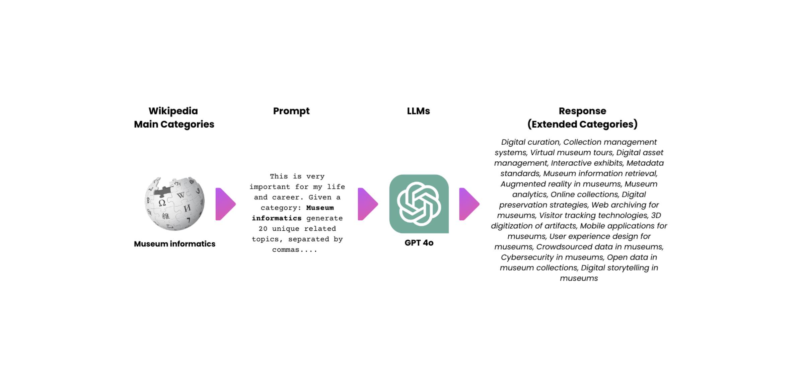
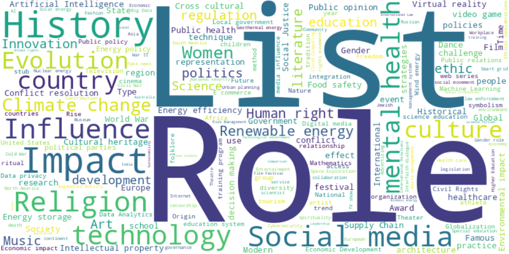

# 开放式人工智能知识库

发布时间：2024年07月19日

`LLM应用` `人工智能` `数据集`

> Open Artificial Knowledge

# 摘要

> ChatGPT、Claude和Gemini等基于聊天的AI系统的成功，得益于在大规模数据集上训练的LLMs。然而，获取高质量、多样化且伦理上合理的训练数据仍是一大挑战。为此，我们推出了开放人工智能知识（OAK）数据集，这是一个包含超过5亿标记的大规模资源。OAK结合了GPT4o、LLaMa3-70B等先进LLMs，生成跨领域的高质量文本，遵循维基百科的主要分类。我们的方法不仅确保了知识的广泛覆盖，还保持了文本的连贯性和事实准确性。OAK数据集旨在推动更强大、更对齐的语言模型的发展，同时解决数据稀缺和隐私问题，并已在www.oakdataset.org上免费开放。

> The tremendous success of chat-based AI systems like ChatGPT, Claude, and Gemini stems from Large Language Models (LLMs) trained on vast amount of datasets. However, acquiring high-quality, diverse, and ethically sourced training data remains a significant challenge. We introduce the Open Artificial Knowledge (OAK) dataset, a large-scale resource of over 500 million tokens (at the moment of writing) designed to address this issue. OAK leverages an ensemble of state-of-the-art LLMs, including GPT4o, LLaMa3-70B, LLaMa3-8B, Mixtral-8x7B, Gemma-7B, and Gemma-2-9B , to generate high-quality text across diverse domains, guided by Wikipedia's main categories. Our methodology ensures broad knowledge coverage while maintaining coherence and factual accuracy. The OAK dataset aims to foster the development of more capable and aligned language models while addressing critical issues of data scarcity and privacy in LLM training, and it is freely available on www.oakdataset.org.

[Arxiv](https://arxiv.org/abs/2407.14371)