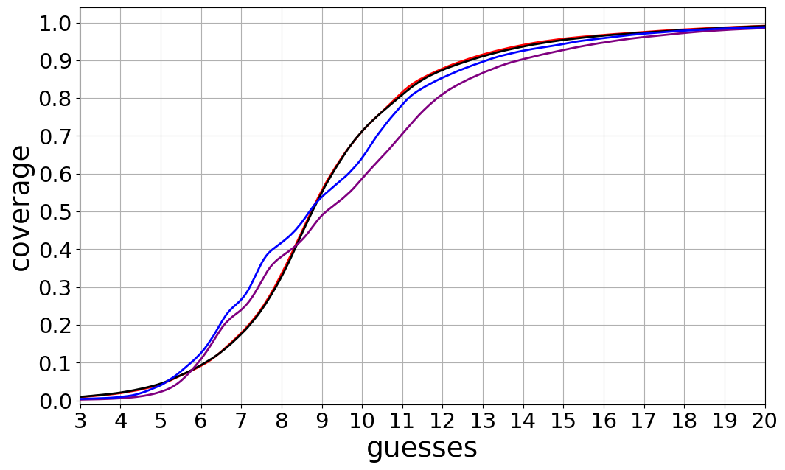
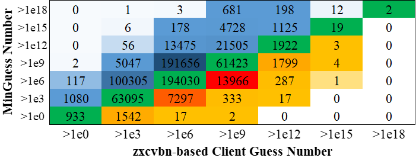

# PassTSL：采用两阶段学习方法，模拟人类密码的生成过程。

发布时间：2024年07月19日

`LLM应用` `网络安全` `密码学`

> PassTSL: Modeling Human-Created Passwords through Two-Stage Learning

# 摘要

> 文本密码作为最广泛的用户认证手段，其与自然语言的紧密关联为自然语言处理（NLP）和机器学习（ML）技术的应用提供了广阔空间。本文提出的PassTSL模型，借鉴了NLP和深度学习中的预训练-微调框架，通过两阶段学习来模拟人类密码创建行为。实验表明，PassTSL在密码猜测方面显著超越了五种顶尖的密码破解技术，最大提升幅度高达64.69%。此外，基于PassTSL开发的密码强度计（PSM）能更精准地评估密码强度，减少误判。研究还发现，即便仅增加极少量的训练数据，也能带来显著的性能提升。本文通过启发式方法优化微调过程，进一步验证了NLP和ML技术在密码领域的应用潜力。

> Textual passwords are still the most widely used user authentication mechanism. Due to the close connections between textual passwords and natural languages, advanced technologies in natural language processing (NLP) and machine learning (ML) could be used to model passwords for different purposes such as studying human password-creation behaviors and developing more advanced password cracking methods for informing better defence mechanisms. In this paper, we propose PassTSL (modeling human-created Passwords through Two-Stage Learning), inspired by the popular pretraining-finetuning framework in NLP and deep learning (DL). We report how different pretraining settings affected PassTSL and proved its effectiveness by applying it to six large leaked password databases. Experimental results showed that it outperforms five state-of-the-art (SOTA) password cracking methods on password guessing by a significant margin ranging from 4.11% to 64.69% at the maximum point. Based on PassTSL, we also implemented a password strength meter (PSM), and our experiments showed that it was able to estimate password strength more accurately, causing fewer unsafe errors (overestimating the password strength) than two other SOTA PSMs when they produce the same rate of safe errors (underestimating the password strength): a neural-network based method and zxcvbn. Furthermore, we explored multiple finetuning settings, and our evaluations showed that, even a small amount of additional training data, e.g., only 0.1% of the pretrained data, can lead to over 3% improvement in password guessing on average. We also proposed a heuristic approach to selecting finetuning passwords based on JS (Jensen-Shannon) divergence and experimental results validated its usefulness. In summary, our contributions demonstrate the potential and feasibility of applying advanced NLP and ML methods to password modeling and cracking.

[Arxiv](https://arxiv.org/abs/2407.14145)