# 探究分布式大型语言模型训练与推理的性能建模及工作负载分析

发布时间：2024年07月19日

`LLM理论` `计算机系统` `人工智能`

> Performance Modeling and Workload Analysis of Distributed Large Language Model Training and Inference

# 摘要

> 在当今世界，将系统设计与大型语言模型（LLM）日益增长的计算需求相匹配至关重要。我们提出了一种综合性能建模方法，通过分析框架深入探讨了分布式LLM训练与推理的计算、内存、网络及并行策略。我们验证了性能预测，并针对分布式训练，解析了内存优化、性能跃升的关键因素，以及技术节点演进对性能的影响。在推理方面，我们剖析了计算与内存的平衡，并探索了内存技术进步对延迟的影响。通过这一框架，我们揭示了技术进步下训练与推理的性能瓶颈，为未来系统设计提供了指导。

> Aligning future system design with the ever-increasing compute needs of large language models (LLMs) is undoubtedly an important problem in today's world. Here, we propose a general performance modeling methodology and workload analysis of distributed LLM training and inference through an analytical framework that accurately considers compute, memory sub-system, network, and various parallelization strategies (model parallel, data parallel, pipeline parallel, and sequence parallel). We validate our performance predictions with published data from literature and relevant industry vendors (e.g., NVIDIA). For distributed training, we investigate the memory footprint of LLMs for different activation re-computation methods, dissect the key factors behind the massive performance gain from A100 to B200 ($\sim$ 35x speed-up closely following NVIDIA's scaling trend), and further run a design space exploration at different technology nodes (12 nm to 1 nm) to study the impact of logic, memory, and network scaling on the performance. For inference, we analyze the compute versus memory boundedness of different operations at a matrix-multiply level for different GPU systems and further explore the impact of DRAM memory technology scaling on inference latency. Utilizing our modeling framework, we reveal the evolution of performance bottlenecks for both LLM training and inference with technology scaling, thus, providing insights to design future systems for LLM training and inference.

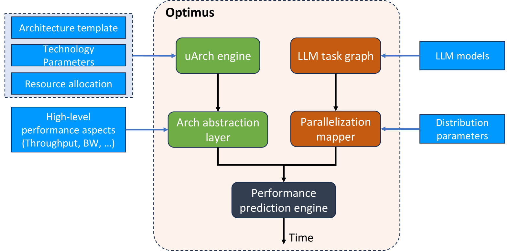

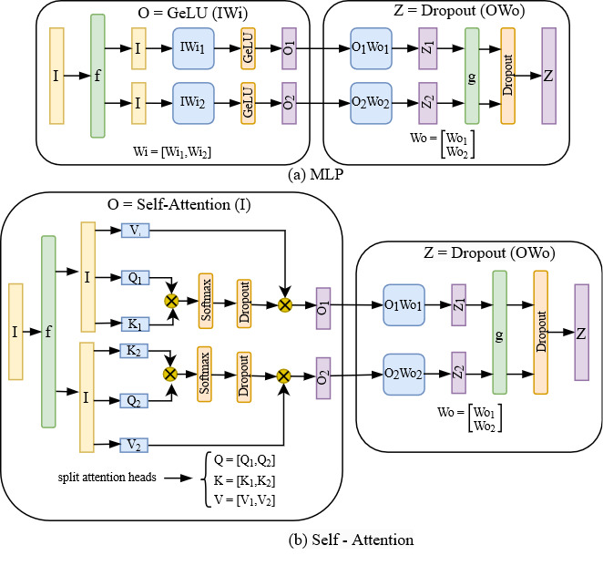

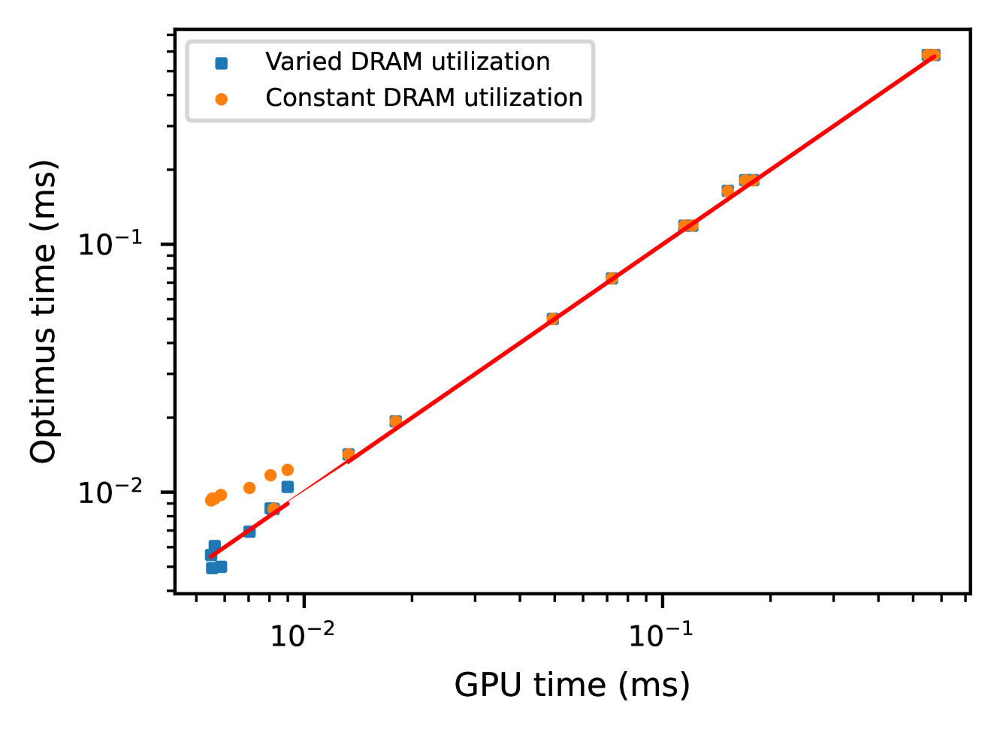

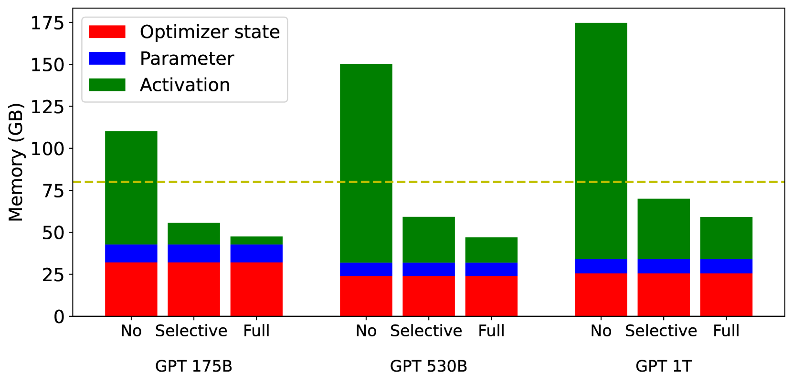

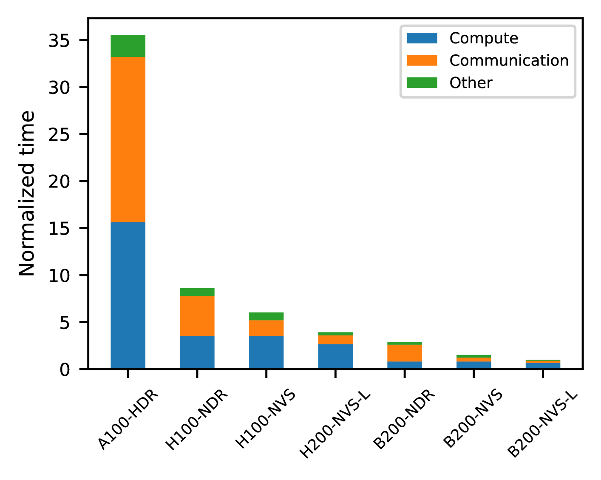

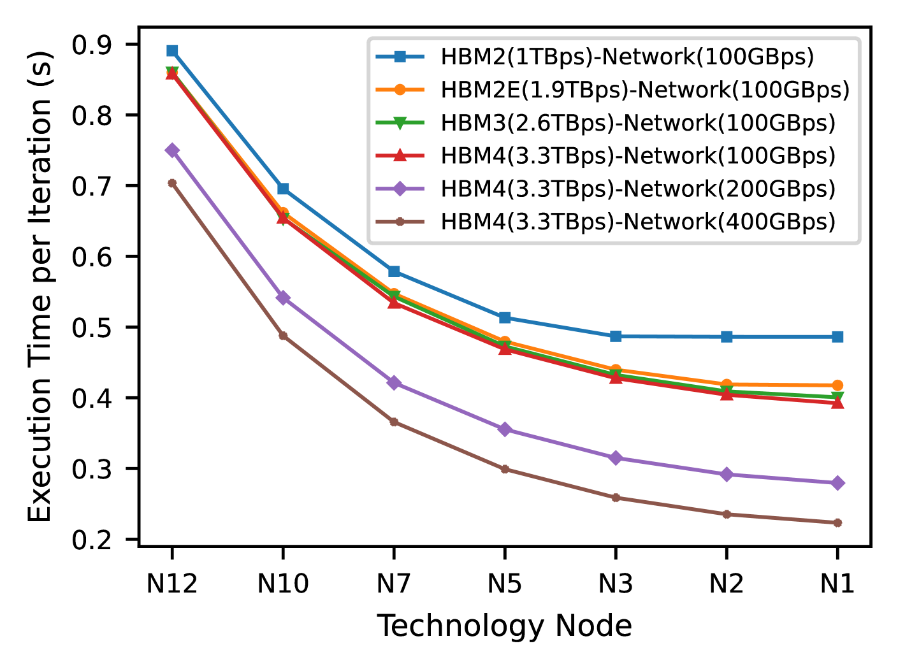

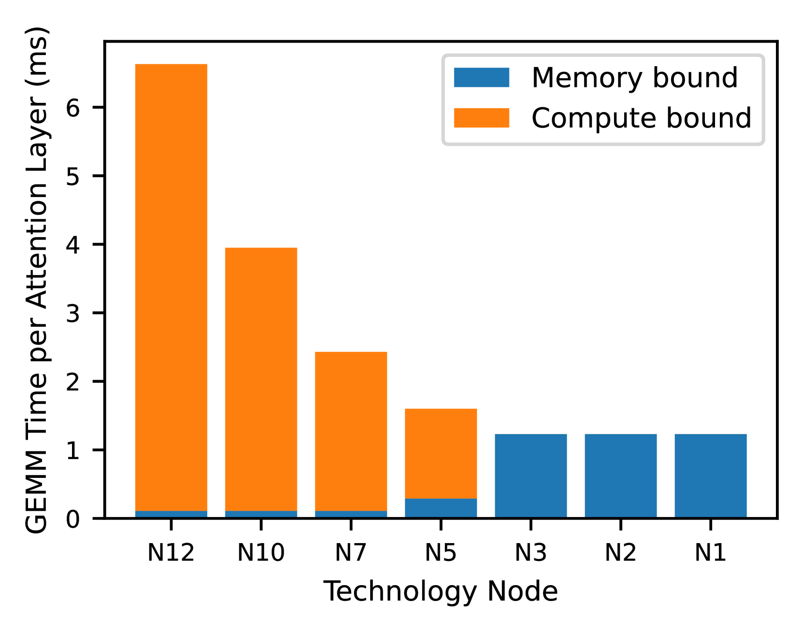

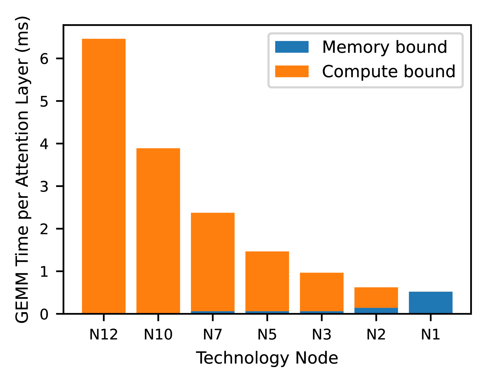

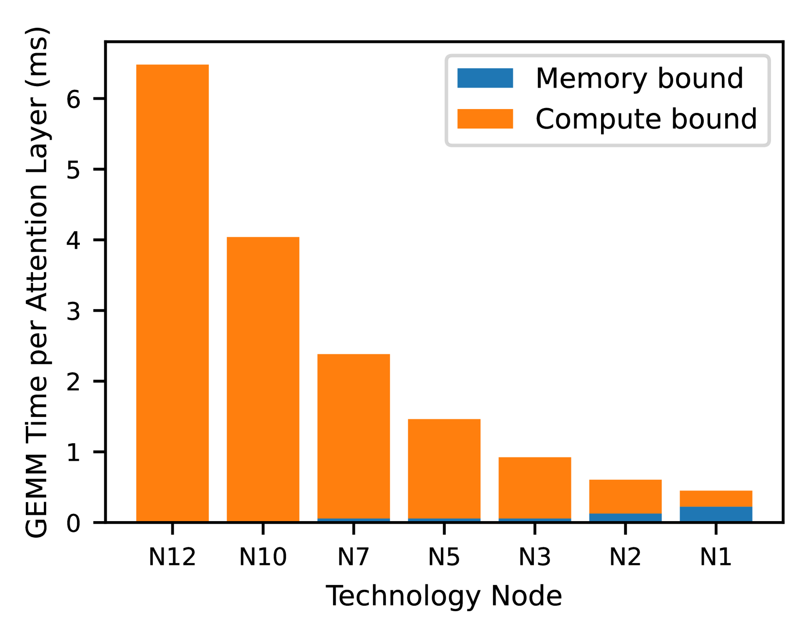

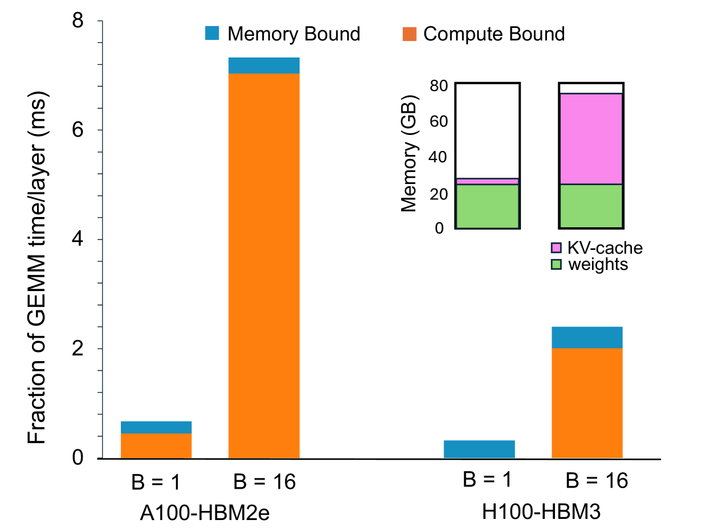

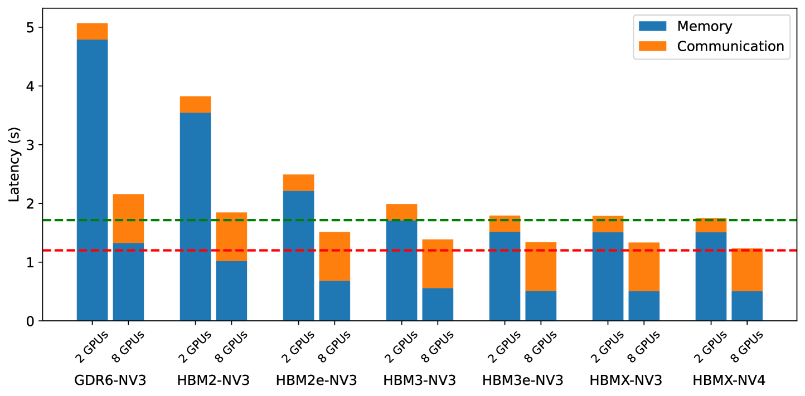

[Arxiv](https://arxiv.org/abs/2407.14645)