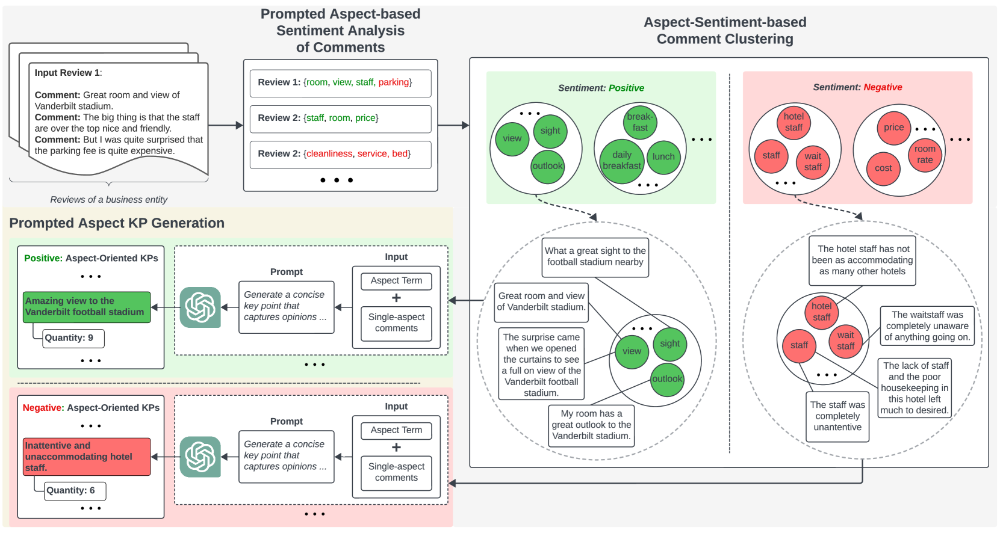

# 通过提示关键点分析，实现评论的定量摘要

发布时间：2024年07月19日

`LLM应用` `社交媒体`

> Prompted Aspect Key Point Analysis for Quantitative Review Summarization

# 摘要

> 关键点分析 (KPA) 旨在提供简洁的文本摘要和衡量其普遍性的数量。大多数针对评论的 KPA 研究采用监督学习提取短句作为关键点 (KP)，然后匹配评论以量化 KP 的普遍性。然而，最近的抽象方法常导致 KP 包含重叠和幻觉观点，量化不准确。为此，我们提出提示方面关键点分析 (PAKPA)，利用方面情感分析和大型语言模型 (LLM) 的提示上下文学习，生成和量化基于方面的 KP，实现忠实且准确的量化，并减少对大量标注数据的依赖。实验表明，我们的框架在 Yelp 和 SPACE 数据集上达到了最先进的性能。源代码和数据可在此获取：https://github.com/antangrocket1312/PAKPA

> Key Point Analysis (KPA) aims for quantitative summarization that provides key points (KPs) as succinct textual summaries and quantities measuring their prevalence. KPA studies for arguments and reviews have been reported in the literature. A majority of KPA studies for reviews adopt supervised learning to extract short sentences as KPs before matching KPs to review comments for quantification of KP prevalence. Recent abstractive approaches still generate KPs based on sentences, often leading to KPs with overlapping and hallucinated opinions, and inaccurate quantification. In this paper, we propose Prompted Aspect Key Point Analysis (PAKPA) for quantitative review summarization. PAKPA employs aspect sentiment analysis and prompted in-context learning with Large Language Models (LLMs) to generate and quantify KPs grounded in aspects for business entities, which achieves faithful KPs with accurate quantification, and removes the need for large amounts of annotated data for supervised training. Experiments on the popular review dataset Yelp and the aspect-oriented review summarization dataset SPACE show that our framework achieves state-of-the-art performance. Source code and data are available at: https://github.com/antangrocket1312/PAKPA

[Arxiv](https://arxiv.org/abs/2407.14049)