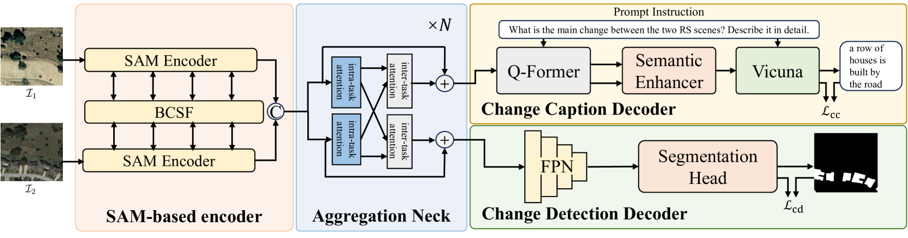
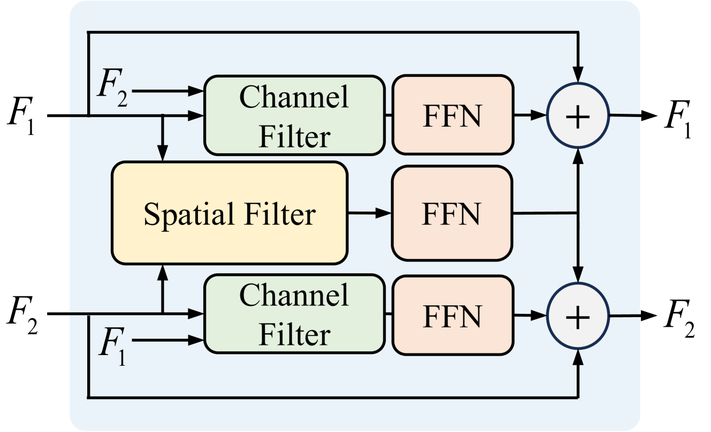
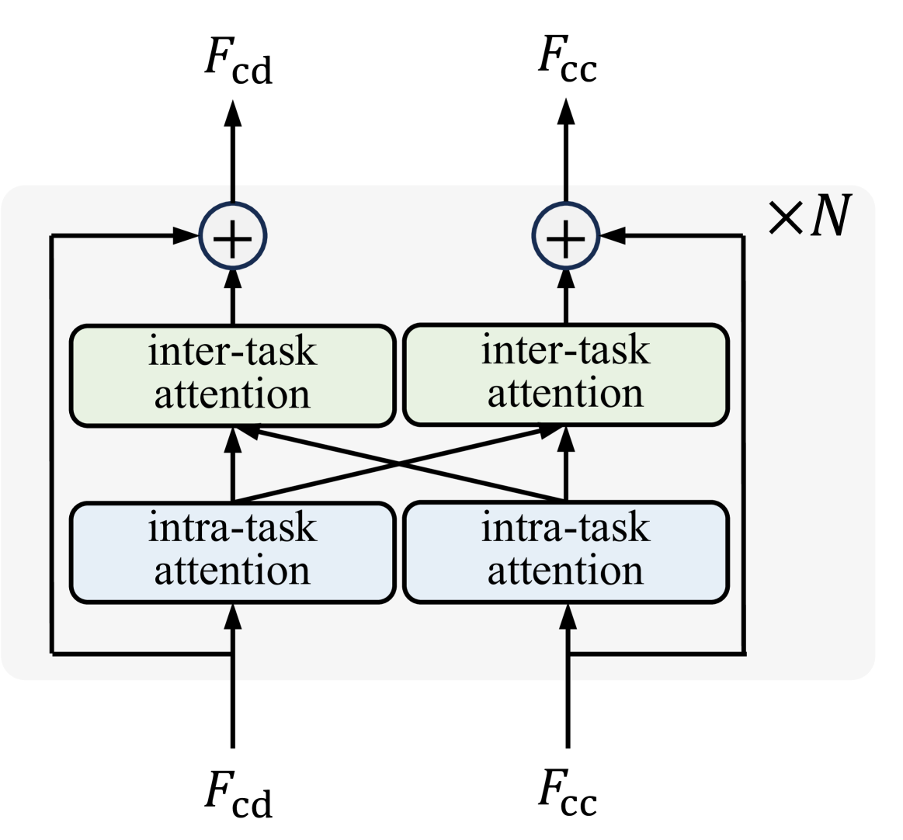
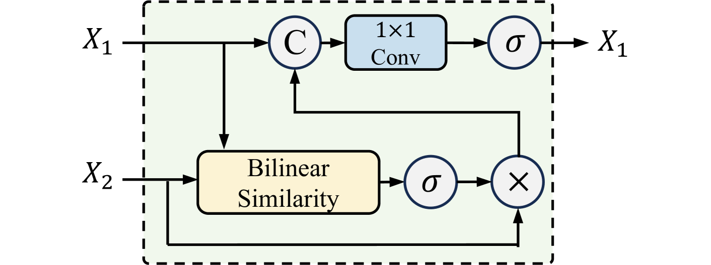
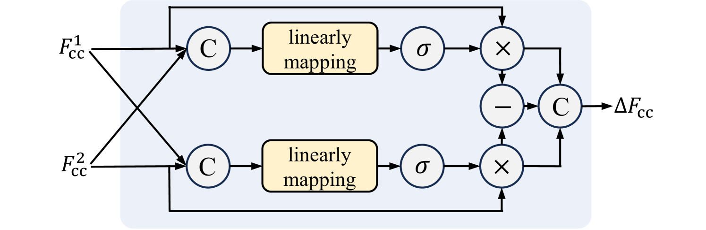
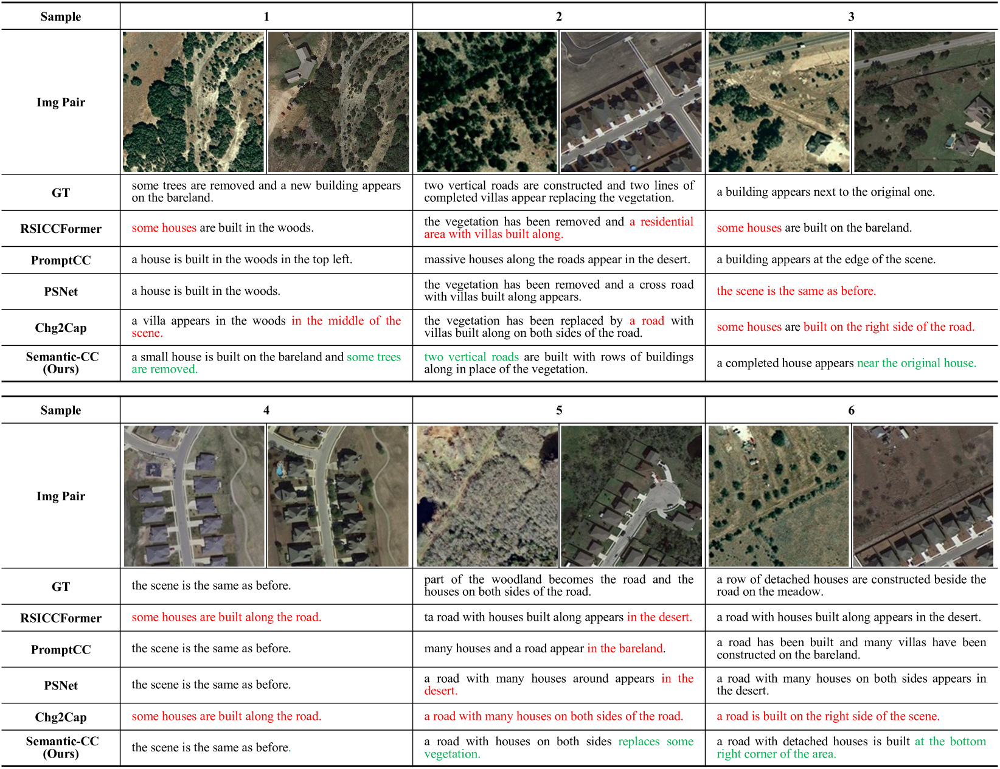
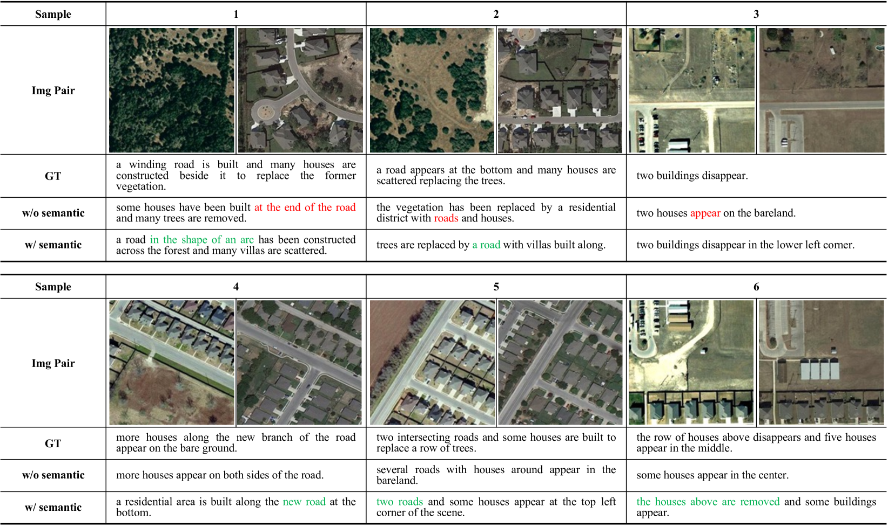
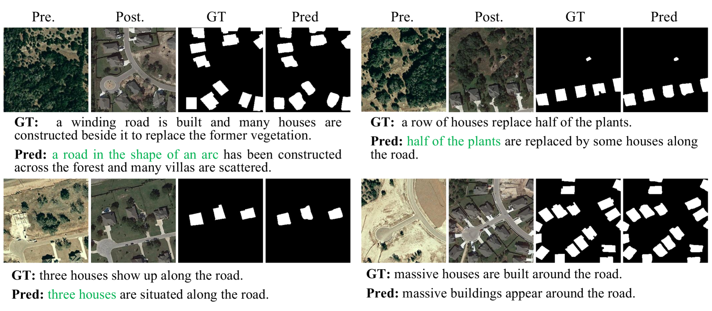

# Semantic-CC：借助基础知识与语义引导，强化遥感图像变化描述能力

发布时间：2024年07月19日

`LLM应用` `地理信息系统`

> Semantic-CC: Boosting Remote Sensing Image Change Captioning via Foundational Knowledge and Semantic Guidance

# 摘要

> 遥感图像变化描述（RSICC）旨在用自然语言描述双时相遥感图像中的变化。面对现有方法在多时相和空间场景中表达一般特征的局限，以及在提供细致、精确变化描述方面的不足，我们创新性地提出了基于基础知识和语义指导的Semantic-CC方法。该方法通过利用基础模型的潜在知识，减少了对大量标注的依赖，并由变化检测中的像素级语义引导，生成更全面准确的变化描述。我们设计了双时相SAM编码器进行特征提取，多任务语义聚合颈部促进任务间信息交互，多尺度变化检测解码器提供语义指导，以及基于LLM的变化描述解码器生成描述句子。为确保CD和CC联合训练的稳定性，我们采用了三阶段训练策略。实验结果显示，Semantic-CC在LEVIR-CC和LEVIR-CD数据集上表现优异，证明了CD和CC的互补性，能生成更准确的变化描述，并在两项任务中达到最佳性能。

> Remote sensing image change captioning (RSICC) aims to articulate the changes in objects of interest within bi-temporal remote sensing images using natural language. Given the limitations of current RSICC methods in expressing general features across multi-temporal and spatial scenarios, and their deficiency in providing granular, robust, and precise change descriptions, we introduce a novel change captioning (CC) method based on the foundational knowledge and semantic guidance, which we term Semantic-CC. Semantic-CC alleviates the dependency of high-generalization algorithms on extensive annotations by harnessing the latent knowledge of foundation models, and it generates more comprehensive and accurate change descriptions guided by pixel-level semantics from change detection (CD). Specifically, we propose a bi-temporal SAM-based encoder for dual-image feature extraction; a multi-task semantic aggregation neck for facilitating information interaction between heterogeneous tasks; a straightforward multi-scale change detection decoder to provide pixel-level semantic guidance; and a change caption decoder based on the large language model (LLM) to generate change description sentences. Moreover, to ensure the stability of the joint training of CD and CC, we propose a three-stage training strategy that supervises different tasks at various stages. We validate the proposed method on the LEVIR-CC and LEVIR-CD datasets. The experimental results corroborate the complementarity of CD and CC, demonstrating that Semantic-CC can generate more accurate change descriptions and achieve optimal performance across both tasks.

[Arxiv](https://arxiv.org/abs/2407.14032)