# System-1.x：探索语言模型中快速与慢速规划的平衡之道

发布时间：2024年07月19日

`LLM应用` `人工智能` `机器人`

> System-1.x: Learning to Balance Fast and Slow Planning with Language Models

# 摘要

> 语言模型在解决长时程规划问题时，有两种模式：快速的“系统1”直接生成计划，无需搜索或回溯；慢速的“系统2”则通过逐步搜索可能动作来规划。尽管系统2更有效，但其高计算成本使其不适用于长计划或大动作空间。此外，单独的系统1或2无法满足用户对最终目标的控制需求。为此，我们设计了系统1.x规划器，这是一个结合了两种模式的混合规划框架，能根据问题难度灵活调整。系统1.x由控制器、系统1规划器和系统2规划器组成，通过用户设定的混合因子（x）来分配任务给系统1或2。我们在单一LLM基础上对这三个组件进行微调，仅依赖搜索轨迹进行监督。实验表明，系统1.x在迷宫导航和积木世界任务中表现优异，不仅超越了单一模式的规划器，还展示了其可控性、灵活性和泛化性。

> Language models can be used to solve long-horizon planning problems in two distinct modes: a fast 'System-1' mode, directly generating plans without any explicit search or backtracking, and a slow 'System-2' mode, planning step-by-step by explicitly searching over possible actions. While System-2 is typically more effective, it is also more computationally expensive, making it infeasible for long plans or large action spaces. Moreover, isolated System-1 or 2 ignores the user's end goals, failing to provide ways to control the model's behavior. To this end, we propose the System-1.x Planner, a controllable planning framework with LLMs that is capable of generating hybrid plans and balancing between the two planning modes based on the difficulty of the problem at hand. System-1.x consists of (i) a controller, (ii) a System-1 Planner, and (iii) a System-2 Planner. Based on a user-specified hybridization factor (x) governing the mixture between System-1 and 2, the controller decomposes a problem into sub-goals, and classifies them as easy or hard to be solved by either System-1 or 2, respectively. We fine-tune all three components on top of a single base LLM, requiring only search traces as supervision. Experiments with two diverse planning tasks -- Maze Navigation and Blocksworld -- show that our System-1.x Planner outperforms a System-1 Planner, a System-2 Planner trained to approximate A* search, and also a symbolic planner (A*). We demonstrate the following key properties of our planner: (1) controllability: increasing the hybridization factor (e.g., System-1.75 vs 1.5) performs more search, improving performance, (2) flexibility: by building a neuro-symbolic variant with a neural System-1 and a symbolic System-2, we can use existing symbolic methods, and (3) generalizability: by being able to learn from different search algorithms, our method is robust to the choice of search algorithm.

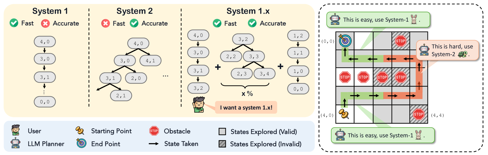

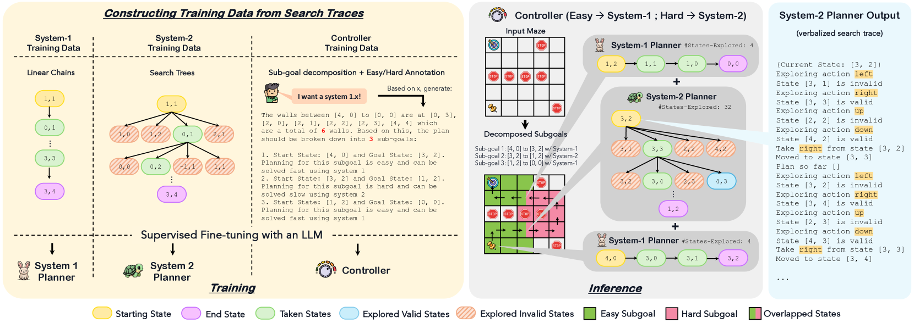

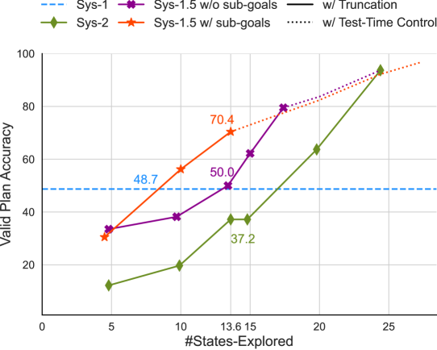

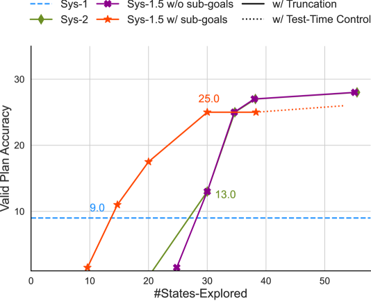

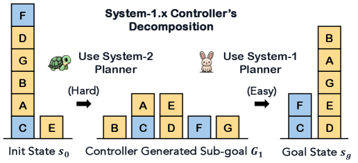

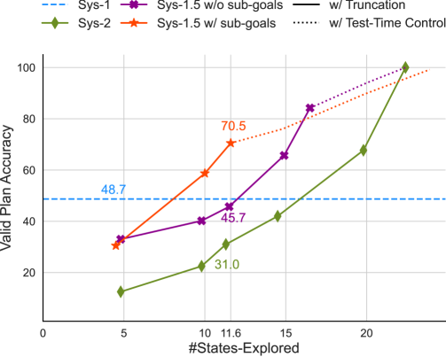

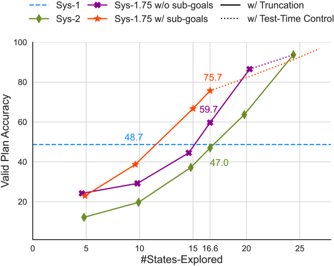

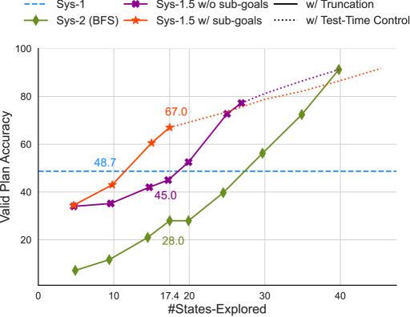

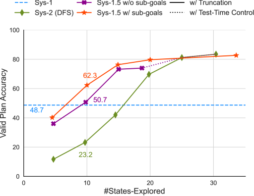

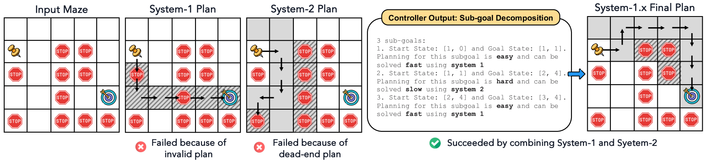

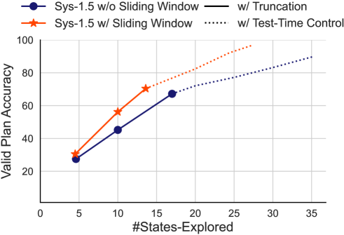

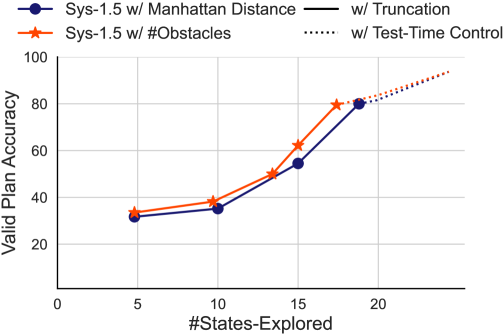

[Arxiv](https://arxiv.org/abs/2407.14414)