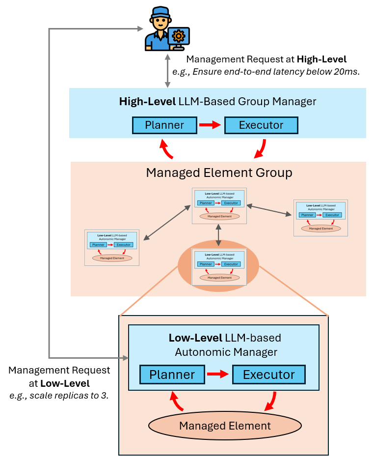
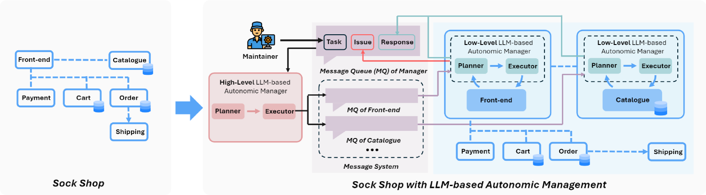
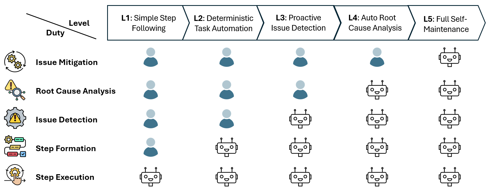
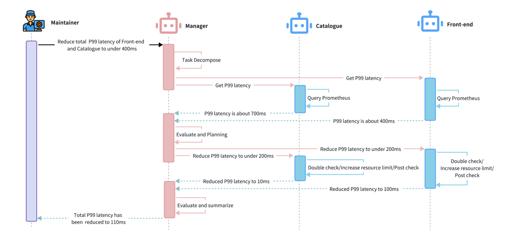

# 自主计算的愿景：LLM 能否将其变为现实？

发布时间：2024年07月19日

`Agent` `软件工程` `云计算`

> The Vision of Autonomic Computing: Can LLMs Make It a Reality?

# 摘要

> 自主计算愿景（ACV）自提出以来，一直梦想着构建能像生物体一样自我管理、适应环境的计算系统。尽管研究多年，现代计算系统的复杂性使得ACV的实现依旧充满挑战。幸运的是，大型语言模型（LLM）的最新进展，凭借其深厚的知识储备、语言理解和任务自动化能力，为解决这些难题提供了新思路。本文通过探索基于LLM的多代理框架在微服务管理中的应用，评估了实现ACV的可行性。我们设计了一个五级自主服务维护体系，并利用Sock Shop项目进行在线评估，验证了框架的性能。研究显示，LLM在提升微服务架构的自主性方面成效显著，特别是在问题检测与解决上。这一创新性研究不仅推动了自主计算的发展，更为未来构建更智能、自适应的计算系统奠定了基础。相关代码将在https://aka.ms/ACV-LLM公开。

> The Vision of Autonomic Computing (ACV), proposed over two decades ago, envisions computing systems that self-manage akin to biological organisms, adapting seamlessly to changing environments. Despite decades of research, achieving ACV remains challenging due to the dynamic and complex nature of modern computing systems. Recent advancements in Large Language Models (LLMs) offer promising solutions to these challenges by leveraging their extensive knowledge, language understanding, and task automation capabilities. This paper explores the feasibility of realizing ACV through an LLM-based multi-agent framework for microservice management. We introduce a five-level taxonomy for autonomous service maintenance and present an online evaluation benchmark based on the Sock Shop microservice demo project to assess our framework's performance. Our findings demonstrate significant progress towards achieving Level 3 autonomy, highlighting the effectiveness of LLMs in detecting and resolving issues within microservice architectures. This study contributes to advancing autonomic computing by pioneering the integration of LLMs into microservice management frameworks, paving the way for more adaptive and self-managing computing systems. The code will be made available at https://aka.ms/ACV-LLM.

[Arxiv](https://arxiv.org/abs/2407.14402)