# 基于Token级关联引导的压缩技术，助力多模态文档理解的高效实现

发布时间：2024年07月19日

`LLM应用` `文档处理` `人工智能`

> Token-level Correlation-guided Compression for Efficient Multimodal Document Understanding

# 摘要

> 当前多模态大型语言模型（MLLMs）普遍采用将高分辨率文档图像裁剪成多个子图像的方法进行文档理解。然而，现有方法往往保留所有标记并同等对待，忽视了标记间的信息差异，导致处理负担加重。为此，我们提出了一种创新的标记级相关性引导压缩方法，无需额外参数，即插即用，旨在优化标记处理。该方法首先通过评估标记间的相关性来识别冗余，进而确定子图像的信息密度；其次，通过深入分析[CLS]标记与补丁标记的相关性，高效筛选出最具信息价值的标记。这一适应性压缩模块可无缝融入MLLMs，不仅加速了处理流程，还保持了卓越性能。实验证明，与mPLUG-DocOwl1.5等先进模型相比，我们的方法在压缩效率上表现出色。

> Cropping high-resolution document images into multiple sub-images is the most widely used approach for current Multimodal Large Language Models (MLLMs) to do document understanding. Most of current document understanding methods preserve all tokens within sub-images and treat them equally. This neglects their different informativeness and leads to a significant increase in the number of image tokens. To perform a more adaptive and efficient document understanding, we propose Token-level Correlation-guided Compression, a parameter-free and plug-and-play methodology to optimize token processing. Firstly, we propose an innovative approach for assessing the pattern repetitiveness based on the correlation between each patch tokens. This method identifies redundant tokens, allowing for the determination of the sub-image's information density. Secondly, we present a token-level sampling method that efficiently captures the most informative tokens by delving into the correlation between the [CLS] token and patch tokens. By integrating these strategies, we develop a plug-and-play adaptive compressor module that can be seamlessly incorporated into MLLMs utilizing cropping techniques. This module not only enhances the processing speed during training and inference but also maintains comparable performance. We conduct experiments with the SOTA document understanding model mPLUG-DocOwl1.5 and the effectiveness is demonstrated through extensive comparisons with other compression methods.

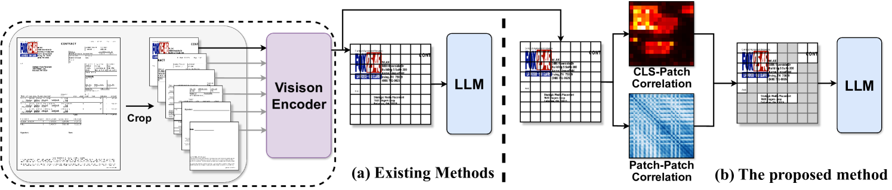

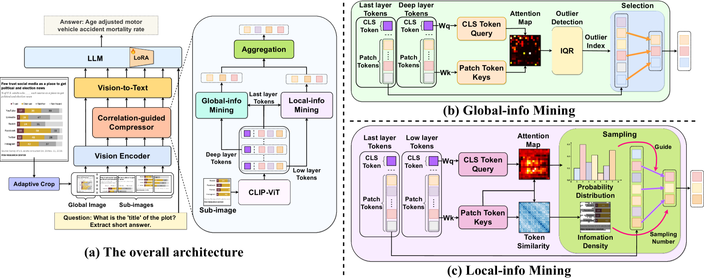

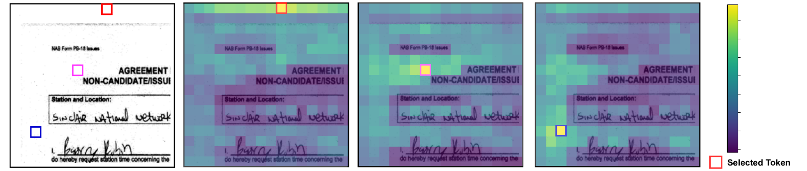

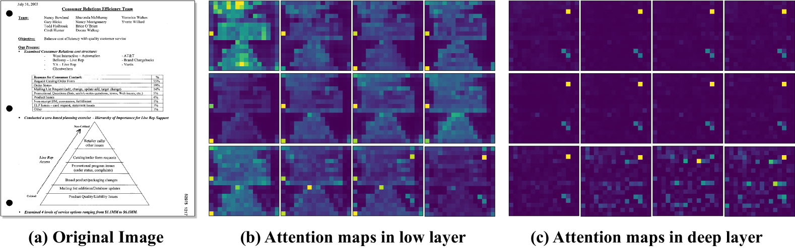

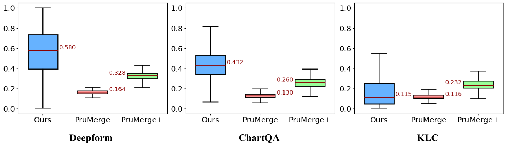

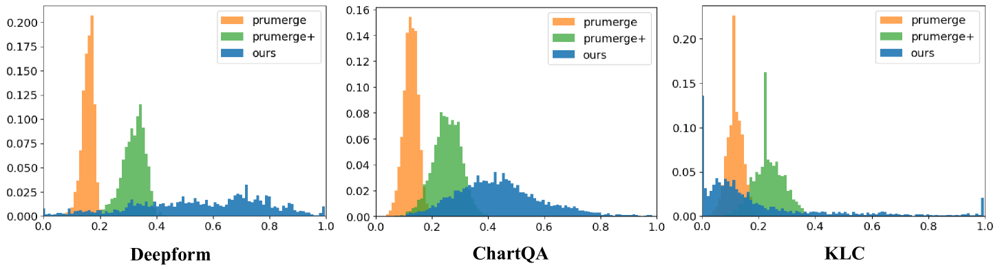

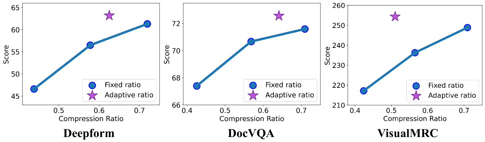

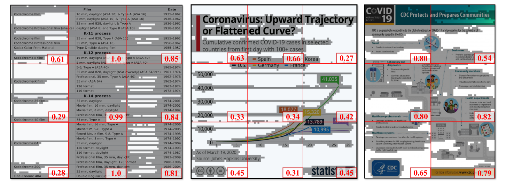

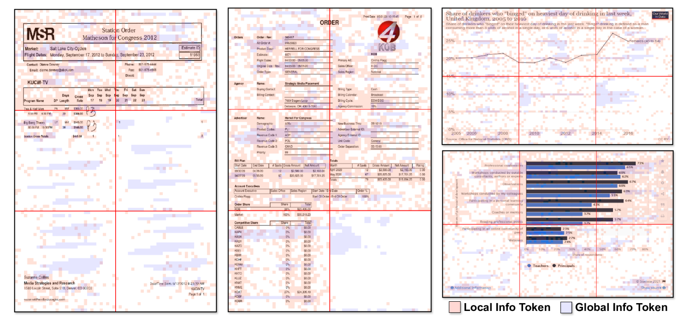

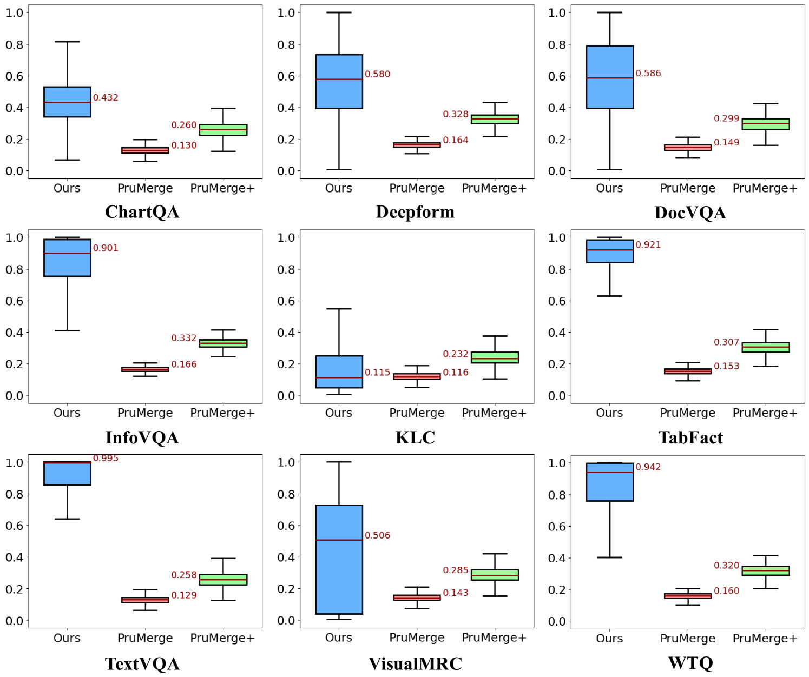

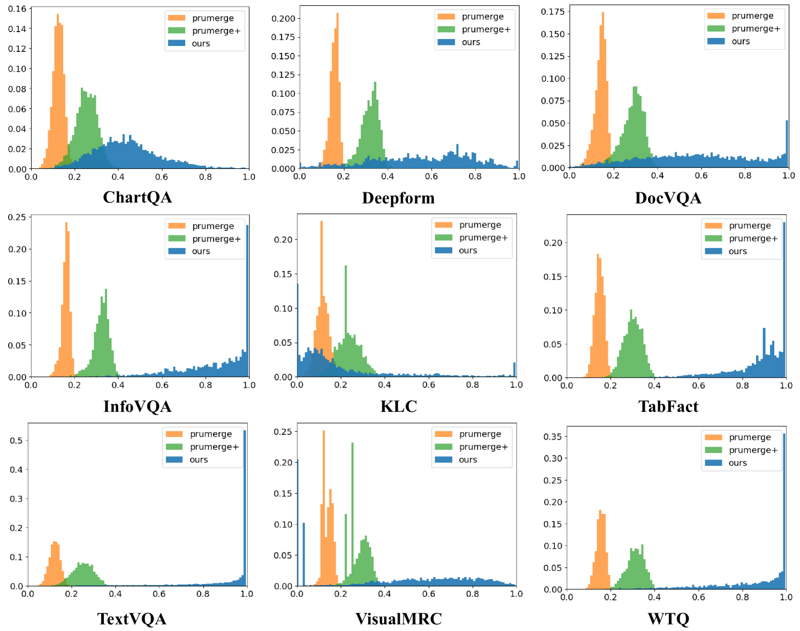

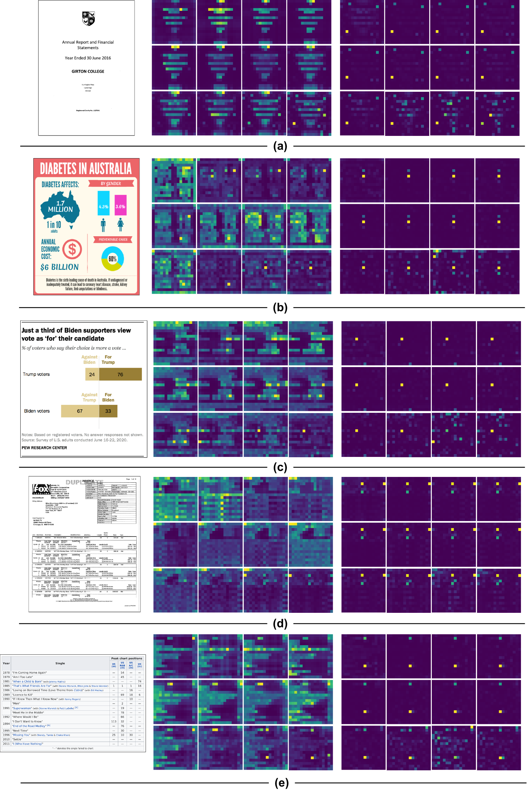

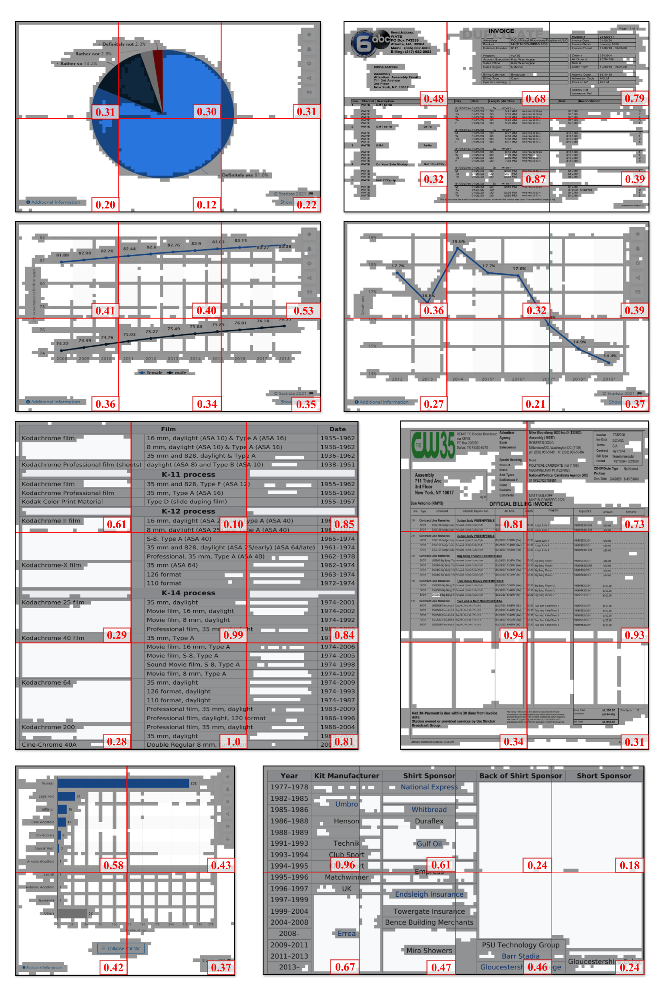

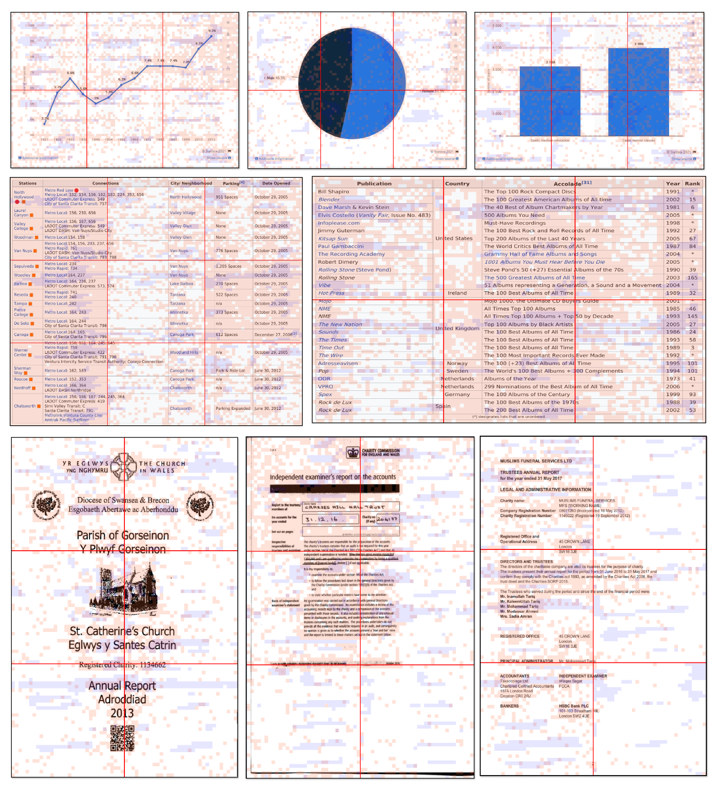

[Arxiv](https://arxiv.org/abs/2407.14439)