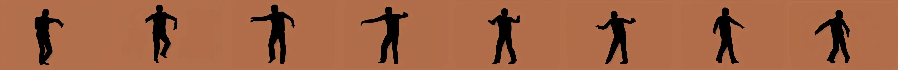

# 探索文本至视频扩散模型中的概念遗忘

发布时间：2024年07月19日

`LLM应用` `版权保护`

> Unlearning Concepts from Text-to-Video Diffusion Models

# 摘要

> 随着计算机视觉和自然语言处理的进步，文本到视频生成技术因文本到视频扩散模型的应用而日益普及。这些模型依赖于互联网上的海量数据进行训练，但这些数据往往包含版权受保护的内容，如卡通角色、艺术家风格、私人肖像及不安全视频等。由于数据过滤和模型重训的复杂性，研究者开始探索从文本到视频扩散模型中移除特定概念的方法。然而，鉴于高计算需求和较大的优化规模，相关研究甚少。为此，我们提出了一种创新的概念遗忘方法，通过借鉴文本到图像扩散模型的文本编码器遗忘能力，将其应用于文本到视频扩散模型。具体来说，我们采用少样本遗忘技术，利用少量生成图像优化文本编码器，进而用于视频生成。该方法不仅计算资源消耗低，优化规模也较小。实验结果显示，我们的方法能够有效移除版权卡通角色、艺术家风格、物体及人物面部特征等概念，且在RTX 3070显卡上仅需约100秒即可完成概念遗忘。此前，文本到视频扩散模型领域尚未有概念遗忘方法，我们的研究填补了这一空白，使得概念遗忘在文本到视频生成领域变得可行且更易实现。

> With the advancement of computer vision and natural language processing, text-to-video generation, enabled by text-to-video diffusion models, has become more prevalent. These models are trained using a large amount of data from the internet. However, the training data often contain copyrighted content, including cartoon character icons and artist styles, private portraits, and unsafe videos. Since filtering the data and retraining the model is challenging, methods for unlearning specific concepts from text-to-video diffusion models have been investigated. However, due to the high computational complexity and relative large optimization scale, there is little work on unlearning methods for text-to-video diffusion models. We propose a novel concept-unlearning method by transferring the unlearning capability of the text encoder of text-to-image diffusion models to text-to-video diffusion models. Specifically, the method optimizes the text encoder using few-shot unlearning, where several generated images are used. We then use the optimized text encoder in text-to-video diffusion models to generate videos. Our method costs low computation resources and has small optimization scale. We discuss the generated videos after unlearning a concept. The experiments demonstrates that our method can unlearn copyrighted cartoon characters, artist styles, objects and people's facial characteristics. Our method can unlearn a concept within about 100 seconds on an RTX 3070. Since there was no concept unlearning method for text-to-video diffusion models before, we make concept unlearning feasible and more accessible in the text-to-video domain.

[Arxiv](https://arxiv.org/abs/2407.14209)