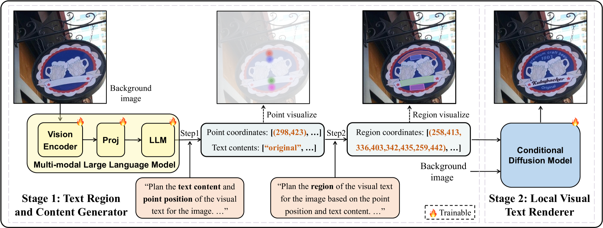

# 自然环境中的视觉文本生成

发布时间：2024年07月19日

`LLM应用` `视觉生成` `文本识别`

> Visual Text Generation in the Wild

# 摘要

> 随着生成模型的飞速进步，视觉文本生成领域也迎来了重大突破。但在实际应用中，要生成高质量的文本图像仍面临挑战，需满足三大关键标准：保真度、合理性和实用性。我们发现，现有方法难以全面达标，限制了其应用。为此，我们创新性地提出了SceneVTG，一种能在复杂环境中生成高质量文本图像的视觉文本生成器。SceneVTG采用两阶段策略，结合多模态大型语言模型与条件扩散模型，确保生成的文本图像既真实又合理，同时极大地提升了其在文本检测与识别等任务中的实用性。实验结果显示，SceneVTG在性能上远超传统与新兴方法。相关代码与数据集已公开，供进一步研究与应用。

> Recently, with the rapid advancements of generative models, the field of visual text generation has witnessed significant progress. However, it is still challenging to render high-quality text images in real-world scenarios, as three critical criteria should be satisfied: (1) Fidelity: the generated text images should be photo-realistic and the contents are expected to be the same as specified in the given conditions; (2) Reasonability: the regions and contents of the generated text should cohere with the scene; (3) Utility: the generated text images can facilitate related tasks (e.g., text detection and recognition). Upon investigation, we find that existing methods, either rendering-based or diffusion-based, can hardly meet all these aspects simultaneously, limiting their application range. Therefore, we propose in this paper a visual text generator (termed SceneVTG), which can produce high-quality text images in the wild. Following a two-stage paradigm, SceneVTG leverages a Multimodal Large Language Model to recommend reasonable text regions and contents across multiple scales and levels, which are used by a conditional diffusion model as conditions to generate text images. Extensive experiments demonstrate that the proposed SceneVTG significantly outperforms traditional rendering-based methods and recent diffusion-based methods in terms of fidelity and reasonability. Besides, the generated images provide superior utility for tasks involving text detection and text recognition. Code and datasets are available at AdvancedLiterateMachinery.

[Arxiv](https://arxiv.org/abs/2407.14138)