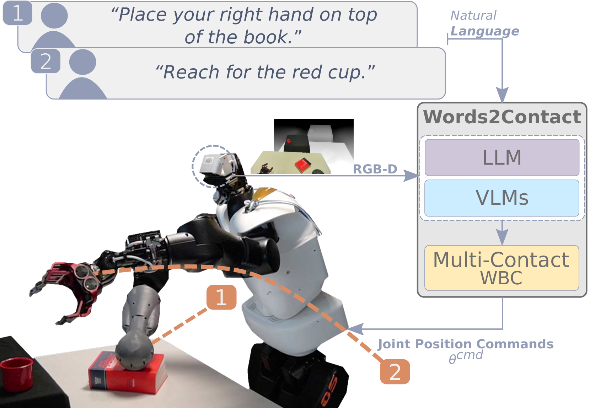
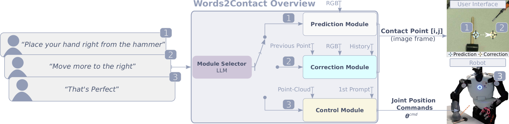
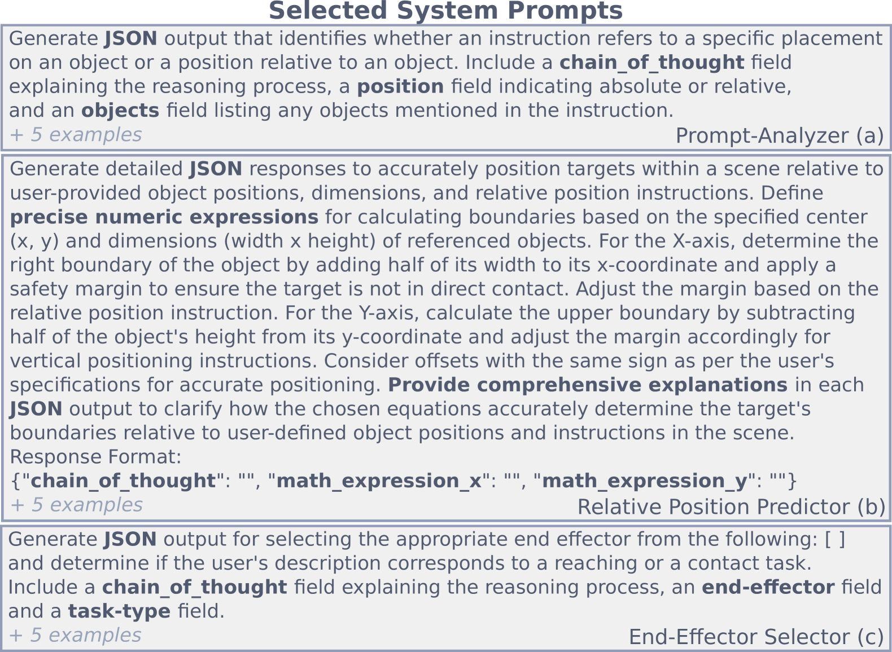
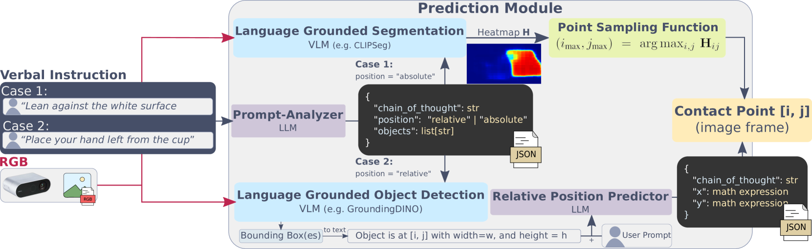
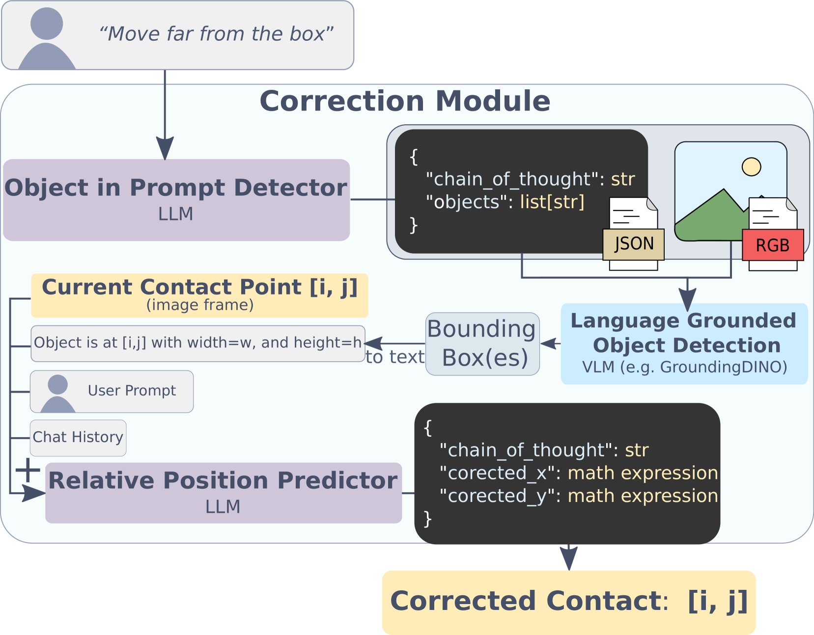
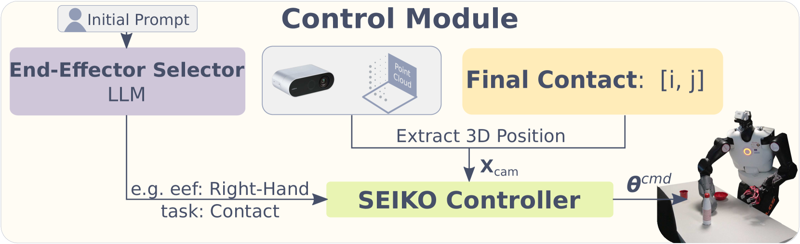
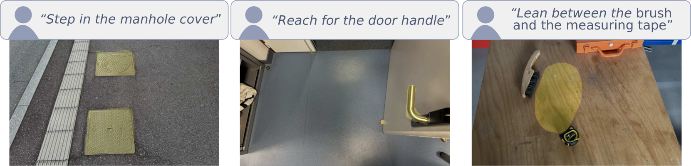
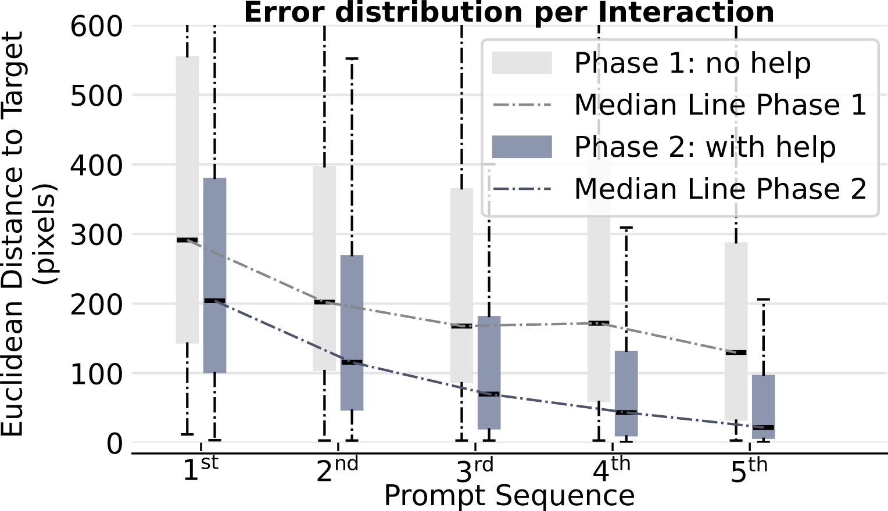
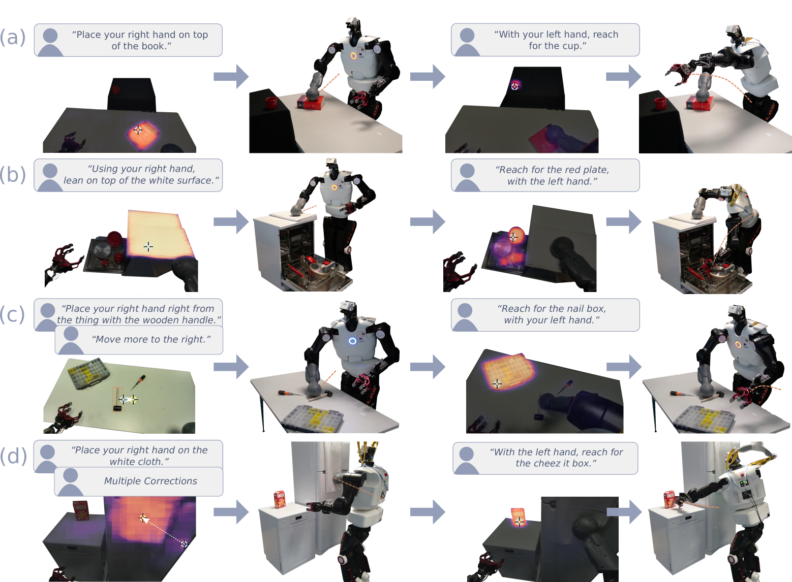

# Words2Contact：借助基础模型，从口头指令中精准识别支持联系人。

发布时间：2024年07月19日

`LLM应用` `机器人` `人机协作`

> Words2Contact: Identifying Support Contacts from Verbal Instructions Using Foundation Models

# 摘要

> 本文推出 Words2Contact，一种结合大型语言模型与视觉语言模型的语言引导多接触点放置系统。该系统是人机协作与远程操作的关键，允许人类操作员用自然语言指导机器人在执行全身动作或操作前确定支撑点。Words2Contact 能将口头指令转换为接触点预测，并支持迭代修正，直至操作员对机器视野内的接触点位置满意。我们评估了最先进的 LLM 和 VLM 在接触点预测中的表现，并展示了迭代修正过程的高效性，即使是新手用户也能迅速掌握如何精确指导系统。最终，我们通过与 Talos 人形机器人在实际操作中的合作，验证了 Words2Contact 的有效性，确保机器人在抓取远物时稳定站立。

> This paper presents Words2Contact, a language-guided multi-contact placement pipeline leveraging large language models and vision language models. Our method is a key component for language-assisted teleoperation and human-robot cooperation, where human operators can instruct the robots where to place their support contacts before whole-body reaching or manipulation using natural language. Words2Contact transforms the verbal instructions of a human operator into contact placement predictions; it also deals with iterative corrections, until the human is satisfied with the contact location identified in the robot's field of view. We benchmark state-of-the-art LLMs and VLMs for size and performance in contact prediction. We demonstrate the effectiveness of the iterative correction process, showing that users, even naive, quickly learn how to instruct the system to obtain accurate locations. Finally, we validate Words2Contact in real-world experiments with the Talos humanoid robot, instructed by human operators to place support contacts on different locations and surfaces to avoid falling when reaching for distant objects.

[Arxiv](https://arxiv.org/abs/2407.14229)