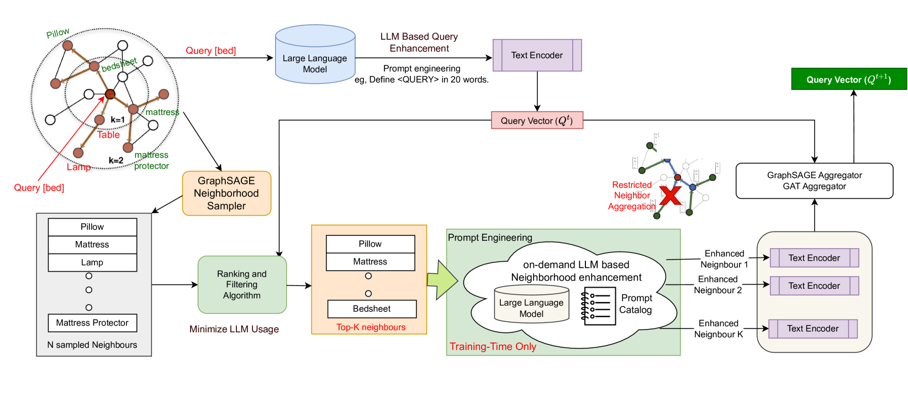
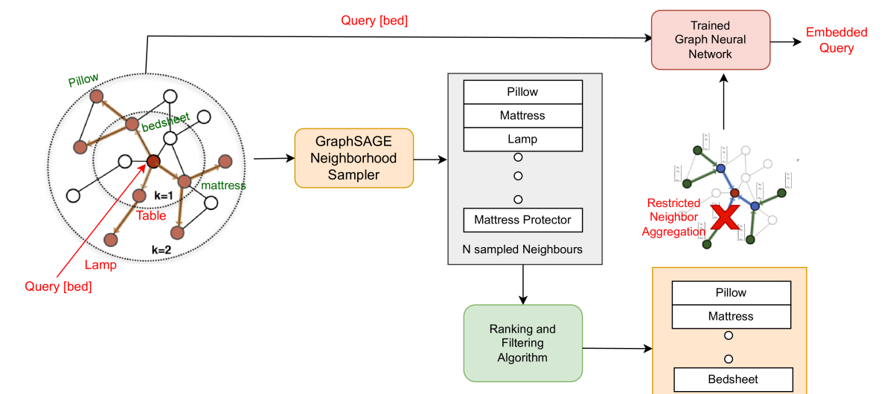
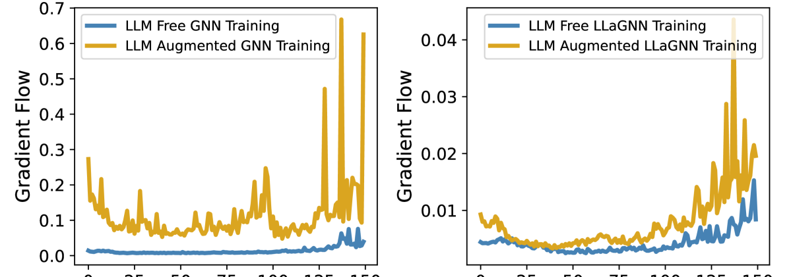
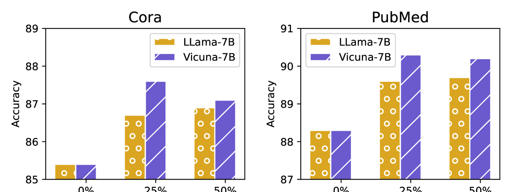

# 全面对抗局部：优化图神经网络中消息传递，高效整合大型语言模型

发布时间：2024年07月20日

`LLM应用` `人工智能` `图数据处理`

> All Against Some: Efficient Integration of Large Language Models for Message Passing in Graph Neural Networks

# 摘要

> 图神经网络 (GNNs) 因其处理图结构数据的广泛应用而备受瞩目。与此同时，大型语言模型 (LLMs) 凭借其深厚的预训练知识和强大的语义理解力，在视觉和文本数据应用中展现出卓越潜力。本文探讨了如何高效利用 LLMs 处理图结构数据，这一领域在 LLM 研究中尚属新颖。我们提出的 E-LLaGNN 框架，通过按需增强图节点的一部分，优化了图学习的消息传递过程。具体而言，E-LLaGNN 先利用 LLMs 精选高质量邻域，再通过多样化提示强化邻域特征，最后结合传统 GNN 架构进行信息聚合。为应对大规模节点处理的挑战，我们设计了多种启发式节点选择策略，以减少计算和内存负担。实验结果表明，E-LLaGNN 不仅提升了深度 GNNs 的梯度流动，还实现了无需 LLM 的推理能力，展现了其广泛的应用前景。

> Graph Neural Networks (GNNs) have attracted immense attention in the past decade due to their numerous real-world applications built around graph-structured data. On the other hand, Large Language Models (LLMs) with extensive pretrained knowledge and powerful semantic comprehension abilities have recently shown a remarkable ability to benefit applications using vision and text data. In this paper, we investigate how LLMs can be leveraged in a computationally efficient fashion to benefit rich graph-structured data, a modality relatively unexplored in LLM literature. Prior works in this area exploit LLMs to augment every node features in an ad-hoc fashion (not scalable for large graphs), use natural language to describe the complex structural information of graphs, or perform computationally expensive finetuning of LLMs in conjunction with GNNs. We propose E-LLaGNN (Efficient LLMs augmented GNNs), a framework with an on-demand LLM service that enriches message passing procedure of graph learning by enhancing a limited fraction of nodes from the graph. More specifically, E-LLaGNN relies on sampling high-quality neighborhoods using LLMs, followed by on-demand neighborhood feature enhancement using diverse prompts from our prompt catalog, and finally information aggregation using message passing from conventional GNN architectures. We explore several heuristics-based active node selection strategies to limit the computational and memory footprint of LLMs when handling millions of nodes. Through extensive experiments & ablation on popular graph benchmarks of varying scales (Cora, PubMed, ArXiv, & Products), we illustrate the effectiveness of our E-LLaGNN framework and reveal many interesting capabilities such as improved gradient flow in deep GNNs, LLM-free inference ability etc.

[Arxiv](https://arxiv.org/abs/2407.14996)