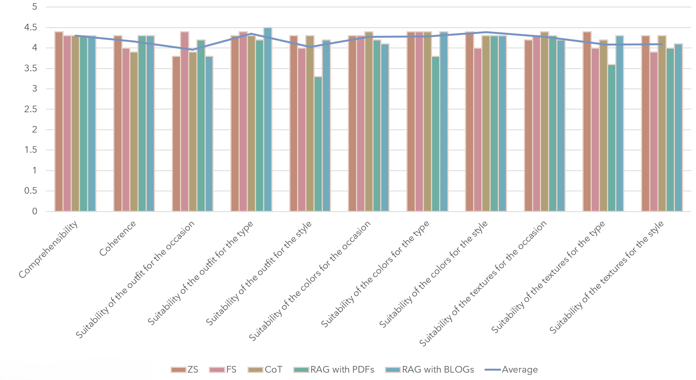

# 借助生成模型中的提示技术，自动创作时尚图像

发布时间：2024年07月20日

`RAG` `人工智能`

> Automatic Generation of Fashion Images using Prompting in Generative Machine Learning Models

# 摘要

> 人工智能的兴起为时尚界带来了革命性的变革，重新定义了创造与创新的新境界。本研究采用两种大型语言模型及一款稳定扩散模型，探索生成个性化时尚描述的方法。我们突破传统，聚焦于零-shot、少-shot学习及思维链（CoT）等提示技术，丰富了色彩与纹理的多样性，提升了作品的多元性。核心方法为检索增强生成（RAG），通过融合时尚领域的智慧，确保作品的时代感。评估方面，我们结合CLIPscore等量化指标与人类的主观评价，凸显了作品在创意、连贯性与美感上的卓越表现。在众多参与者中，RAG与少-shot学习技术因其生成的描述更具相关性与吸引力而备受推崇。项目代码已公开于https://github.com/georgiarg/AutoFashion。

> The advent of artificial intelligence has contributed in a groundbreaking transformation of the fashion industry, redefining creativity and innovation in unprecedented ways. This work investigates methodologies for generating tailored fashion descriptions using two distinct Large Language Models and a Stable Diffusion model for fashion image creation. Emphasizing adaptability in AI-driven fashion creativity, we depart from traditional approaches and focus on prompting techniques, such as zero-shot and few-shot learning, as well as Chain-of-Thought (CoT), which results in a variety of colors and textures, enhancing the diversity of the outputs. Central to our methodology is Retrieval-Augmented Generation (RAG), enriching models with insights from fashion sources to ensure contemporary representations. Evaluation combines quantitative metrics such as CLIPscore with qualitative human judgment, highlighting strengths in creativity, coherence, and aesthetic appeal across diverse styles. Among the participants, RAG and few-shot learning techniques are preferred for their ability to produce more relevant and appealing fashion descriptions. Our code is provided at https://github.com/georgiarg/AutoFashion.

[Arxiv](https://arxiv.org/abs/2407.14944)