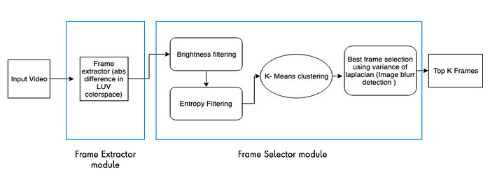

# VLMs 能否助力视频动作识别？LLMs 担当视觉推理的协调者角色。

发布时间：2024年07月20日

`LLM应用` `视频分析`

> Can VLMs be used on videos for action recognition? LLMs are Visual Reasoning Coordinators

# 摘要

> 近期，多种视觉-语言模型 (VLMs) 在跨领域常识推理上表现出色，但这些模型的协同潜力尚未充分挖掘。Cola 框架通过展示 LLM 如何利用自然语言高效协调多个 VLMs，充分发挥各自优势，解决了这一问题。我们在 A-OKVQA 数据集上验证了其有效性。进一步地，我们研究了这种方法是否适用于监控视频中的动作识别，特别是当仅提供关键帧和有限时间信息时，VLMs 和 LLM 能否有效推断动作。实验显示，LLM 在协调 VLMs 时，即便时间信号较弱，也能识别模式并推断动作。为提升这一方法的实用性，我们建议增强时间信号并增加帧数。

> Recent advancements have introduced multiple vision-language models (VLMs) demonstrating impressive commonsense reasoning across various domains. Despite their individual capabilities, the potential of synergizing these complementary VLMs remains underexplored. The Cola Framework addresses this by showcasing how a large language model (LLM) can efficiently coordinate multiple VLMs through natural language communication, leveraging their distinct strengths. We have verified this claim on the challenging A-OKVQA dataset, confirming the effectiveness of such coordination. Building on this, our study investigates whether the same methodology can be applied to surveillance videos for action recognition. Specifically, we explore if leveraging the combined knowledge base of VLMs and LLM can effectively deduce actions from a video when presented with only a few selectively important frames and minimal temporal information. Our experiments demonstrate that LLM, when coordinating different VLMs, can successfully recognize patterns and deduce actions in various scenarios despite the weak temporal signals. However, our findings suggest that to enhance this approach as a viable alternative solution, integrating a stronger temporal signal and exposing the models to slightly more frames would be beneficial.

[Arxiv](https://arxiv.org/abs/2407.14834)