# DISCO：融合可微场景语义与双层控制，实现智能体的具身导航与交互。

发布时间：2024年07月20日

`Agent` `智能家居` `机器人技术`

> DISCO: Embodied Navigation and Interaction via Differentiable Scene Semantics and Dual-level Control

# 摘要

> 打造一个能听从人类指令执行多样任务的智能家庭助手，是具身AI研究的宏伟蓝图。这不仅要求精通任务规划、环境建模，还需擅长物体交互。我们深入探索了具身代理的基本移动操作——如何依据动词-名词指令进行导航与互动。为此，我们创新性地提出了DISCO系统，它在场景建模与控制效率上实现了质的飞跃。DISCO巧妙融合了对象与功能的丰富语义，这些动态学习的场景表示极大地优化了导航规划。同时，我们设计了双级精细动作控制机制，充分利用全局与局部线索，确保移动操作任务的高效执行。DISCO的灵活性使其能无缝融入具身指令跟随等任务。为验证其卓越性能，我们选取了ALFRED基准进行大规模长时限视觉-语言导航与交互测试。实验结果显示，即使在无逐步指令的情况下，DISCO在未见场景中的成功率也大幅领先现有技术8.6%。我们的代码已公开，详见https://github.com/AllenXuuu/DISCO。

> Building a general-purpose intelligent home-assistant agent skilled in diverse tasks by human commands is a long-term blueprint of embodied AI research, which poses requirements on task planning, environment modeling, and object interaction. In this work, we study primitive mobile manipulations for embodied agents, i.e. how to navigate and interact based on an instructed verb-noun pair. We propose DISCO, which features non-trivial advancements in contextualized scene modeling and efficient controls. In particular, DISCO incorporates differentiable scene representations of rich semantics in object and affordance, which is dynamically learned on the fly and facilitates navigation planning. Besides, we propose dual-level coarse-to-fine action controls leveraging both global and local cues to accomplish mobile manipulation tasks efficiently. DISCO easily integrates into embodied tasks such as embodied instruction following. To validate our approach, we take the ALFRED benchmark of large-scale long-horizon vision-language navigation and interaction tasks as a test bed. In extensive experiments, we make comprehensive evaluations and demonstrate that DISCO outperforms the art by a sizable +8.6% success rate margin in unseen scenes, even without step-by-step instructions. Our code is publicly released at https://github.com/AllenXuuu/DISCO.

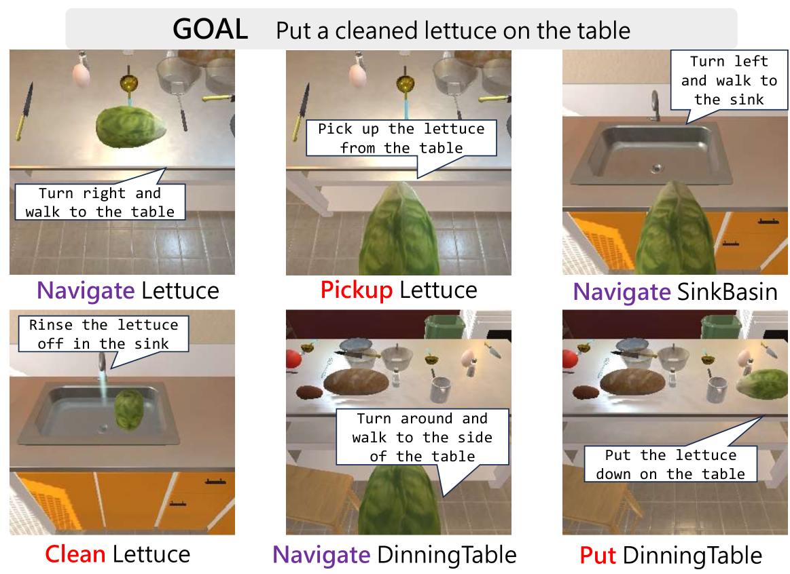

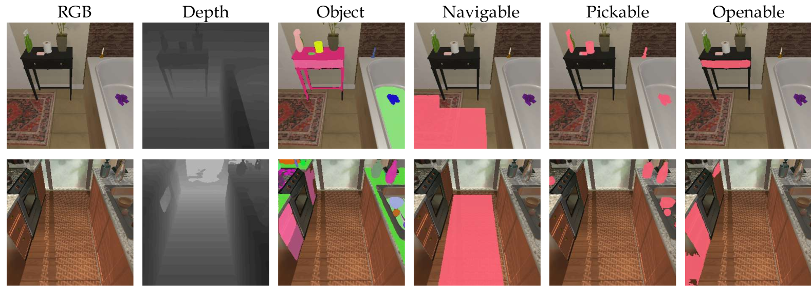

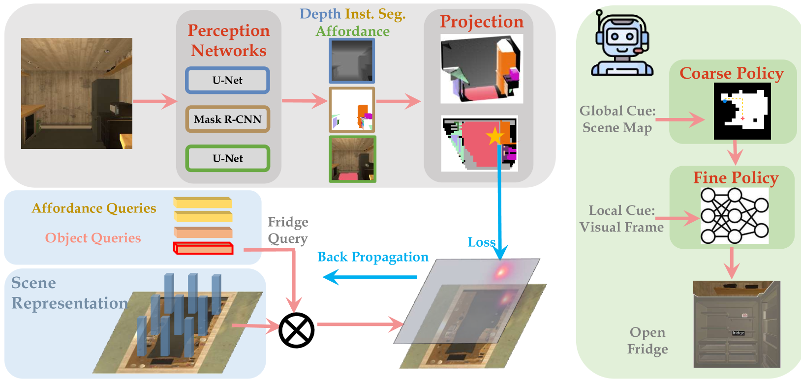

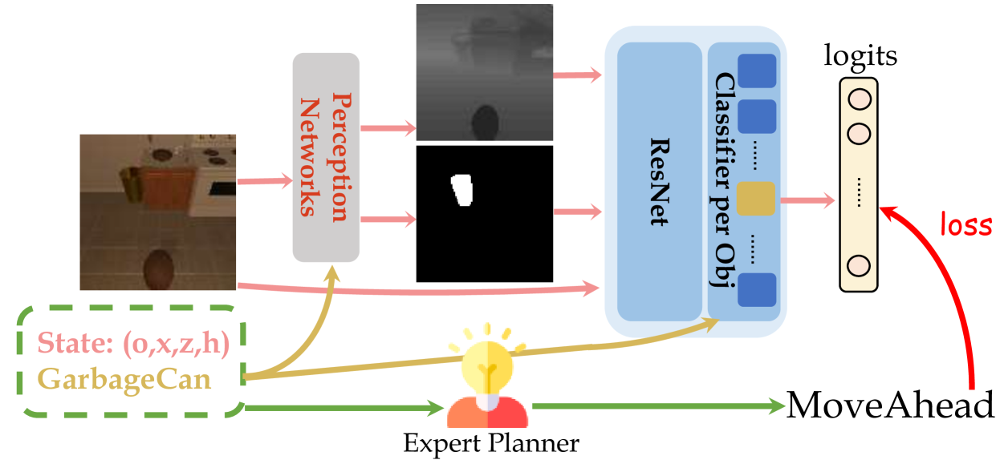

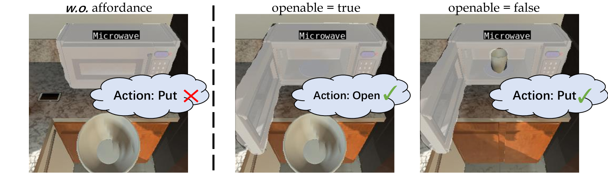

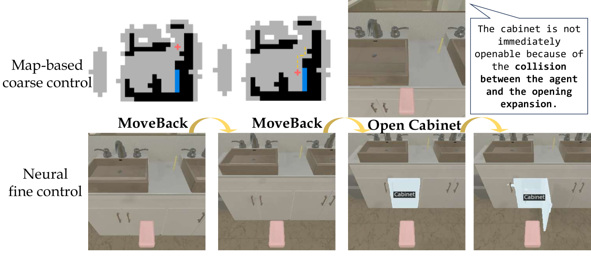

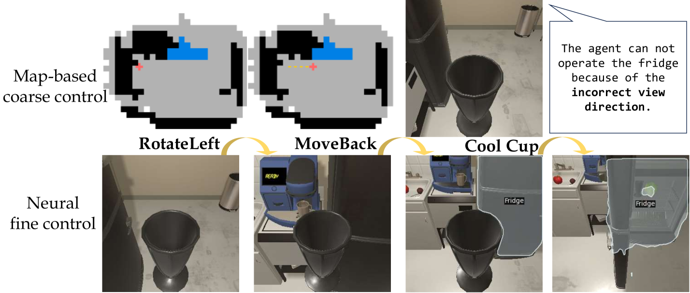

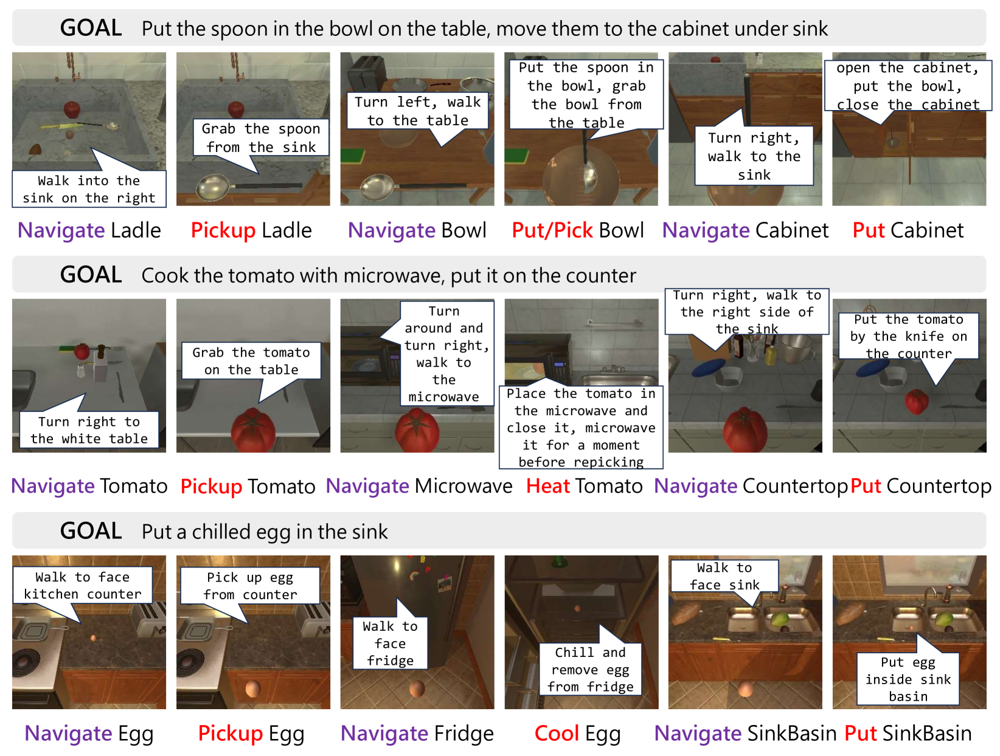

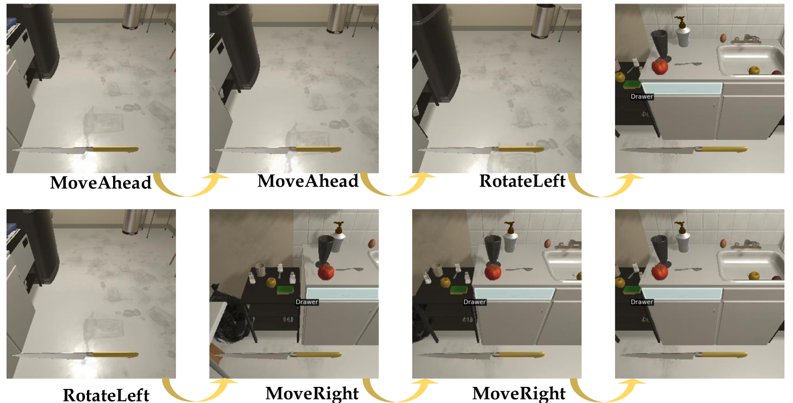

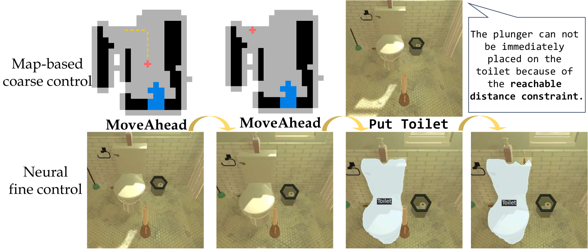

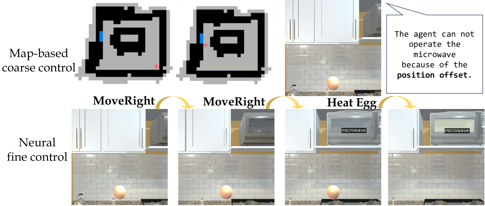

[Arxiv](https://arxiv.org/abs/2407.14758)