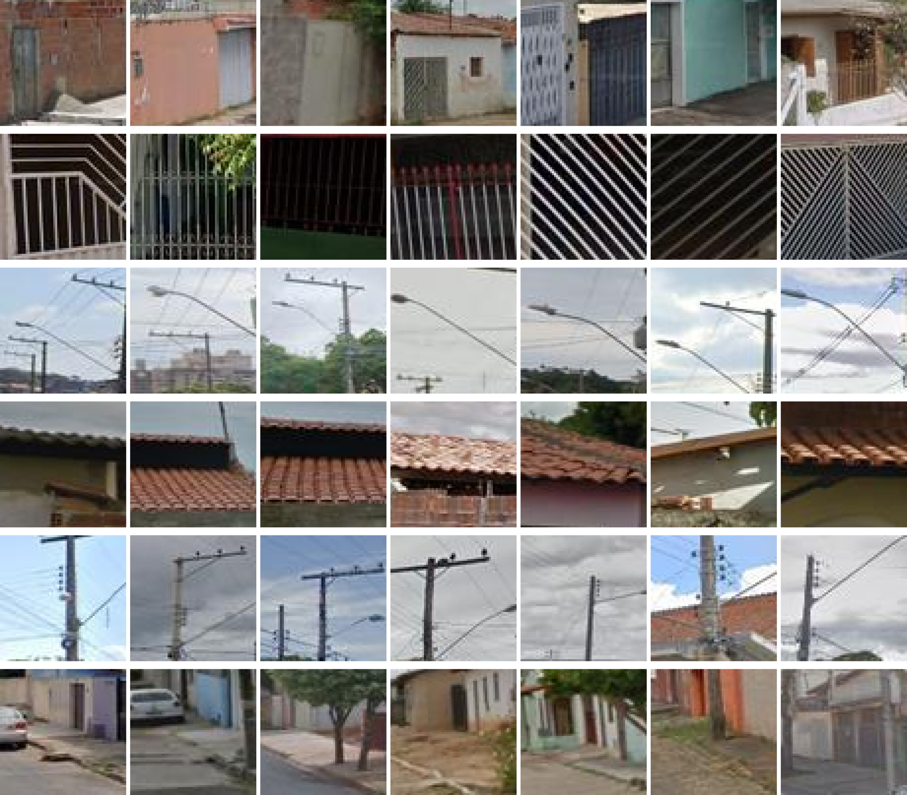

# 扩散模型：数据挖掘的新利器

发布时间：2024年07月20日

`LLM应用` `视觉数据挖掘` `图像合成`

> Diffusion Models as Data Mining Tools

# 摘要

> 本文揭示了如何将图像合成领域的生成模型转化为视觉数据挖掘的利器。我们的核心观点是，既然这些模型能精准捕捉训练数据的特征，我们便可借助它们挖掘视觉模式，从而提炼数据精华。具体而言，我们通过微调条件扩散模型，使其能从特定数据集生成图像，进而利用这些模型定义数据集上的典型性度量。这一度量能评估不同标签（如地理位置、时间戳、语义标签乃至疾病存在）下视觉元素的典型程度。此合成驱动的数据挖掘法有两大优势：一是不需逐一比较所有视觉元素对，扩展性远超传统方法；二是能跨越单一数据集的限制，适用于内容与规模迥异的各类数据集，如历史车、人脸、全球街景及场景数据集。此外，该方法还能实现视觉元素在不同类别间的转换，并洞察其一致性变化。

> 
Abstract:This paper demonstrates how to use generative models trained for image synthesis as tools for visual data mining. Our insight is that since contemporary generative models learn an accurate representation of their training data, we can use them to summarize the data by mining for visual patterns. Concretely, we show that after finetuning conditional diffusion models to synthesize images from a specific dataset, we can use these models to define a typicality measure on that dataset. This measure assesses how typical visual elements are for different data labels, such as geographic location, time stamps, semantic labels, or even the presence of a disease. This analysis-by-synthesis approach to data mining has two key advantages. First, it scales much better than traditional correspondence-based approaches since it does not require explicitly comparing all pairs of visual elements. Second, while most previous works on visual data mining focus on a single dataset, our approach works on diverse datasets in terms of content and scale, including a historical car dataset, a historical face dataset, a large worldwide street-view dataset, and an even larger scene dataset. Furthermore, our approach allows for translating visual elements across class labels and analyzing consistent changes.
    

[Arxiv](https://arxiv.org/pdf/2408.02752)