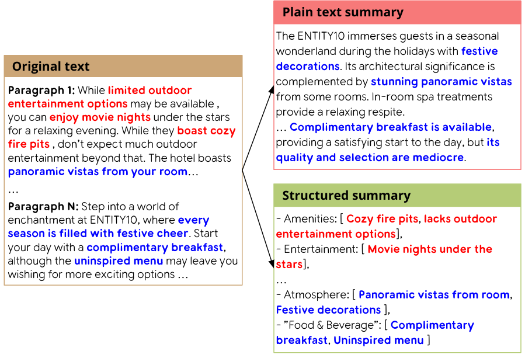
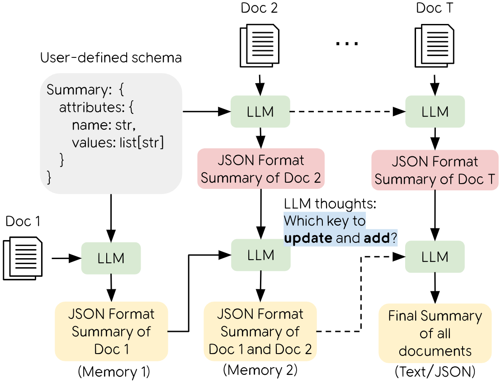
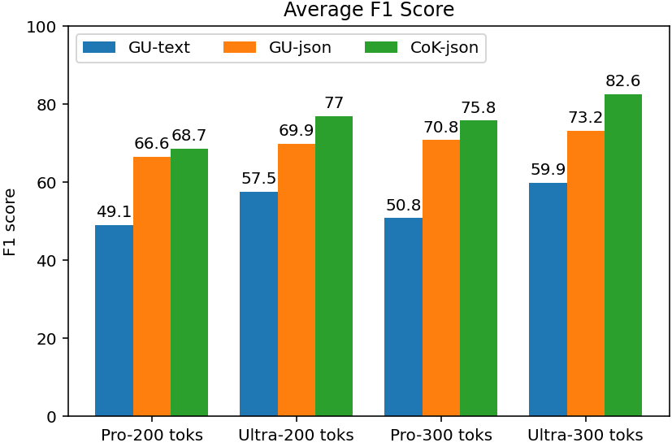
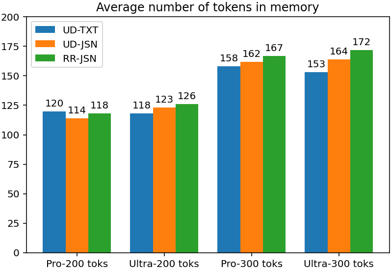

# 利用结构化表示提升增量摘要效果

发布时间：2024年07月20日

`LLM应用` `信息技术` `数据处理`

> Enhancing Incremental Summarization with Structured Representations

# 摘要

> 大型语言模型在处理庞杂的输入信息时，常陷入冗余、不准确或不连贯的总结困境。尽管近期方法尝试通过非结构化记忆来逐步消化这些信息，但仍难逃信息过载的困扰。我们研究中提出的结构化知识表示 ($GU_{json}$)，在两个公共数据集上分别提升了40%和14%的总结质量。尤为突出的是，我们创新的关键链策略 ($CoK_{json}$)，通过动态更新而非重构结构化记忆，进一步提升了7%和4%的性能，有效应对了信息处理的挑战。

> Large language models (LLMs) often struggle with processing extensive input contexts, which can lead to redundant, inaccurate, or incoherent summaries. Recent methods have used unstructured memory to incrementally process these contexts, but they still suffer from information overload due to the volume of unstructured data handled. In our study, we introduce structured knowledge representations ($GU_{json}$), which significantly improve summarization performance by 40% and 14% across two public datasets. Most notably, we propose the Chain-of-Key strategy ($CoK_{json}$) that dynamically updates or augments these representations with new information, rather than recreating the structured memory for each new source. This method further enhances performance by 7% and 4% on the datasets.

[Arxiv](https://arxiv.org/abs/2407.15021)