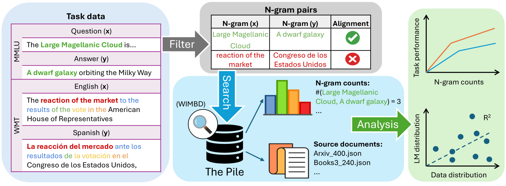
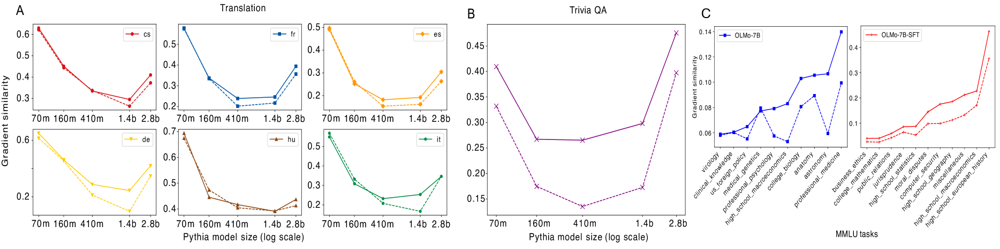
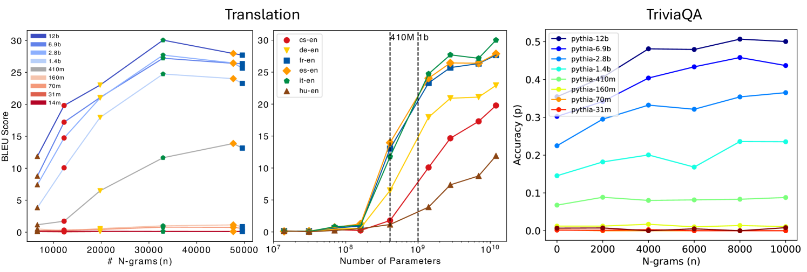
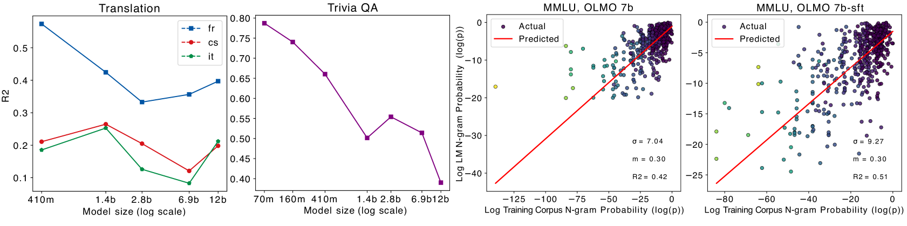
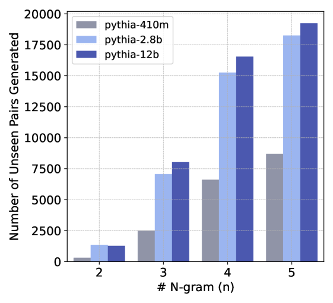
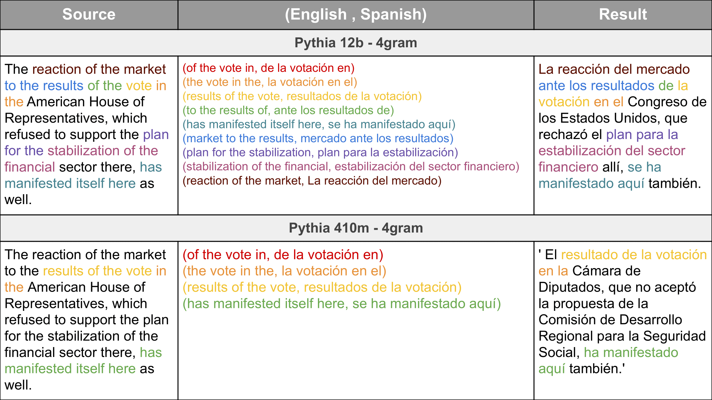
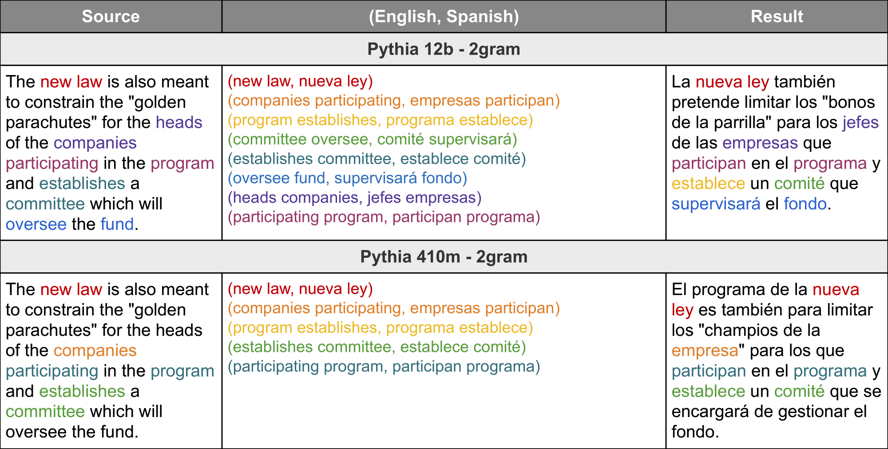
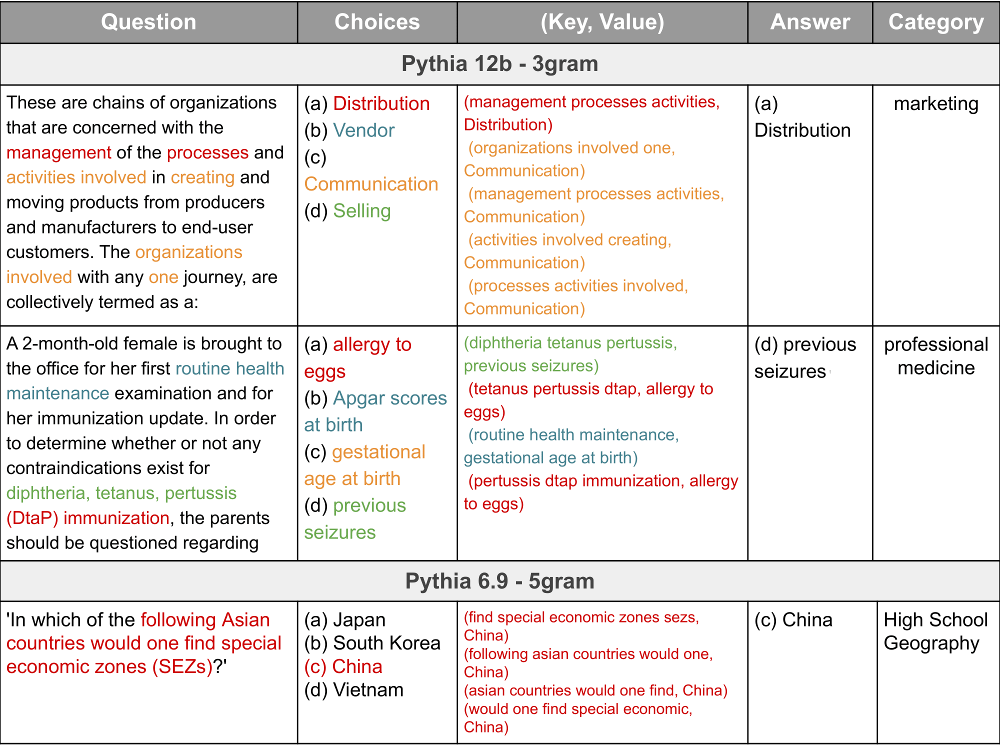
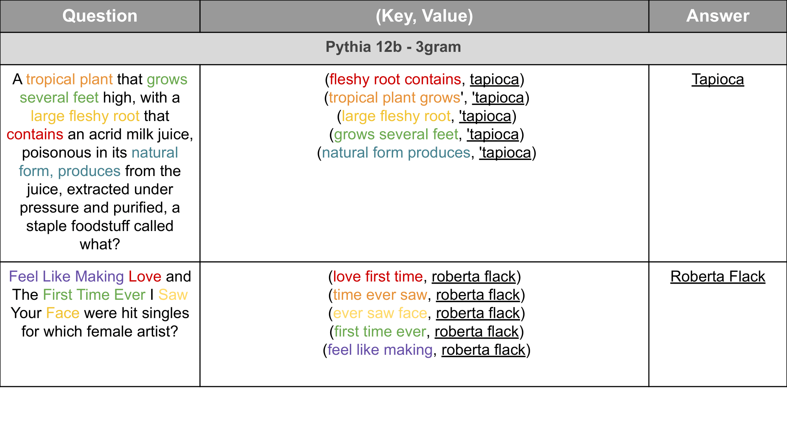

# 探究语言模型的泛化与记忆能力，追溯其根源至预训练数据。

发布时间：2024年07月20日

`LLM理论` `人工智能`

> Generalization v.s. Memorization: Tracing Language Models' Capabilities Back to Pretraining Data

# 摘要

> 尽管 LLM 在实际应用中表现出色，但其如何利用大规模预训练文本语料库的能力仍是个谜。我们通过深入的 $n$-gram 分析，探讨了预训练 LLM 中泛化与记忆的平衡。实验涵盖翻译、问答和多选推理等任务。随着模型规模的扩大，我们发现与任务相关的 $n$-gram 数据愈发关键，不仅提升任务性能，还减少记忆负担，增强泛化能力，并催生新能力。研究结果表明，LLM 的强大能力源于记忆与泛化的精妙平衡，以及充足的任务相关预训练数据。这为未来更大规模的分析提供了方向，有望深化我们对这些模型的理解。

> Despite the proven utility of large language models (LLMs) in real-world applications, there remains a lack of understanding regarding how they leverage their large-scale pretraining text corpora to achieve such capabilities. In this work, we investigate the interplay between generalization and memorization in pretrained LLMs at scale, through a comprehensive $n$-gram analysis of their training data. Our experiments focus on three general task types: translation, question-answering, and multiple-choice reasoning. With various sizes of open-source LLMs and their pretraining corpora, we observe that as the model size increases, the task-relevant $n$-gram pair data becomes increasingly important, leading to improved task performance, decreased memorization, stronger generalization, and emergent abilities. Our results support the hypothesis that LLMs' capabilities emerge from a delicate balance of memorization and generalization with sufficient task-related pretraining data, and point the way to larger-scale analyses that could further improve our understanding of these models.

[Arxiv](https://arxiv.org/abs/2407.14985)