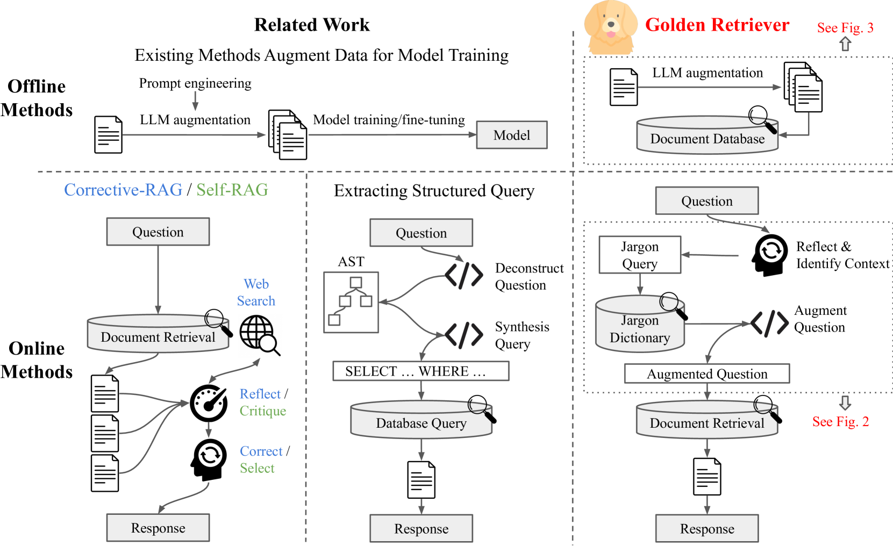
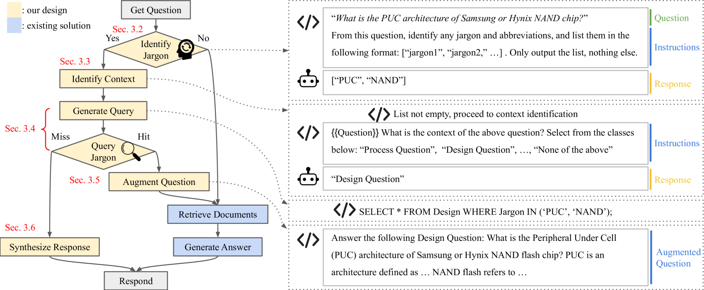
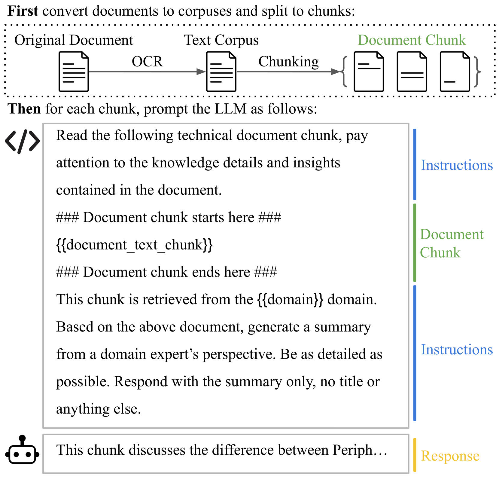

# Golden-Retriever：专为工业知识库设计的高保真、智能增强检索生成系统

发布时间：2024年07月20日

`RAG` `知识库`

> Golden-Retriever: High-Fidelity Agentic Retrieval Augmented Generation for Industrial Knowledge Base

# 摘要

> 本文推出的 Golden-Retriever 工具，专为高效穿越庞大的工业知识库而设计，有效解决了传统 LLM 微调和 RAG 框架在处理专业术语和上下文理解上的难题。Golden-Retriever 在检索文档前，通过识别并澄清术语含义，增强问题表达，确保检索的准确性。具体操作包括提取术语、匹配上下文、查询详细定义，从而为 RAG 框架提供清晰且无歧义的检索环境，大幅提升检索效果。在特定领域问答数据集上的测试表明，Golden-Retriever 性能卓越，为工业知识库的高效整合与查询提供了坚实的技术支持。

> This paper introduces Golden-Retriever, designed to efficiently navigate vast industrial knowledge bases, overcoming challenges in traditional LLM fine-tuning and RAG frameworks with domain-specific jargon and context interpretation. Golden-Retriever incorporates a reflection-based question augmentation step before document retrieval, which involves identifying jargon, clarifying its meaning based on context, and augmenting the question accordingly. Specifically, our method extracts and lists all jargon and abbreviations in the input question, determines the context against a pre-defined list, and queries a jargon dictionary for extended definitions and descriptions. This comprehensive augmentation ensures the RAG framework retrieves the most relevant documents by providing clear context and resolving ambiguities, significantly improving retrieval accuracy. Evaluations using three open-source LLMs on a domain-specific question-answer dataset demonstrate Golden-Retriever's superior performance, providing a robust solution for efficiently integrating and querying industrial knowledge bases.

[Arxiv](https://arxiv.org/abs/2408.00798)