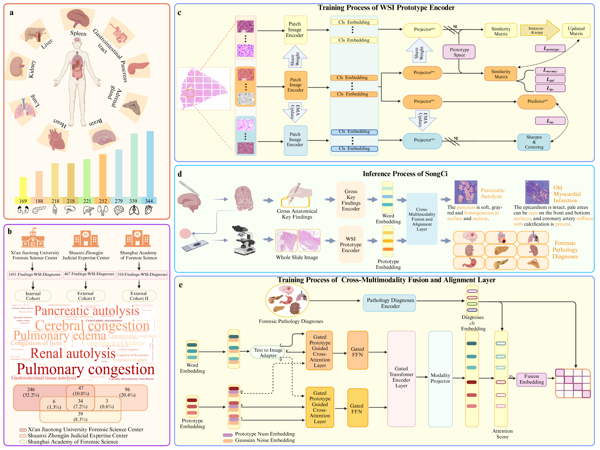
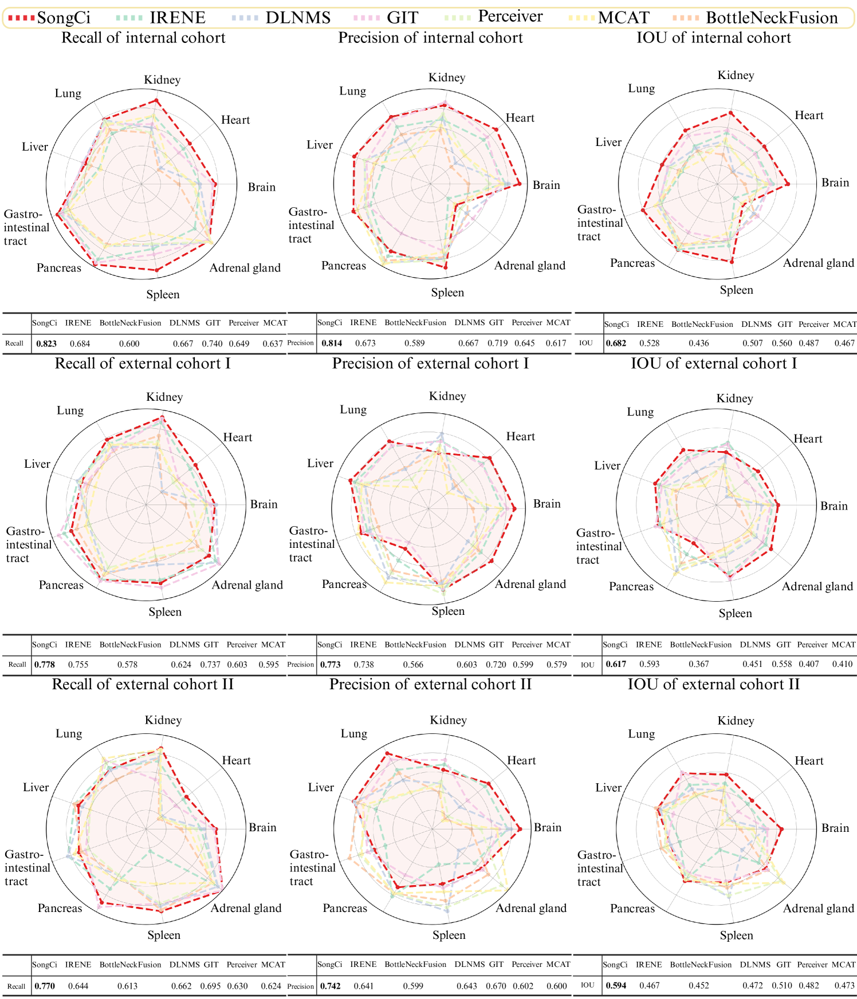
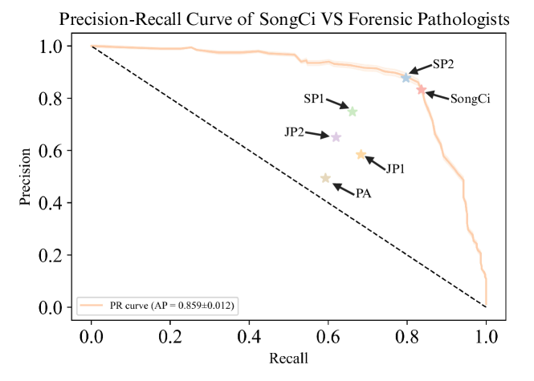
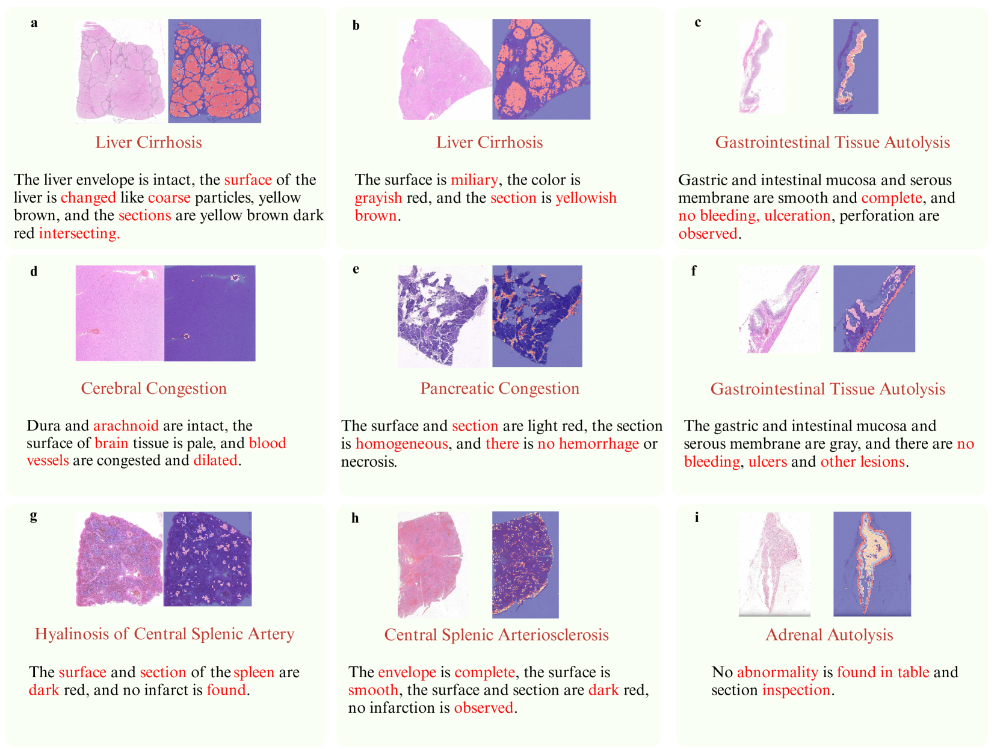

# 利用原型跨模态对比学习技术，实现大规模词汇的法医病理学深入分析

发布时间：2024年07月20日

`LLM应用` `法医病理学` `计算病理学`

> Large-vocabulary forensic pathological analyses via prototypical cross-modal contrastive learning

# 摘要

> 法医病理学通过尸检确定死亡原因，但面临结果不一致、流程繁琐和专家稀缺的挑战。SongCi，一款专为法医病理学定制的视觉-语言模型，通过先进的跨模态学习技术，显著提升了法医分析的准确性与效率。在包含千万级图像数据和数百种诊断结果的大型数据集上，SongCi的表现不仅媲美资深法医，更超越了经验较浅的同行，为法医调查提供了有力的多模态支持。SongCi不仅是首个专为法医病理学设计的VLM，也是法医学领域首个能直接处理千兆像素图像的计算病理学模型，开启了法医病理分析的新篇章。

> Forensic pathology is critical in determining the cause and manner of death through post-mortem examinations, both macroscopic and microscopic. The field, however, grapples with issues such as outcome variability, laborious processes, and a scarcity of trained professionals. This paper presents SongCi, an innovative visual-language model (VLM) designed specifically for forensic pathology. SongCi utilizes advanced prototypical cross-modal self-supervised contrastive learning to enhance the accuracy, efficiency, and generalizability of forensic analyses. It was pre-trained and evaluated on a comprehensive multi-center dataset, which includes over 16 million high-resolution image patches, 2,228 vision-language pairs of post-mortem whole slide images (WSIs), and corresponding gross key findings, along with 471 distinct diagnostic outcomes. Our findings indicate that SongCi surpasses existing multi-modal AI models in many forensic pathology tasks, performs comparably to experienced forensic pathologists and significantly better than less experienced ones, and provides detailed multi-modal explainability, offering critical assistance in forensic investigations. To the best of our knowledge, SongCi is the first VLM specifically developed for forensic pathological analysis and the first large-vocabulary computational pathology (CPath) model that directly processes gigapixel WSIs in forensic science.

[Arxiv](https://arxiv.org/abs/2407.14904)