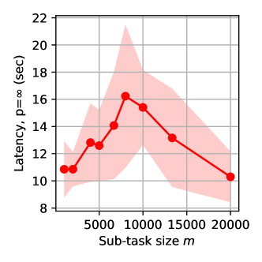

# 探讨基于LLM算法的构思与评估

发布时间：2024年07月20日

`LLM理论` `人工智能` `软件开发`

> On the Design and Analysis of LLM-Based Algorithms

# 摘要

> 我们正式开启了基于大型语言模型（LLM）算法的深入研究，这些算法将LLM作为核心子程序，并高度依赖其能力。尽管从简单的提示工程到复杂的AI系统，基于LLM的算法已取得显著成就，但其设计与优化仍多依赖于经验法则和反复试验。为弥补这一理论空缺，我们首先确立了LLM算法的计算图表示、任务分解原则及关键抽象，以此为基础，我们进行了严谨的准确性与效率分析，即便面对LLM的黑箱特性。此外，我们还通过并行分解案例，深入探讨了四个具体实例。我们的框架不仅揭示了实证现象的内在逻辑，指导超参数选择，预测算法性能，还激发了新算法设计的灵感，推动了LLM算法的进步。为促进更广泛的研究，我们在GitHub上公开了我们的研究代码。

> We initiate a formal investigation into the design and analysis of LLM-based algorithms, i.e. algorithms that contain one or multiple calls of large language models (LLMs) as sub-routines and critically rely on the capabilities of LLMs. While LLM-based algorithms, ranging from basic LLM calls with prompt engineering to complicated LLM-powered agent systems and compound AI systems, have achieved remarkable empirical success, the design and optimization of them have mostly relied on heuristics and trial-and-errors, which is largely due to a lack of formal and analytical study for these algorithms. To fill this gap, we start by identifying the computational-graph representation of LLM-based algorithms, the design principle of task decomposition, and some key abstractions, which then facilitate our formal analysis for the accuracy and efficiency of LLM-based algorithms, despite the black-box nature of LLMs. We further consider parallel decomposition for a case study, providing extensive analytical and empirical study for four concrete examples of this pattern. Our proposed framework holds promise for advancing LLM-based algorithms, by revealing the reasons behind curious empirical phenomena, guiding the choices of hyperparameters, predicting the empirical performance of algorithms, and inspiring new algorithm design. To promote further study of LLM-based algorithms, we release our source code at https://github.com/modelscope/agentscope/tree/main/examples/paper_llm_based_algorithm.

[Arxiv](https://arxiv.org/abs/2407.14788)