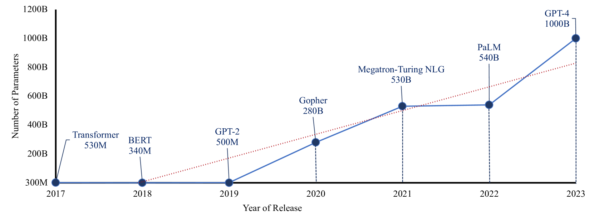

# 生成式AI与大型语言模型领域正迎来新进展，我们探讨其现状、面临的挑战及未来展望。

发布时间：2024年07月20日

`LLM理论` `人工智能`

> Recent Advances in Generative AI and Large Language Models: Current Status, Challenges, and Perspectives

# 摘要

> 生成式AI与大型语言模型的崛起，开启了自然语言处理的新纪元，其前所未有的能力正重塑多个行业。本文深入探讨了这些前沿技术的现状，突显其卓越进步与广泛应用。我们致力于提供一个全面的视角，涵盖生成式AI与LLM的技术基础、实际应用及新兴挑战。我们认为，深入理解AI的生成潜力及LLM的特定环境，对研究者、实践者和政策制定者至关重要，以便共同推动这些技术在各领域的负责任与道德融合。同时，我们揭示并填补了关键研究空白，为AI研究界指明未来探索方向。

> The emergence of Generative Artificial Intelligence (AI) and Large Language Models (LLMs) has marked a new era of Natural Language Processing (NLP), introducing unprecedented capabilities that are revolutionizing various domains. This paper explores the current state of these cutting-edge technologies, demonstrating their remarkable advancements and wide-ranging applications. Our paper contributes to providing a holistic perspective on the technical foundations, practical applications, and emerging challenges within the evolving landscape of Generative AI and LLMs. We believe that understanding the generative capabilities of AI systems and the specific context of LLMs is crucial for researchers, practitioners, and policymakers to collaboratively shape the responsible and ethical integration of these technologies into various domains. Furthermore, we identify and address main research gaps, providing valuable insights to guide future research endeavors within the AI research community.

[Arxiv](https://arxiv.org/abs/2407.14962)