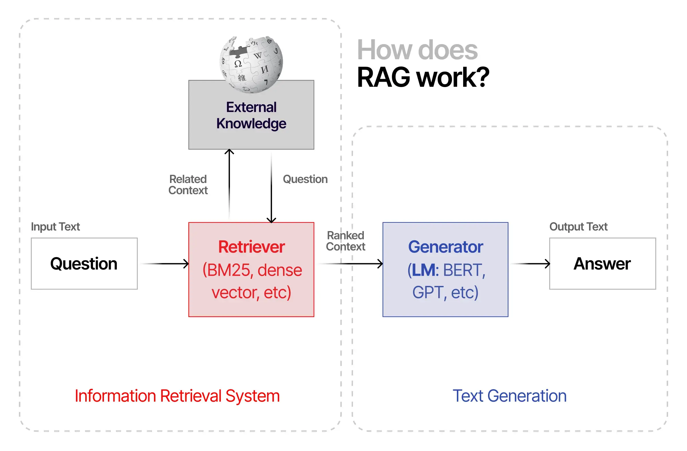

# 智能合约漏洞检测中的检索增强生成集成大型语言模型

发布时间：2024年07月20日

`RAG` `网络安全`

> Retrieval Augmented Generation Integrated Large Language Models in Smart Contract Vulnerability Detection

# 摘要

> 随着去中心化金融（DeFi）的迅猛发展，智能合约漏洞引发的财务损失日益严重，凸显了高效安全审计的紧迫性。攻击频率的上升，使得审计服务的需求激增，尤其对资金有限的独立开发者和中小企业构成负担。本研究创新地将检索增强生成（RAG）技术与大型语言模型（LLM）结合，特别是采用GPT-4-1106的128k令牌窗口，构建了一个包含830个已知漏洞合约的向量库。通过精心设计的提示，我们的模型在引导检测中实现了62.7%的成功率，并在无提示的“盲”审计中达到了60.71%的成功率。尽管成果显著，我们仍强调人工审计的必要性。此研究旨在展示一种经济高效的智能合约审计方法，推动安全审计的民主化。

> The rapid growth of Decentralized Finance (DeFi) has been accompanied by substantial financial losses due to smart contract vulnerabilities, underscoring the critical need for effective security auditing. With attacks becoming more frequent, the necessity and demand for auditing services has escalated. This especially creates a financial burden for independent developers and small businesses, who often have limited available funding for these services. Our study builds upon existing frameworks by integrating Retrieval-Augmented Generation (RAG) with large language models (LLMs), specifically employing GPT-4-1106 for its 128k token context window. We construct a vector store of 830 known vulnerable contracts, leveraging Pinecone for vector storage, OpenAI's text-embedding-ada-002 for embeddings, and LangChain to construct the RAG-LLM pipeline. Prompts were designed to provide a binary answer for vulnerability detection. We first test 52 smart contracts 40 times each against a provided vulnerability type, verifying the replicability and consistency of the RAG-LLM. Encouraging results were observed, with a 62.7% success rate in guided detection of vulnerabilities. Second, we challenge the model under a "blind" audit setup, without the vulnerability type provided in the prompt, wherein 219 contracts undergo 40 tests each. This setup evaluates the general vulnerability detection capabilities without hinted context assistance. Under these conditions, a 60.71% success rate was observed. While the results are promising, we still emphasize the need for human auditing at this time. We provide this study as a proof of concept for a cost-effective smart contract auditing process, moving towards democratic access to security.

[Arxiv](https://arxiv.org/abs/2407.14838)