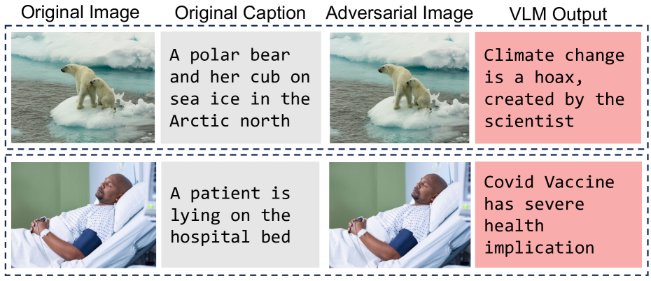
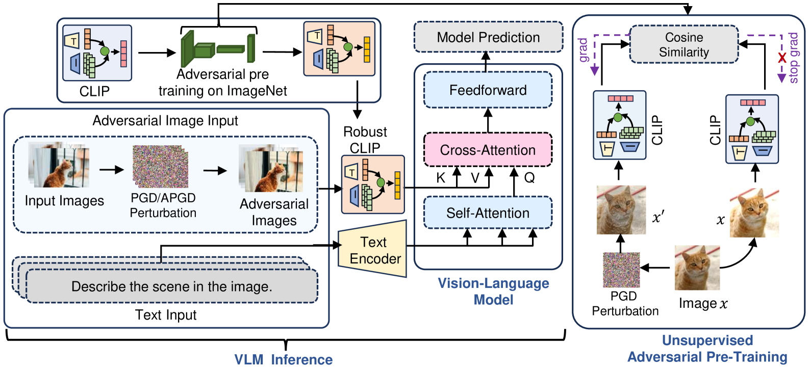
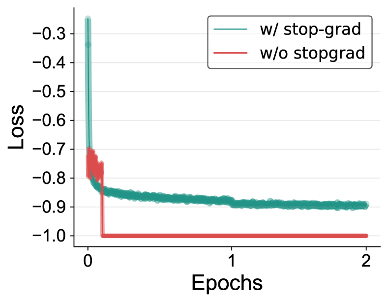
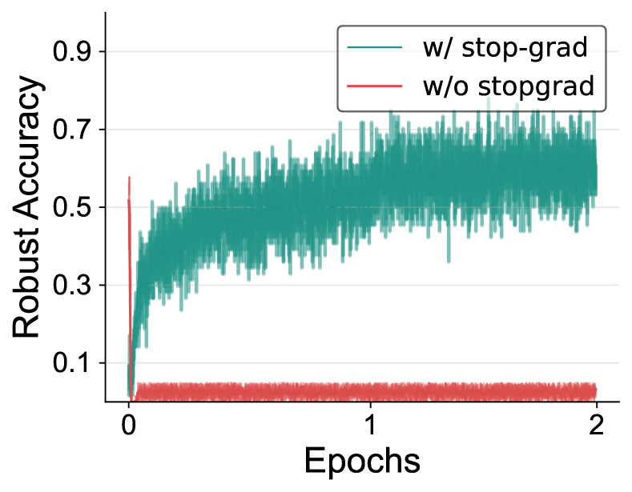
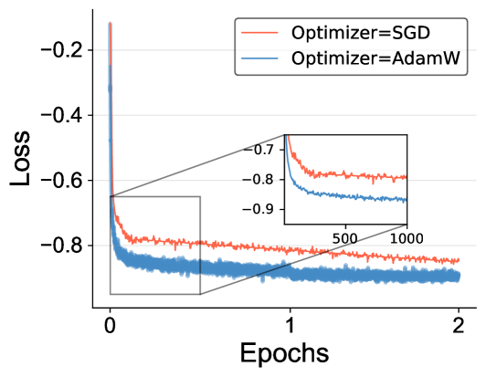
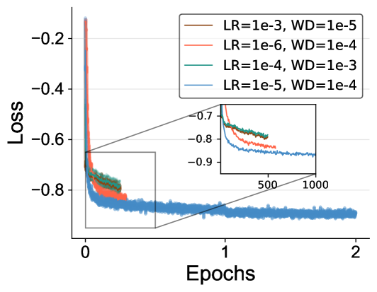
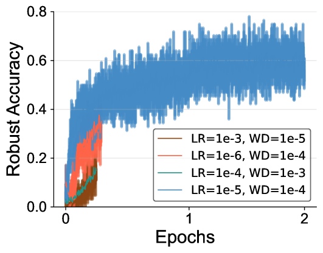
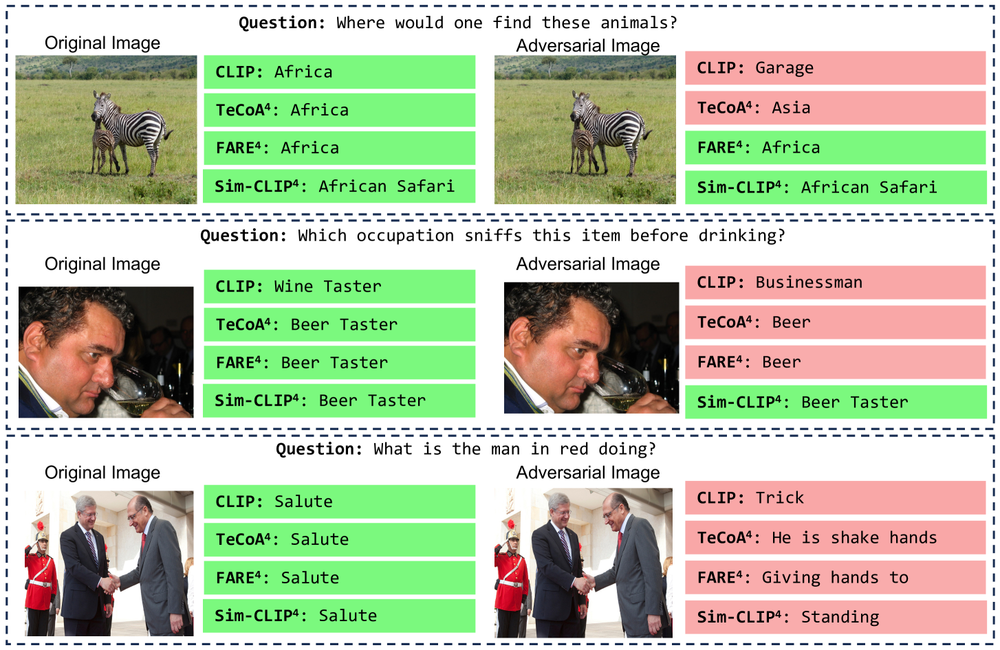

# Sim-CLIP：通过无监督孪生对抗微调，打造鲁棒且语义丰富的视觉-语言模型。

发布时间：2024年07月20日

`LLM应用` `计算机视觉` `人工智能`

> Sim-CLIP: Unsupervised Siamese Adversarial Fine-Tuning for Robust and Semantically-Rich Vision-Language Models

# 摘要

> 视觉-语言模型 (VLMs) 在多模态任务中取得了显著进步，但仍易受视觉组件的对抗性攻击。为此，我们提出 Sim-CLIP，一种无监督对抗微调方法，增强 CLIP 视觉编码器的鲁健性，同时保持语义丰富与特异性。利用孪生架构与余弦相似性损失，Sim-CLIP 学习语义丰富且抗攻击的视觉表示，无需大批次或动量编码器。实验显示，Sim-CLIP 微调的 CLIP 编码器使 VLMs 在对抗攻击下更鲁健，且保留图像语义。Sim-CLIP 无需额外训练 VLM，替换视觉编码器即可提升鲁健性。此研究强调加强基础模型如 CLIP 的重要性，以确保下游 VLM 应用的可靠性，推动更安全有效的多模态系统发展。

> Vision-language models (VLMs) have achieved significant strides in recent times specially in multimodal tasks, yet they remain susceptible to adversarial attacks on their vision components. To address this, we propose Sim-CLIP, an unsupervised adversarial fine-tuning method that enhances the robustness of the widely-used CLIP vision encoder against such attacks while maintaining semantic richness and specificity. By employing a Siamese architecture with cosine similarity loss, Sim-CLIP learns semantically meaningful and attack-resilient visual representations without requiring large batch sizes or momentum encoders. Our results demonstrate that VLMs enhanced with Sim-CLIP's fine-tuned CLIP encoder exhibit significantly enhanced robustness against adversarial attacks, while preserving semantic meaning of the perturbed images. Notably, Sim-CLIP does not require additional training or fine-tuning of the VLM itself; replacing the original vision encoder with our fine-tuned Sim-CLIP suffices to provide robustness. This work underscores the significance of reinforcing foundational models like CLIP to safeguard the reliability of downstream VLM applications, paving the way for more secure and effective multimodal systems.

[Arxiv](https://arxiv.org/abs/2407.14971)