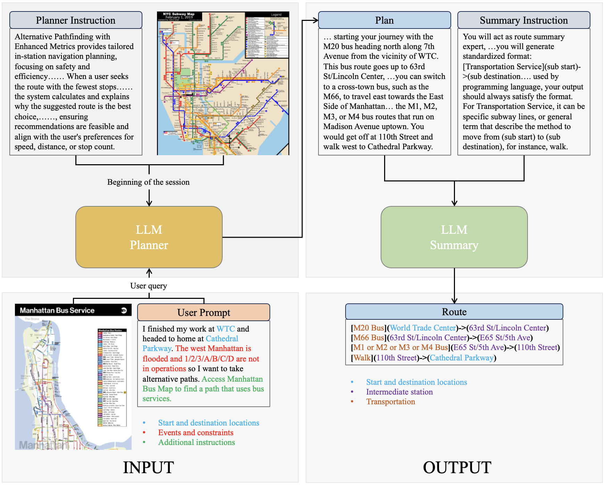
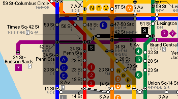
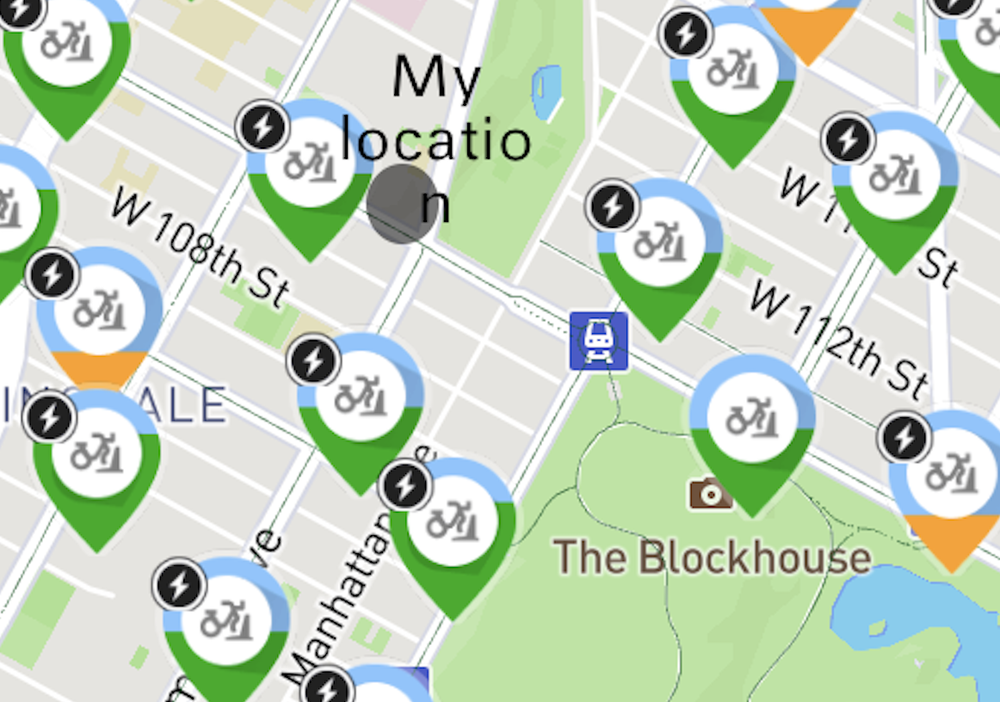
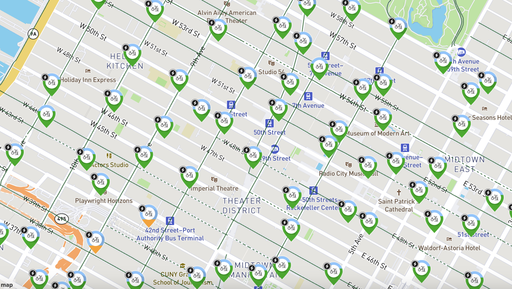
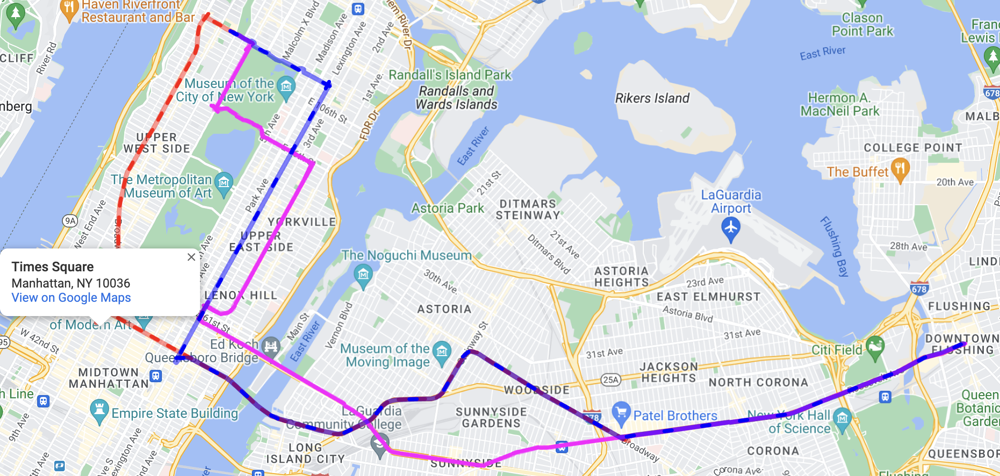

# TraveLLM：在网络中断的情况下，能否为我规划一条新的公共交通路线？

发布时间：2024年07月20日

`LLM应用` `导航系统`

> TraveLLM: Could you plan my new public transit route in face of a network disruption?

# 摘要

> 设想一下，时代广场地铁站的1号列车发生故障，你在Google地图上寻找前往JFK机场的替代路线，却未能获得一个兼顾故障和避免拥挤站点的理想方案。我们发现，在许多类似情况下，现有导航应用往往力不从心，无法提供合理建议。为此，本文研发了TraveLLM原型，利用大型语言模型（LLM）在面对交通中断时规划公共交通路线。LLM在多领域推理与规划中展现出非凡能力，我们旨在探索其将多模态用户特定需求与约束融入公共交通路线推荐的潜力。通过设计涵盖不同天气、紧急事件及新交通服务的多样化测试案例，我们对比了GPT-4、Claude 3和Gemini等顶尖LLM在路线生成上的表现。比较分析显示，尤其是GPT-4，在导航规划上表现出色。这些发现预示着LLM有望提升现有导航系统，为应对交通中断提供更灵活智能的解决方案，满足用户多样需求。

> Imagine there is a disruption in train 1 near Times Square metro station. You try to find an alternative subway route to the JFK airport on Google Maps, but the app fails to provide a suitable recommendation that takes into account the disruption and your preferences to avoid crowded stations. We find that in many such situations, current navigation apps may fall short and fail to give a reasonable recommendation. To fill this gap, in this paper, we develop a prototype, TraveLLM, to plan routing of public transit in face of disruption that relies on Large Language Models (LLMs). LLMs have shown remarkable capabilities in reasoning and planning across various domains. Here we hope to investigate the potential of LLMs that lies in incorporating multi-modal user-specific queries and constraints into public transit route recommendations. Various test cases are designed under different scenarios, including varying weather conditions, emergency events, and the introduction of new transportation services. We then compare the performance of state-of-the-art LLMs, including GPT-4, Claude 3 and Gemini, in generating accurate routes. Our comparative analysis demonstrates the effectiveness of LLMs, particularly GPT-4 in providing navigation plans. Our findings hold the potential for LLMs to enhance existing navigation systems and provide a more flexible and intelligent method for addressing diverse user needs in face of disruptions.

[Arxiv](https://arxiv.org/abs/2407.14926)