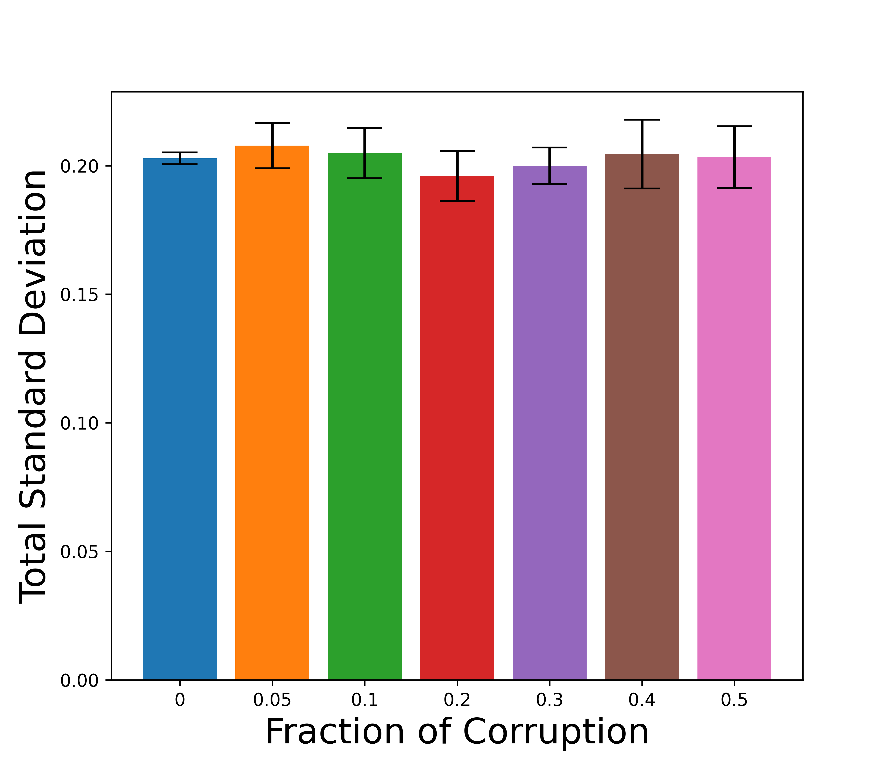
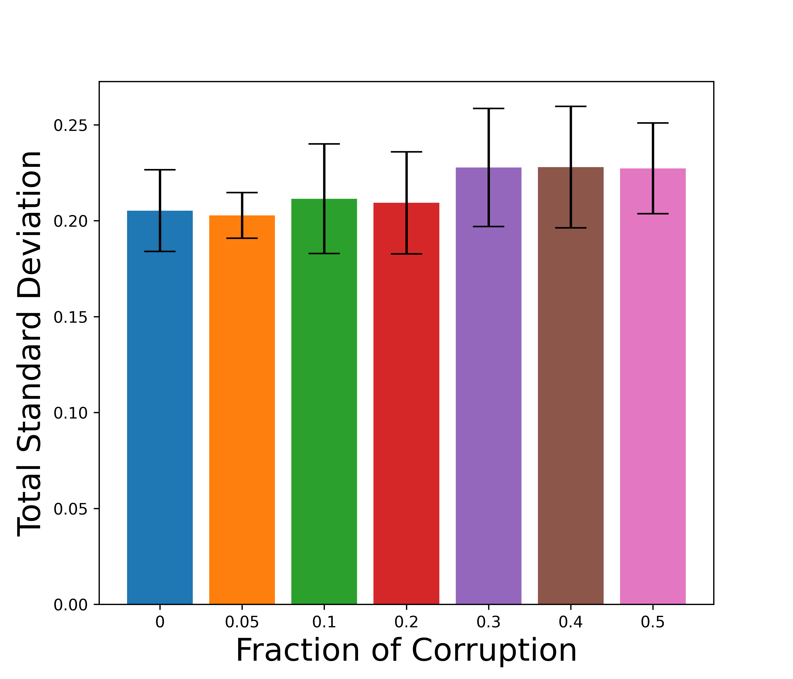
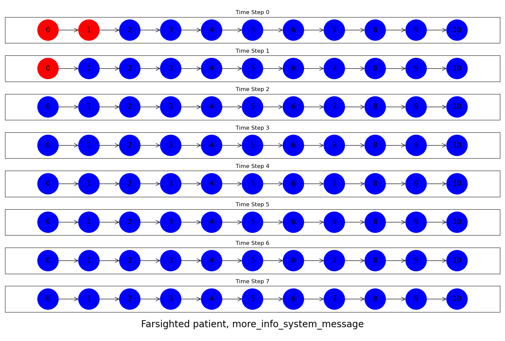
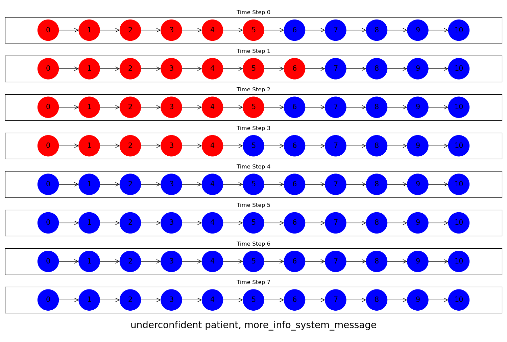

# 探究大型语言模型中提示与响应不确定性之间的关联

发布时间：2024年07月20日

`LLM理论` `人工智能`

> Understanding the Relationship between Prompts and Response Uncertainty in Large Language Models

# 摘要

> LLM 在决策领域的应用广泛，但其可靠性，尤其是在医疗等关键任务中，尚未稳固。理解 LLM 的推理与决策过程对其安全应用至关重要。本文探讨了 LLM 响应的不确定性与输入提示信息之间的关系。基于 LLM 预训练中学习推断潜在概念的特性，我们构建了一个提示-响应概念模型，揭示了 LLM 响应生成机制，并阐明了提示与响应不确定性间的联系。实验表明，提示信息越丰富，响应的不确定性越低，这与认知不确定性相似。我们的实验结果在真实数据集上验证了这一模型的有效性。

> Large language models (LLMs) are widely used in decision-making, but their reliability, especially in critical tasks like healthcare, is not well-established. Therefore, understanding how LLMs reason and make decisions is crucial for their safe deployment. This paper investigates how the uncertainty of responses generated by LLMs relates to the information provided in the input prompt. Leveraging the insight that LLMs learn to infer latent concepts during pretraining, we propose a prompt-response concept model that explains how LLMs generate responses and helps understand the relationship between prompts and response uncertainty. We show that the uncertainty decreases as the prompt's informativeness increases, similar to epistemic uncertainty. Our detailed experimental results on real datasets validate our proposed model.

[Arxiv](https://arxiv.org/abs/2407.14845)