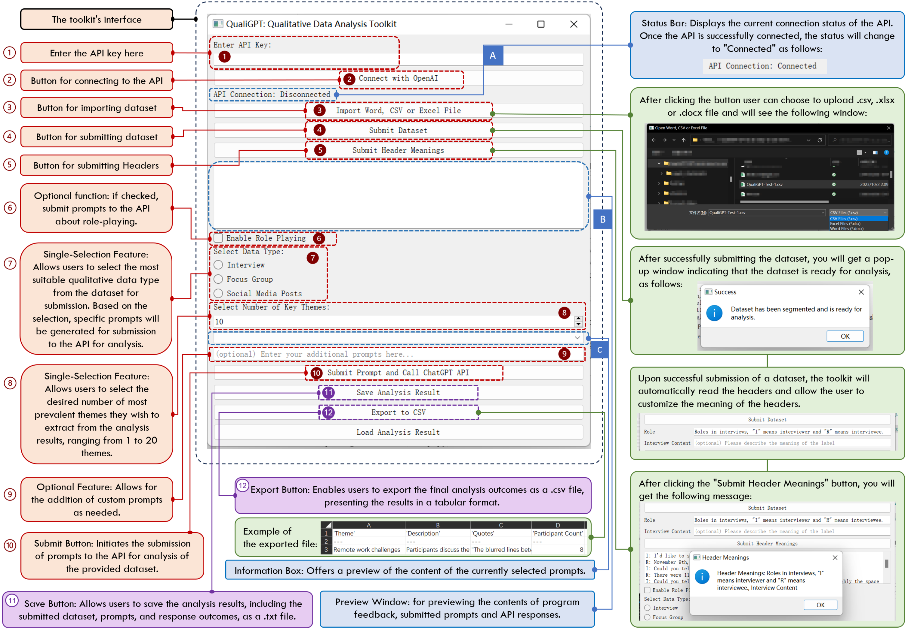

# 定性研究与大型语言模型的邂逅：揭秘 QualiGPT 在定性编码中的应用潜力

发布时间：2024年07月20日

`LLM应用` `社会科学` `人工智能`

> When Qualitative Research Meets Large Language Model: Exploring the Potential of QualiGPT as a Tool for Qualitative Coding

# 摘要

> 定性研究因其深入探索复杂现象的能力而备受推崇，但常涉及耗时的分析，尤其是在编码阶段。现有定性分析软件多缺乏自动化、用户友好及成本效益。随着GPT-3等大型语言模型的兴起，定性分析迎来了革新机遇。本文推出的QualiGPT工具，旨在解决ChatGPT在定性分析中的难题。通过对比传统手动编码与QualiGPT在模拟及真实数据上的表现，采用归纳与演绎编码法，我们证实QualiGPT大幅优化了定性分析流程。研究显示，QualiGPT提升了编码效率、透明度及易用性。通过评分者间一致性评估，QualiGPT与人类编码员在多种场景下达成高度一致。此外，我们还探讨了AI融入定性研究的意义，并展望了未来人机协作的提升方向。

> Qualitative research, renowned for its in-depth exploration of complex phenomena, often involves time-intensive analysis, particularly during the coding stage. Existing software for qualitative evaluation frequently lacks automatic coding capabilities, user-friendliness, and cost-effectiveness. The advent of Large Language Models (LLMs) like GPT-3 and its successors marks a transformative era for enhancing qualitative analysis. This paper introduces QualiGPT, a tool developed to address the challenges associated with using ChatGPT for qualitative analysis. Through a comparative analysis of traditional manual coding and QualiGPT's performance on both simulated and real datasets, incorporating both inductive and deductive coding approaches, we demonstrate that QualiGPT significantly improves the qualitative analysis process. Our findings show that QualiGPT enhances efficiency, transparency, and accessibility in qualitative coding. The tool's performance was evaluated using inter-rater reliability (IRR) measures, with results indicating substantial agreement between human coders and QualiGPT in various coding scenarios. In addition, we also discuss the implications of integrating AI into qualitative research workflows and outline future directions for enhancing human-AI collaboration in this field.

[Arxiv](https://arxiv.org/abs/2407.14925)