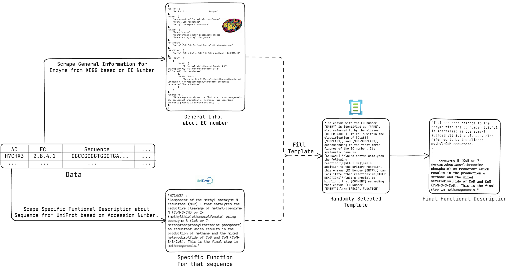

# 本研究推出一个基准数据集，旨在通过结合DNA序列与自然语言，实现对酶功能的多模态预测。

发布时间：2024年07月21日

`LLM应用` `生物学`

> A Benchmark Dataset for Multimodal Prediction of Enzymatic Function Coupling DNA Sequences and Natural Language

# 摘要

> 预测基因功能是生物学的一大挑战。众多深度学习模型通过利用公共数据库中的信息，尝试从DNA序列预测酶功能。然而，生物学知识的许多方面并未体现在分类标签中，而是以非结构化文本形式描述了机制、反应和酶行为。这些文本常与DNA序列一同存储在数据库中。深度学习模型若能整合这些多模态数据，将极大提升酶功能预测的准确性。为此，我们创建了一个新数据集和基准套件，支持开发大型多模态神经网络模型，结合基因DNA序列和自然语言描述进行功能预测。我们的基准测试显示了无监督和监督任务的难度，并证明了多模态数据在功能预测中的优势。数据集链接：https://hoarfrost-lab.github.io/BioTalk/。

> Predicting gene function from its DNA sequence is a fundamental challenge in biology. Many deep learning models have been proposed to embed DNA sequences and predict their enzymatic function, leveraging information in public databases linking DNA sequences to an enzymatic function label. However, much of the scientific community's knowledge of biological function is not represented in these categorical labels, and is instead captured in unstructured text descriptions of mechanisms, reactions, and enzyme behavior. These descriptions are often captured alongside DNA sequences in biological databases, albeit in an unstructured manner. Deep learning of models predicting enzymatic function are likely to benefit from incorporating this multi-modal data encoding scientific knowledge of biological function. There is, however, no dataset designed for machine learning algorithms to leverage this multi-modal information. Here we propose a novel dataset and benchmark suite that enables the exploration and development of large multi-modal neural network models on gene DNA sequences and natural language descriptions of gene function. We present baseline performance on benchmarks for both unsupervised and supervised tasks that demonstrate the difficulty of this modeling objective, while demonstrating the potential benefit of incorporating multi-modal data types in function prediction compared to DNA sequences alone. Our dataset is at: https://hoarfrost-lab.github.io/BioTalk/.

[Arxiv](https://arxiv.org/abs/2407.15888)