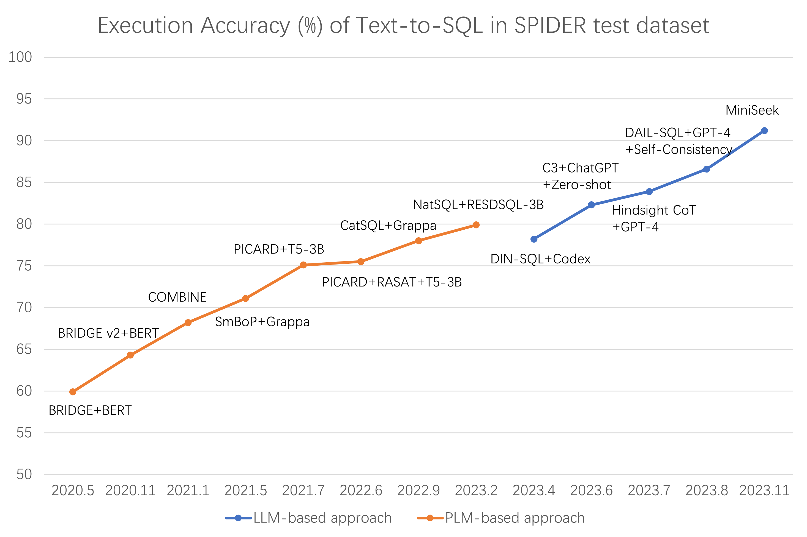

# 大型语言模型在文本转SQL任务中的应用调查

发布时间：2024年07月21日

`LLM应用` `数据库` `信息技术`

> A Survey on Employing Large Language Models for Text-to-SQL Tasks

# 摘要

> 随着关系数据库中数据量的激增，高效查询和利用这些数据的需求在各行业中愈发迫切。然而，SQL查询的专业性限制了非专业用户的访问能力。文本到SQL解析技术通过将自然语言转换为SQL查询，降低了数据库使用的门槛。借助大型语言模型（LLMs）的进步，新的方法聚焦于提示工程和微调。本调查全面梳理了LLMs在文本到SQL领域的应用，涵盖基准数据集、提示工程、微调策略及未来研究方向，旨在拓宽读者对该领域前沿进展的认识，并展望其未来发展。

> The increasing volume of data stored in relational databases has led to the need for efficient querying and utilization of this data in various sectors. However, writing SQL queries requires specialized knowledge, which poses a challenge for non-professional users trying to access and query databases. Text-to-SQL parsing solves this issue by converting natural language queries into SQL queries, thus making database access more accessible for non-expert users. To take advantage of the recent developments in Large Language Models (LLMs), a range of new methods have emerged, with a primary focus on prompt engineering and fine-tuning. This survey provides a comprehensive overview of LLMs in text-to-SQL tasks, discussing benchmark datasets, prompt engineering, fine-tuning methods, and future research directions. We hope this review will enable readers to gain a broader understanding of the recent advances in this field and offer some insights into its future trajectory.

[Arxiv](https://arxiv.org/abs/2407.15186)