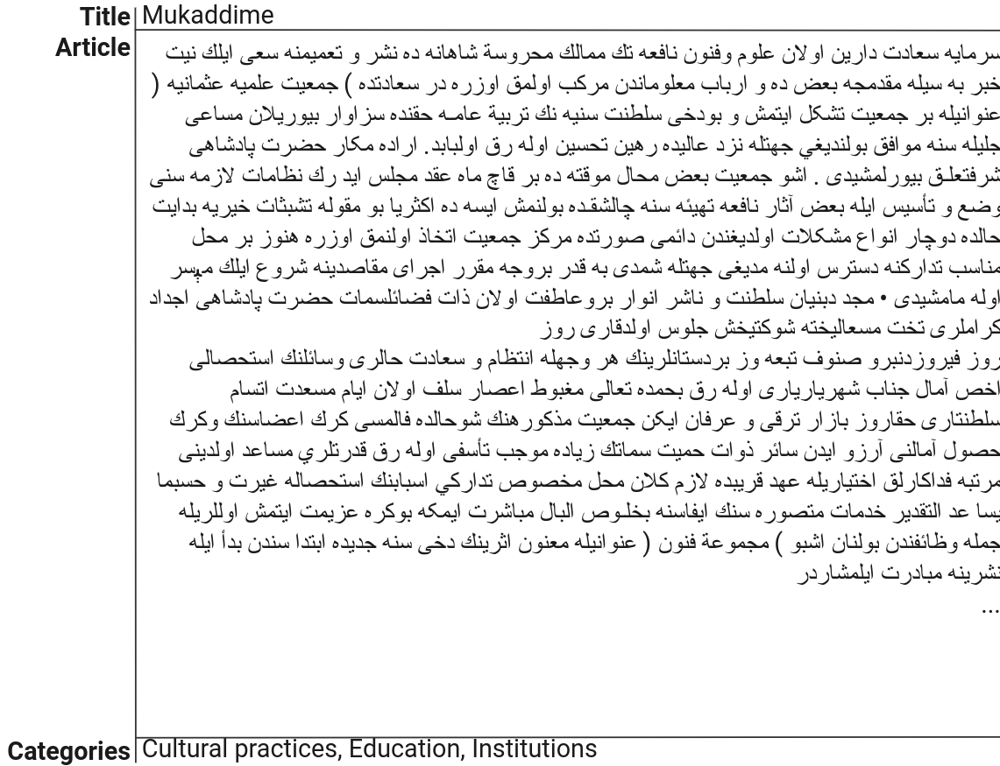
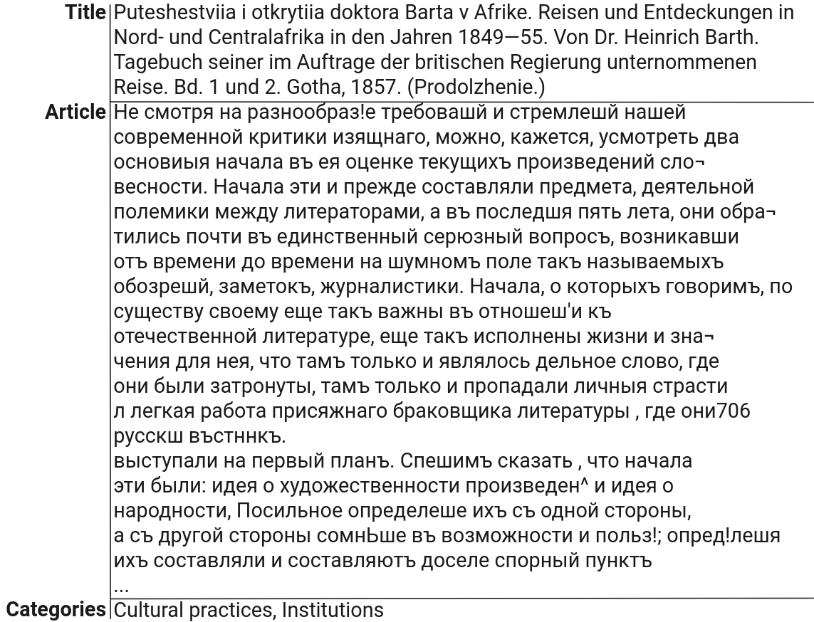
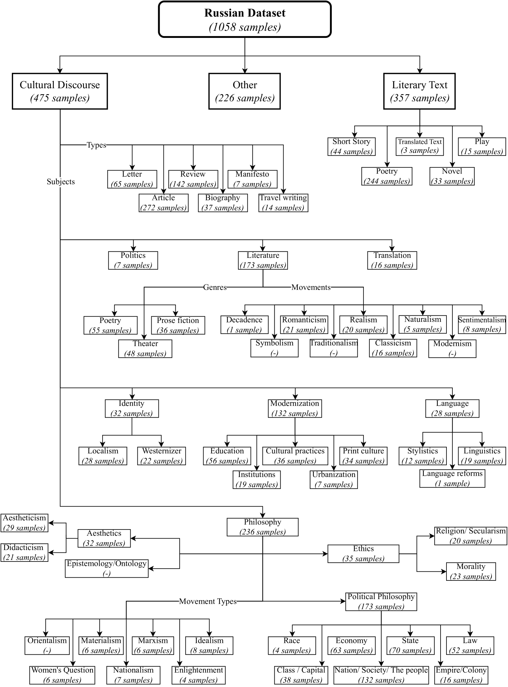

# 19世纪奥斯曼与俄罗斯文学批评文本的多级多标签分类数据集

发布时间：2024年07月21日

`LLM应用`

> A multi-level multi-label text classification dataset of 19th century Ottoman and Russian literary and critical texts

# 摘要

> 本文首次将大型语言模型（LLMs）应用于一个包含19世纪奥斯曼土耳其语和俄语文学及批评文本的多层次、多标签文本分类数据集。文本经过精心分类和标注，由专家根据其结构和语义特性进行。我们比较了词袋（BoW）模型与多语言BERT、Falcon和Llama-v2的分类效果，发现BoW在某些情况下表现更佳，凸显了低资源语言环境下进一步研究的重要性。该数据集对自然语言处理和机器学习领域的研究者，尤其是处理历史和低资源语言的研究者，具有重要价值，并已公开发布^1。

> This paper introduces a multi-level, multi-label text classification dataset comprising over 3000 documents. The dataset features literary and critical texts from 19th-century Ottoman Turkish and Russian. It is the first study to apply large language models (LLMs) to this dataset, sourced from prominent literary periodicals of the era. The texts have been meticulously organized and labeled. This was done according to a taxonomic framework that takes into account both their structural and semantic attributes. Articles are categorized and tagged with bibliometric metadata by human experts. We present baseline classification results using a classical bag-of-words (BoW) naive Bayes model and three modern LLMs: multilingual BERT, Falcon, and Llama-v2. We found that in certain cases, Bag of Words (BoW) outperforms Large Language Models (LLMs), emphasizing the need for additional research, especially in low-resource language settings. This dataset is expected to be a valuable resource for researchers in natural language processing and machine learning, especially for historical and low-resource languages. The dataset is publicly available^1.

[Arxiv](https://arxiv.org/abs/2407.15136)